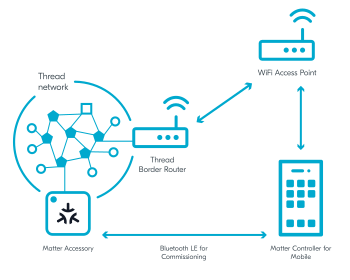
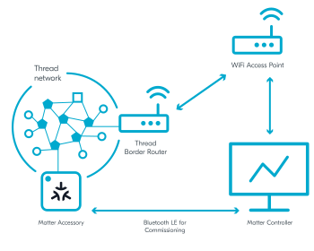

.. _ug_matter_configuring_env:

Configuring Matter development environment
##########################################

.. contents::
   :local:
   :depth: 2

Setting up Matter development environment is all about setting up the Matter network and commissioning your device into it.
In Matter, the commissioning procedure takes place over Bluetooth LE between a Matter accessory device and the Matter controller, where the controller has the commissioner role.
When the procedure has completed, the device should be equipped with all information needed to securely operate in the Matter network.

During the last part of the commissioning procedure (the provisioning operation), the Matter controller sends the Thread network credentials to the Matter accessory device.
As a result, the device can join the Thread network and communicate with other Thread devices in the network.

To start the commissioning procedure, the controller must get the onboarding information from the Matter accessory device.
The data payload, which includes the device discriminator and setup PIN code, is encoded within a QR code, printed to the UART console, and can be shared using an NFC tag.

Matter development environment setup depends on how you choose to run the Matter controller.
You can either run it on the same device as the Thread Border Router or run the Matter controller and the Thread Border Router on separate devices.

Running Thread Border Router and Matter controller on separate devices
**********************************************************************

The recommended approach is to run the Thread Border Router and the Matter controller on separate devices.
With the Thread Border Router installed on Raspberry Pi, this approach provides support for most functionalities.
For example, it allows using a mobile controller by providing connectivity between a Wi-Fi network and a Thread network.

In this setup, Raspberry Pi runs the Thread Border Router, which provides communication between the Thread nodes and the Matter controller.
The controller can be installed on a PC or a mobile phone.
Both the Thread Border Router and the Matter controller must support IPv6 communication over backbone network, for example Wi-Fi or Ethernet.

.. _ug_matter_configuring_mobile:

Configuring Thread Border Router and mobile Matter Controller
=============================================================

In this setup, the Matter controller is installed on mobile and a dedicated Wi-Fi Access Point is used.

.. matter_env_ctrl_mobile_start

.. matter_env_ctrl_mobile_end

Requirements
------------

To use this setup, you need the following hardware:

* 1x smartphone with Android 8+
* 1x Raspberry Pi Model 3B+ or newer (along with an SD card with at least 8 GB of memory)
* 1x Wi-Fi Access Point supporting IPv6 (without the IPv6 Router Advertisement Guard enabled on the router)
* 1x nRF52840 DK or nRF52840 Dongle - for the Radio Co-Processor (RCP) device
* 1x nRF52840 DK or nRF5340 DK - for the Matter accessory device (programmed with one of :ref:`matter_samples`)

Configuring the environment
---------------------------

To configure and use Thread Border Router and mobile Matter controller on separate devices, complete the following steps:

1. Program the development kit for the Matter accessory device with one of available :ref:`matter_samples`.
#. Configure the Thread Border Router on a Raspberry Pi.
   See :ref:`ug_thread_tools_tbr` in the |NCS| documentation for details.
#. Configure the mobile Matter controller:

   a. Install the controller using one of the options described in :ref:`ug_matter_configuring_controller_mobile`.
   #. Complete the following steps from the :doc:`matter:nrfconnect_android_commissioning` user guide in the Matter documentation:

      * Building and installing Android CHIPTool - which prepares your CHIPTool for commissioning.
      * Preparing accessory device - which prepares your device programmed with the Matter sample for commissioning and provides you with the commissioning QR code.

        .. note::
            In the |NCS|, you can also use :ref:`NFC tag for Matter commissioning <ug_matter_configuring_optional_nfc>`.

      * Commissioning accessory device - which lets you commission your device into the network you created when configuring the Thread Border Router on Raspberry Pi.
      * Sending Matter commands - which checks the IPv6 connectivity.

#. Depending on which Matter sample you programmed onto the development kit, go to this sample's documentation page and complete the steps from the Testing section.

.. _ug_matter_configuring_pc:

Configuring Thread Border Router and Matter Controller on PC
============================================================

In this setup, the Matter controller is installed on PC and a dedicated Wi-Fi Access Point is used.

.. matter_env_ctrl_pc_start

.. matter_env_ctrl_pc_end

Requirements
------------

To use this setup, you need the following hardware:

* 1x PC with Ubuntu (20.04 or newer)
* 1x Raspberry Pi Model 3B+ or newer (along with an SD card with at least 8 GB of memory)
* 1x Wi-Fi Access Point supporting IPv6 (without the IPv6 Router Advertisement Guard enabled on the router)
* 1x nRF52840 DK or nRF52840 Dongle - for the Radio Co-Processor (RCP) device
* 1x nRF52840 DK or nRF5340 DK - for the Matter accessory device (programmed with one of :ref:`matter_samples`)

Configuring the environment
---------------------------

To configure and use Thread Border Router and PC Matter controller on separate devices, complete the following steps:

1. Program the development kit for the Matter accessory device with one of available :ref:`matter_samples`.
#. Configure the Thread Border Router on a Raspberry Pi.
   See :ref:`ug_thread_tools_tbr` in the |NCS| documentation for details.
#. Configure the Python Matter controller:

   a. Build the controller using one of the options described in :ref:`ug_matter_configuring_controller_pc`.
   #. Complete the following steps from the :doc:`matter:python_chip_controller_building` user guide in the Matter documentation:

      * Building and installing - which prepares your CHIPTool for commissioning.
      * Running the tool - which gives you access to Bluetooth interface.
      * Using Python CHIP Controller for Matter accessory testing - which prepares your device programmed with the Matter sample for commissioning and testing.

        .. note::
            Skip the step about programming the example, as you already have a development kit programmed with a Matter sample.

#. Depending on which Matter sample you programmed onto the development kit, go to this sample's documentation page and complete the steps from the Testing section.

Running Thread Border Router and Matter controller on the same device
*********************************************************************

If you only have one device, be it a PC with Linux or a Raspberry Pi, you can set up and test the development environment with both the Thread Border Router and the Matter controller running on this one device.

In this setup, a PC or a Raspberry Pi runs the Thread Border Router and the Python Matter controller simultaneously.
To simplify enabling the Thread communication with the Matter accessory device, use a Docker container with the OpenThread Border Router image instead of installing the OpenThread Border Router natively.

.. matter_env_ctrl_one_start

.. figure:: images/matter_otbr_controller_same_device.svg
   :width: 600
   :alt: Setup with OpenThread Border Router and Matter controller on the same device

   Setup with OpenThread Border Router and Matter controller on the same device

.. matter_env_ctrl_one_end

Requirements
============

To use this setup, you need the following hardware:

* One of the following:

  * 1x PC with Ubuntu (20.04 or newer)
  * 1x Raspberry Pi Model 3B+ or newer with Ubuntu (20.04 or newer) instead of Raspbian OS

* 1x Bluetooth LE dongle (can be embedded inside the PC, like it is on Raspberry Pi)
* 1x nRF52840 DK or nRF52840 Dongle - for the Radio Co-Processor (RCP) device
* 1x nRF52840 DK or nRF5340 DK - for the Matter accessory device (programmed with one of :ref:`matter_samples`)

Configuring the environment
===========================

.. note::
    The Python Matter controller is currently not supported for building on Raspbian OS.
    If you use Raspberry Pi to run the controller and the Thread Border Router, replace Raspbian OS with Ubuntu Server.

To configure and use Thread Border Router and Matter controller on the same device, complete the following steps:

1. Program the Matter accessory device with one of available :ref:`matter_samples`.
#. Configure the Thread Border Router on a PC or on a Raspberry Pi, depending on what hardware you are using.
   For detailed steps, see the Running OTBR using Docker section on the :ref:`ug_thread_tools_tbr` page in the |NCS| documentation.
#. Configure the Python Matter controller:

   a. Build the controller using one of the options described in :ref:`ug_matter_configuring_controller_pc`.
   #. Complete the following steps from the :doc:`matter:python_chip_controller_building` user guide in the Matter documentation:

      * Building and installing - which prepares your CHIPTool for commissioning.
      * Running the tool - which gives you access to Bluetooth interface.
      * Using Python CHIP Controller for Matter accessory testing - which prepares your device programmed with the Matter sample for commissioning and testing.

        .. note::
            Skip Step 1, as you have the development kit programmed with a Matter sample.

#. Depending on which Matter sample you programmed onto the development kit, go to this sample's documentation page and complete the steps from the Testing section.
