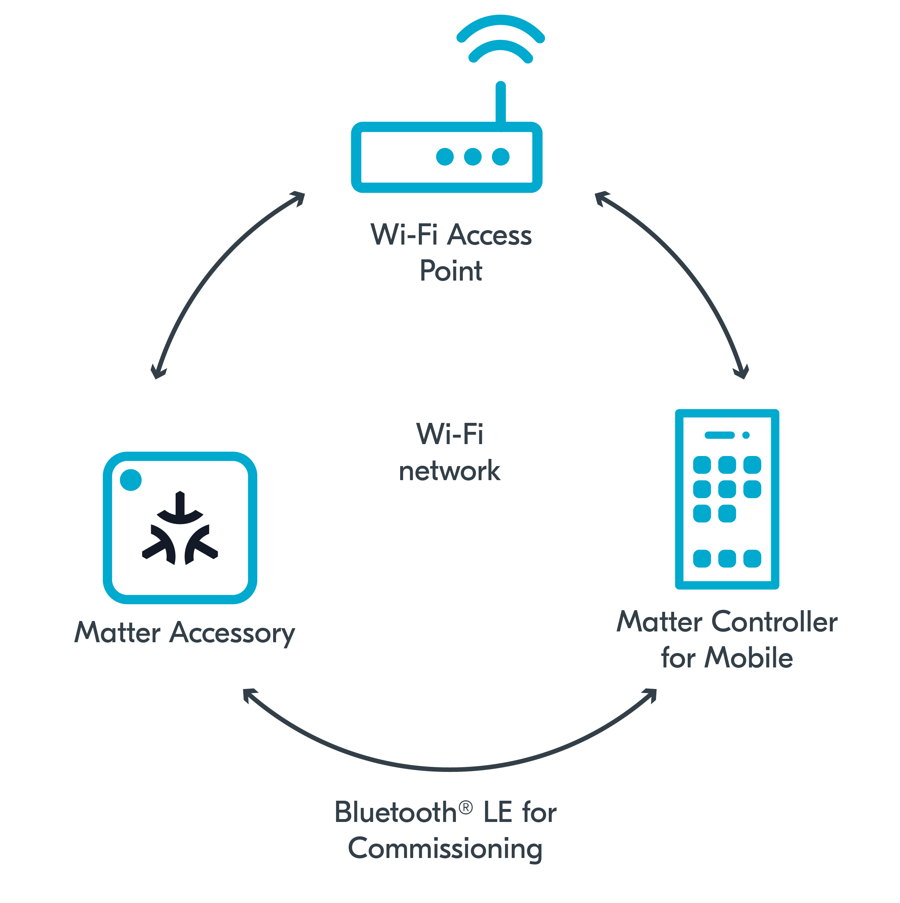

.. _ug_matter_gs_testing_wifi_mobile:

Matter over Wi-Fi: Configuring CHIP Tool for Android
####################################################

In this setup, the Matter controller is installed on mobile, and a dedicated Wi-Fi Access Point is used.

   Matter over Wi-Fi setup with Matter controller on mobile

Requirements
************

To use this setup, you need the following hardware:

* 1x smartphone with Android 8+
* 1x Wi-Fi Access Point supporting IPv6 (without the IPv6 Router Advertisement Guard enabled on the router)
* 1x compatible Nordic Semiconductor's DK - for the Matter accessory device (compatible and programmed with one of :ref:`matter_samples`)

Configuring the environment
***************************

To configure and use CHIP Tool for Android, complete the following steps:

1. Program the development kit for the Matter accessory device with one of available :ref:`matter_samples`.
#. Configure the CHIP Tool for Android:

   a. Install the controller using one of the options described in :ref:`ug_matter_configuring_controller_mobile`.
   #. Complete the following steps from the :doc:`matter:nrfconnect_android_commissioning` user guide in the Matter documentation:

      * Building and installing CHIP Tool for Android - which prepares the controller for commissioning.
      * Preparing accessory device - which prepares your device programmed with the Matter sample for commissioning and provides you with the commissioning QR code.

        .. note::
            In the |NCS|, you can also use :ref:`NFC tag for Matter commissioning <ug_matter_configuring_optional_nfc>`.

      * Commissioning accessory device - which lets you commission your device into the Wi-Fi network (Wi-Fi Access Point).
      * Sending Matter commands - which checks the IPv6 connectivity.

#. Depending on which Matter sample you programmed onto the development kit, go to this sample's documentation page and complete the steps from the Testing section.
