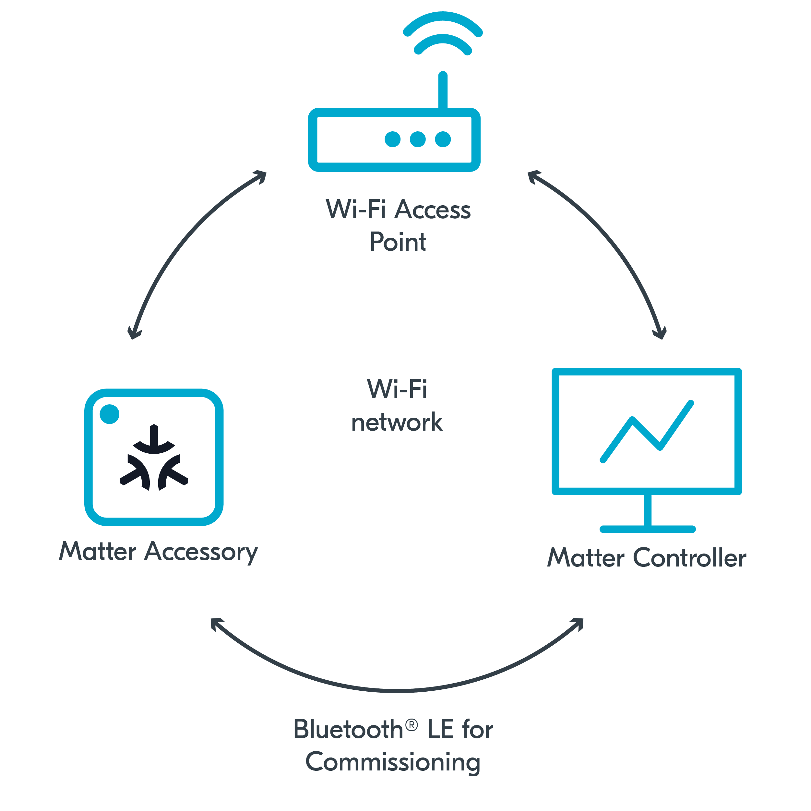

.. _ug_matter_gs_testing_wifi_pc:

Matter over Wi-Fi: Configuring CHIP Tool for Linux or macOS
###########################################################

.. contents::
   :local:
   :depth: 2

In this setup, the Matter controller is installed on PC that is running either Linux or macOS, and a dedicated Wi-Fi Access Point is used.
This is the recommended setup for Matter over Wi-Fi.

   Matter over Wi-Fi setup with Matter controller on PC

Requirements
************

To use this setup, you need the following hardware:

* 1x PC with Ubuntu (20.04 or newer)
* 1x Wi-Fi Access Point supporting IPv6 (without the IPv6 Router Advertisement Guard enabled on the router)
* 1x compatible Nordic Semiconductor's DK - for the Matter accessory device (compatible and programmed with one of :ref:`matter_samples`)

Configuring the environment
***************************

To configure and use CHIP Tool for Linux or macOS with Matter over Wi-Fi, complete the following steps.

.. rst-class:: numbered-step

Program the sample
==================

Program the development kit for the Matter accessory device with one of available :ref:`matter_samples`.
We recommend using :ref:`Matter light bulb <matter_light_bulb_sample>`.

.. rst-class:: numbered-step

Configure the CHIP Tool for Linux or macOS
==========================================

|matter_chip_tool_pc_default_line|
It is available for both amd64 and aarch64 architectures.
This implies that the tool can also be run on a Raspberry Pi with a 64-bit OS.

To use this controller type, complete the following steps:

1. Choose one of the following options:

   * For Linux only - Use the prebuilt tool package from the `Matter nRF Connect releases`_ GitHub page.
     Make sure that the package is compatible with your |NCS| version.
   * For both Linux and macOS - Build it manually from the source files available in the :file:`modules/lib/matter/examples/chip-tool` directory and using the building instructions from the :doc:`matter:chip_tool_guide` page in the Matter documentation.

#. Configure the CHIP Tool for Linux or macOS by following the steps in the sections of the :doc:`matter:chip_tool_guide` in the Matter documentation:

   a. Build and run the CHIP Tool by completing the steps listed in "Building and running CHIP Tool".
   #. Prepare the environment for testing by completing the steps listed in "Using CHIP Tool for Matter device testing".

.. rst-class:: numbered-step

Continue to testing the sample
==============================

Depending on which Matter sample you programmed onto the development kit, go to this sample's documentation page and complete the steps from the Testing section.
