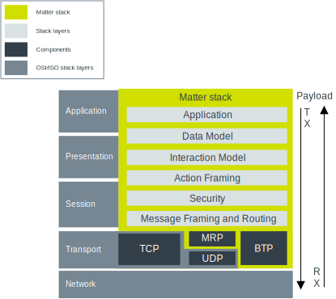
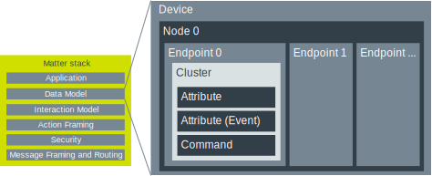

.. _ug_matter_architecture:
.. _ug_matter_overview_architecture:

Matter architecture
###################

.. contents::
   :local:
   :depth: 2

Matter defines an application layer on top of the IPv6-based transport protocols.
This allows for routing messages regardless of the underlying physical and link layers.

.. figure:: images/matter_architecture.svg
   :alt: Matter architecture overview

   Matter architecture overview

.. _ug_matter_architecture_overview:

Matter stack architecture
*************************

The Matter application layer can be broken down into several main components, as shown on the following diagram.

   Matter stack overview

At its lowest layer, the Matter stack interacts with the Transport layer.
The payload flows down the protocol stack on the transmitting device and up the protocol stack on the receiving device.

.. _ug_matter_architecture_overview_app:

Application
===========

The Application layer defines the business logic for a given end product.
For example, for a door lock application, the business logic could be opening and closing a specific model of the door bolt in reaction to a voice command from a specific virtual assistant technology.
It could also define input from a specific PIN keyboard UI, reaction on a specific LED on the door bolt model, and so on.

.. _ug_matter_architecture_overview_dm:

Data Model
==========

The Data Model layer describes how to separate data into abstract logical blocks that help maintain the application in a comfortable manner.
The layer operates regardless of the business logic, and so for example it is identical for each door lock type of device.

   Data Model layer overview

Nodes
   Each device is composed of one or more nodes, which are complete implementations of a Matter application functionality on a single stack.
   Nodes are identifiable with a unique network address on a single network.
   They can communicate directly with other nodes in the network.

Endpoints
   Each node is composed of one or more endpoints, which contain feature sets of single device functionalities.
   For example, in a voice-controlled door lock device, one endpoint could include the feature set for operating the bolt, while the other endpoint could include the feature set for handling a temperature sensor.

   .. note::
      Endpoint 0 is always reserved for Matter's Utility Clusters.
      This is the only mandatory endpoint for each Matter device.

Clusters
   Endpoints are composed of one or more clusters, which group attributes, commands and events that together make up each single feature in a set.
   For example, in an endpoint for operating a door bolt, one cluster could group attributes for moving the bolt to open or closed position, while other could group attributes for controlling alarms in case the door is opened in unauthorized way.

   Clusters can be of the following types:

   * Server -- responsible for holding values for Attributes, Commands, and Events.
   * Client -- responsible for performing interactions with other Server Clusters.

   The supported Matter application clusters are described in the Application Clusters specification, available to the `Connectivity Standards Alliance`_ members.
   Sets of clusters on one or more endpoint can form a :ref:`device type <ug_matter_device_types>`, that is an officially defined collection of requirements that is conformant with the Device Library specification.

Attributes
   Attributes are data entities that represent a physical quantity or state.
   They are stored in the Matter device's memory, but can also be calculated dynamically on demand.

Commands
   Commands are actions that can be used to trigger some behavior on other devices.
   For example, in a door lock device the lock door command can be used to trigger such action on a physical device.

Events
   Events are a type of attributes that communicate device state changes.
   They can also be treated as historical data records of something that happened on the device in the past.

.. _ug_matter_architecture_overview_im:

Interaction Model
=================

While the `Data Model`_ layer describes abstraction for handling data, the Interaction Model defines how to exchange this data between nodes through interactions.
The Interaction Model layer defines what interactions can be performed between a client and a server device.
The node that initiates the interaction is called initiator (typically, a client device), and the node that is the destinatary of the interaction is called target (typically, a server device).

The following interaction types belong to the Interaction Model:

* Read - This interaction is used get the value of attributes or events.
* Write - This interaction is used to modify attribute values.
* Invoke - This interaction is used to send commands.
* Subscribe - This interaction is used to create subscription with a target in order to receive data reports from the target periodically instead of polling for data.
  Subscriptions can be related to attributes and events.

Each interaction is made of transactions, which in turn are made of actions.
Each action can be conveyed by one or more messages.

.. _ug_matter_architecture_overview_af:

Action Framing
==============

The Action Framing layer transforms messages that are part of interactions from the `Interaction Model`_ into serialized binary packets.

.. _ug_matter_architecture_overview_sec:

Security
========

The Security layer takes the encoded frames from the `Action Framing`_ layer, encrypts them and appends them with a message authentication code.

.. _ug_matter_architecture_overview_routing:

Message Framing and Routing
===========================

This layer is responsible for composing the payload with required and optional header fields.
These header fields specify both the properties of the message and its logical routing information.

.. _ug_matter_architecture_overview_transport:

Transport and IP Framing
========================

This layer manages the transmission of the payload through the IP network to the peer device.
It uses either the Transmission Control Protocol (TCP) or the combination of User Datagram Protocol (UDP) with Matter's Message Reliable Protocol (MRP).
During the commissioning process, Bluetooth Transport Protocol over Bluetooth LE can be used instead of that layer.
