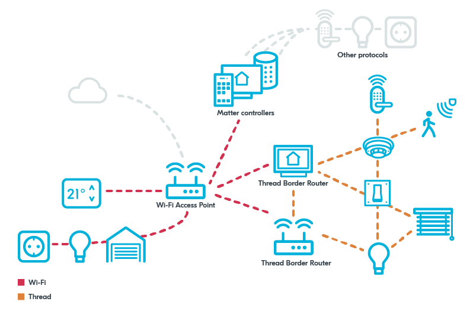

.. _ug_matter_overview_network_topologies:

Matter network overview
#######################

.. contents::
   :local:
   :depth: 2

Matter network can be composed of Ethernet, Wi-Fi, and Thread devices.
Networks are joined together, which means that devices that belong to different network can talk to each other within the local Matter fabric (infrastructure).
All communication is achieved over IPv6, although the Matter network is capable of running in the absence of IPv6 infrastructure connected to the Internet.
Bluetooth LE can be used for commissioning of a Matter device to the Matter network.

.. _ug_matter_network_topologies_structure:

Matter network topologies
*************************

A Matter network can be made of one or more IPv6-based networks, for example Wi-Fi network or Thread network.

The Matter network topology refers to the structure of connections between Matter devices and IPv6 networks.
Different IPv6 networks can communicate with each other through central hubs, for example Thread Border Router or Wi-Fi Access Point.

Matter allows for connecting with external networks based on other protocols, such as Zigbee, through Matter bridges.

The following figure illustrates a generic Matter topology example with two Thread Border Router devices, including one with an optional connection to cloud, and three Wi-Fi devices in the upper part of the figure acting as Matter bridges for other protocol devices.

   Matter topology example

.. _ug_matter_network_topologies_concepts:

Matter network concepts
***********************

The Matter network is using the following concepts, listed in alphabetical order:

Bridge
  A network device used for exposing mesh networking devices that are not compatible with Matter to a Matter network (for example, Zigbee devices).
  Such *bridged devices* can then work with Matter devices in a fabric and communicate on different application layers.
  The bridge makes sure that the connection between Matter and non-Matter devices is secured.

Controller
  |matter_controller_def|
  For more information, see the following section.

Edge Router
  A network device used for ensuring interoperability of different IPv6 networks that are supported by Matter.
  The main task of a Edge Router is coordinating cross-network communication.
  Multiple Edge Routers can operate within a network to ensure no-single-point-of-failure approach.
  Examples of Edge Routers include Thread Border Router and Wi-Fi Access Point.

Fabric
  This is a logical set of nodes that communicate with each other and can belong to different networks.
  The devices in a fabric share the same :ref:`root of trust <ug_matter_network_topologies_concepts_security>` and configuration state and are identifiable with a unique 64-bit Fabric ID.
  Using the Multiple Fabrics feature, you can assign nodes to a specific set of fabrics.

Multi-admin
  A Matter feature that allows to connect Matter devices to multiple applications and ecosystems out of the box.

Node
  A single instance of a Matter device, available on an IPv6 network after commissioning with a Node ID and security credentials.
  A node can be commissioned to multiple separate fabrics and have multiple administrators using the Multiple Fabrics feature, and thus have multiple Node IDs.
  Nodes in Matter support home automation bridging, which allows to implement other home automation technologies, transports, and link layers.
  Each node has assigned a unique 64-bit Node ID, a 16-bit Vendor ID (VID), statically allocated by the CSA, a 16-bit Product ID (PID), and a 16-bit Group ID (GID), which identifies a set of nodes across a fabric.

OTA Provider
  A Matter node that can respond to queries from the OTA Requestor node about available software update images and provide OTA Requestor with the update packages during the Over-the-Air (OTA) software update process.

OTA Requestor
  A Matter node that can request information about available software update images to the OTA Provider node and receive update packages from it during the OTA software update process.
  An OTA Requestor can also handle announcements about the available OTA Providers in the Matter network.

.. _ug_matter_configuring_controller:

Matter controller
=================

|matter_controller_def|

.. matter_controller_start

The following figure shows the available Matter controllers in the |NCS|.

.. figure:: images/matter_setup_controllers_generic.png
   :width: 600
   :alt: Controllers used by Matter

   Controllers used by Matter

.. matter_controller_end

The Matter controller interacts with the accessory devices using the following protocols:

* Bluetooth LE during the commissioning process - to securely pass the network credentials and provision the accessory device into the Thread network during commissioning.
  At this stage, the controller has the commissioner role.
  When the commissioning has completed, the device has joined the IPv6 network and is equipped with all information needed to securely operate in the Matter network with other IPv6 devices.
  For more information about the commissioning process, see :ref:`ug_matter_network_topologies_commissioning`.
* Regular IPv6 communication after the accessory device joins the Thread or Wi-Fi network - to interact with each other by exchanging application messages.
  For example, to report temperature measurements of a sensor.

The following Matter controllers can be used for testing Matter applications based on the |NCS|:

* **Recommended:** CHIP Tool for Linux or macOS
* CHIP Tool for Android

These controller types are compatible with the |NCS| implementation of Matter.
For information about how to build and configure them, see the pages in the :ref:`ug_matter_gs_testing` section.
In the Matter upstream repository, you can find information and resources for implementing `other controller setups`_ (for example, mobile Matter controller for iOS).

.. _ug_matter_network_topologies_concepts_security:

Matter network security
***********************

The Matter network security aims at authenticating only trustworthy devices to the Matter fabric and protecting the confidentiality of messages exchanged between the fabric nodes.

Session establishment
=====================

Session establishment is a process that serves two purposes.
It is used to exchange keys required for establishing a safe communication between nodes.
It also involves node authentication, which verifies that both nodes that initiate communication trust each other.

The Matter protocol uses elliptic curve cryptography as the principal mean of both public and private key protection and for providing digital signatures.
The elliptic curve cryptography is based on the NIST P-256 curve (secp256r1).

The following session establishment methods are available:

* Password-Authenticated Session Establishment (PASE)
* Certificate-Authenticated Session Establishment (CASE)

Password-Authenticated Session Establishment (PASE)
---------------------------------------------------

When using PASE, both nodes share the same secret.
This process takes place when commissioning the device.

PASE uses the `SPAKE2+`_ algorithm to ensure a safe exchange of keys over non-secure channel.
With the SPAKE2+ algorithm, only one of the communicating parties actively uses the password during the execution of the protocol.
This is a reinforced version of the Password Authenticated Key Exchange (PAKE) protocol, where both parties are involved in creating a shared key and both actively use the password.

Certificate-Authenticated Session Establishment (CASE)
------------------------------------------------------

When using CASE, both nodes own operational certificates that chain back to the same root of trust.
This process takes place while establishing the secured communication between nodes that are already commissioned.

CASE uses the `SIGMA`_ algorithm to ensure a safe exchange of keys over non-secure channel.

Root of trust is a concept within Matter that is centered around a certification authority (CA), identified by Root Public Key (Root PK).
The CA is a device tasked with issuing and assigning Node Operational Credentials (NOCs).
NOCs are used to identify a node within a fabric and are signed by the Root Private Key.
NOCs are installed during the :ref:`ug_matter_network_topologies_commissioning` by the commissioner together with Trusted Root CA Certificates.

Message confidentiality
=======================

After exchanging the keys and establishing secure channel, the commonly available AES modes of operation are used to provide shared key cryptographic operations.

.. _ug_matter_network_topologies_commissioning:

Matter network commissioning
****************************

The commissioning in Matter is a process of joining a device to a fabric (operational network).
The process takes place between a commissioner device and a commissionee device.

To start the commissioning procedure, the controller must get the onboarding information from the Matter accessory device.
The data payload, which includes the device discriminator and setup passcode, is encoded within a QR code, printed to the UART console, and can be shared using an NFC tag.

The commissioning procedure consists of the following stages:

1. Device discovery -- The commissioner discovers devices that can be commissioned onto the network.
   If the node is being added to its first Matter fabric, the device discovery uses Bluetooth LE.
#. Security setup with PASE -- The commissioner runs the Passcode-Authenticated Session Establishment (PASE) protocol, which is exclusive to the commissioning process.
   This protocol is used to establish the first session between devices that take part in commissioning.
   The session is established with a passcode provided out-of-band and that is used to derive encryption keys.
   This passcode is known only to the commissioner and the commissionee.
#. Establishing fail-safe -- The commissioner requests the commissionee to back up its original configuration.
#. Preliminary node configuration -- The commissioner configures the commissionee with regulatory information and the current UTC time.
#. Device Attestation Certificate verification -- The commissioner checks whether the commissionee is a certified Matter device.
   If this verification fails, the commissioner can either terminate or continue the commissioning procedure.
   The verification can fail if the device is not able to prove the validity and ownership of mandatory :ref:`ug_matter_device_attestation` elements.
#. Installing operational credentials -- The commissioner installs Node Operational Certificate (NOC) and Operational ID on the commissionee.
   The commissionee becomes the new node of the Matter fabric.
   The node is identified by a tuple consisting of the Root PK, Fabric ID, and Node ID.
   (While the fabric is identified by a tuple consisting of the Root PK and the Fabric ID.)
#. Network commissioning -- The commissioner provisions the commissionee node with the operational network credentials, either Wi-Fi or Thread, and requests the commissionee to connect to the network.
#. Operational discovery -- The commissioner discovers the commissionee node on the operational network using DNS-SD.
   This way, the commissioner learns the IP address of the node.
#. Security setup with CASE -- The commissioner and the node use the Certificate-Authenticated Session Establishment (CASE) protocol to establish secure communication.
   The CASE protocol is in charge of exchanging NOCs to set up a session secured with a new pair of keys.
   The CASE connection is reset each time a device breaks the connection.
#. Disarming fail-safe -- The commissioner requests the commissionee node to remove the stored configuration backup.
#. Message exchange -- The commissioner and the commissionee exchange an AES-encrypted message on the operational network.

These stages can take place in one of the following connection scenarios between the commissioner and the commissionee:

* Concurrent connection commissioning flow -- where it is possible to have two network connections simultaneously: one on the operational network and one on the commissioning channel.
* Non-concurrent connection commissioning flow -- where the connection to the operational network immediately breaks the connection on the commissioning channel.

This is because the commissioning process can take place over a different network interface (for example Bluetooth LE) than the interface used for connection with the operational network (for example Thread or Wi-Fi).

At the end of the commissioning procedure, the device that has successfully joined the Matter fabric will have the following information configured:

* New instance name, constructed using the fabric ID and the node ID (assigned by the commissioner)
* New Node Operational Certificate for the Matter fabric it has joined
* New Private Key for operation certificate
* New Access Control List
* Information about operational network
