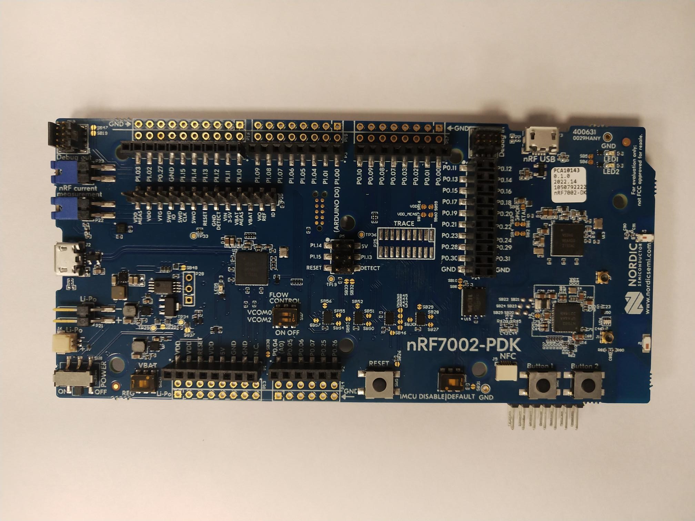

.. _nrf7002dk_nrf5340:

Getting started with nRF7002 DK
###############################

.. contents::
   :local:
   :depth: 2

The nRF7002 DK (PCA10143) is a single-board development kit for evaluation and development on the Nordic nRF7002, a Wi-Fi companion IC to Nordic nRF5340 System-on-Chip (SoC) host processor.

Overview
********

The nRF7002 is an IEEE 802.11ax (Wi-Fi 6) compliant solution that implements the Wi-Fi physical layer and MAC layer protocols.
It implements the Wi-Fi driver software on the nRF5340 host processor communicating over the QSPI bus.

The nRF5340 host is a dual-core SoC based on the Arm® Cortex®-M33 architecture.
It has the following features:

* A full-featured Arm Cortex-M33F core with DSP instructions, FPU, and Armv8-M Security Extension, running at up to 128 MHz, referred to as the *application core*.
* A secondary Arm Cortex-M33 core, with a reduced feature set, running at a fixed 64 MHz, referred to as the *network core*.

The ``nrf7002dk_nrf5340_cpuapp`` build target provides support for the application core on the nRF5340 SoC.
The ``nrf7002dk_nrf5340_cpunet`` build target provides support for the network core on the nRF5340 SoC.

     nRF7002 PDK (Preview DK will later be replaced by the certified nRF7002 DK)

Hardware
********

The nRF7002 DK has two external oscillators:

   * The frequency of the slow clock is 32.768 kHz.
   * The frequency of the main clock is 32 MHz.

Supported features
==================

The ``nrf7002dk_nrf5340_cpuapp`` board configuration supports the following hardware features:

+-----------+------------+----------------------+
| Interface | Controller | Driver/Component     |
+===========+============+======================+
| ADC       | on-chip    | adc                  |
+-----------+------------+----------------------+
| CLOCK     | on-chip    | clock_control        |
+-----------+------------+----------------------+
| FLASH     | on-chip    | flash                |
+-----------+------------+----------------------+
| GPIO      | on-chip    | gpio                 |
+-----------+------------+----------------------+
| I2C(M)    | on-chip    | i2c                  |
+-----------+------------+----------------------+
| MPU       | on-chip    | arch/arm             |
+-----------+------------+----------------------+
| NVIC      | on-chip    | arch/arm             |
+-----------+------------+----------------------+
| PWM       | on-chip    | pwm                  |
+-----------+------------+----------------------+
| RTC       | on-chip    | system clock         |
+-----------+------------+----------------------+
| RTT       | Segger     | console              |
+-----------+------------+----------------------+
| RADIO     | nrf7002    | Wi-Fi 6 (802.11ax)   |
+-----------+------------+----------------------+
| QSPI      | on-chip    | qspi                 |
+-----------+------------+----------------------+
| SPI(M/S)  | on-chip    | spi                  |
+-----------+------------+----------------------+
| SPU       | on-chip    | system protection    |
+-----------+------------+----------------------+
| UARTE     | on-chip    | serial               |
+-----------+------------+----------------------+
| USB       | on-chip    | usb                  |
+-----------+------------+----------------------+
| WDT       | on-chip    | watchdog             |
+-----------+------------+----------------------+

The ``nrf7002dk_nrf5340_cpunet`` board configuration supports the following hardware features:

+-----------+------------+----------------------+
| Interface | Controller | Driver/Component     |
+===========+============+======================+
| CLOCK     | on-chip    | clock_control        |
+-----------+------------+----------------------+
| FLASH     | on-chip    | flash                |
+-----------+------------+----------------------+
| GPIO      | on-chip    | gpio                 |
+-----------+------------+----------------------+
| I2C(M)    | on-chip    | i2c                  |
+-----------+------------+----------------------+
| MPU       | on-chip    | arch/arm             |
+-----------+------------+----------------------+
| NVIC      | on-chip    | arch/arm             |
+-----------+------------+----------------------+
| RADIO     | on-chip    | Bluetooth,           |
|           |            | ieee802154           |
+-----------+------------+----------------------+
| RTC       | on-chip    | system clock         |
+-----------+------------+----------------------+
| RTT       | Segger     | console              |
+-----------+------------+----------------------+
| QSPI      | on-chip    | qspi                 |
+-----------+------------+----------------------+
| SPI(M/S)  | on-chip    | spi                  |
+-----------+------------+----------------------+
| UARTE     | on-chip    | serial               |
+-----------+------------+----------------------+
| WDT       | on-chip    | watchdog             |
+-----------+------------+----------------------+

Other hardware features are not supported by the |NCS| kernel.

Connections and IOs
===================

The connections and IOs supported by the development kit are listed in this section.

LED
---

* LED1 (green) = P1.06
* LED2 (green) = P1.07

Push buttons
------------

* BUTTON1 = SW1 = P1.08
* BUTTON2 = SW2 = P1.09
* BOOT = SW5 = boot/reset

Wi-Fi control
-------------

* BUCKEN = P0.12
* IOVDD CONTROL = P0.31
* HOST IRQ = P0.23
* COEX_REQ = P0.28
* COEX_STATUS0 = P0.30
* COEX_STATUS1 = P0.29
* COEX_GRANT = P0.24

Security components
===================

The following security components are available:

* Implementation Defined Attribution Unit (`IDAU`_) on the application core.

  The IDAU is implemented with the System Protection Unit and is used to define secure and non-secure memory maps.
  By default, the entire memory space (Flash, SRAM, and peripheral address space) is defined to be secure-accessible only.

* Secure boot.

Programming and debugging
*************************

The nRF5340 application core supports the Armv8-M Security Extension.
Applications built for the ``nrf7002dk_nrf5340_cpuapp`` board boot by default in the secure state.

The nRF5340 network core does not support the Armv8-M Security Extension.
nRF5340 IDAU can configure bus accesses by the nRF5340 network core to have the secure attribute set.
This allows to build and run secure-only applications on the nRF5340 SoC.

Building secure/non-secure |NCS| applications with Arm TrustZone
=================================================================

Applications on the nRF5340 can contain both a secure and a non-secure firmware image for the application core.
You can build the secure image using either |NCS| or `Trusted Firmware M`_ (TF-M).
You must always build the non-secure firmware images using |NCS|.

.. note::
   By default, the secure image for the nRF5340 application core is built using TF-M.

Building the firmware with TF-M
-------------------------------

To build the secure firmware image using TF-M and the non-secure firmware image using |NCS|, complete the following steps:

1. Build the non-secure |NCS| application for the application core using the ``nrf7002dk_nrf5340_cpuapp_ns`` build target.

   To invoke the building of TF-M, the |NCS| build system requires the Kconfig option :kconfig:option:`CONFIG_BUILD_WITH_TFM` to be enabled, which is set by default when building |NCS| as a non-secure application.

   The |NCS| build system performs the following steps automatically:

      a. Build the non-secure firmware image as a regular |NCS| application.
      #. Build a TF-M (secure) firmware image.
      #. Merge the output image binaries.
      #. Optionally, build a bootloader image (MCUboot).

   .. note::
      Depending on the TF-M configuration, an application DTS overlay can be required to adjust the non-secure image flash memory partition and SRAM starting address and sizes.

#. Build the application firmware for the network core using the ``nrf7002dk_nrf5340_cpunet`` build target.

Building the secure firmware using |NCS|
----------------------------------------

To build the secure and the non-secure firmware images using |NCS|, complete the following steps:

1. Build the secure |NCS| application for the application core using the ``nrf7002dk_nrf5340_cpuapp`` build target.

   Also set :kconfig:option:`CONFIG_TRUSTED_EXECUTION_SECURE` to ``y`` and :kconfig:option:`CONFIG_BUILD_WITH_TFM` to ``n`` in the application project configuration file.
#. Build the non-secure |NCS| application for the application core using the ``nrf7002dk_nrf5340_cpuapp_ns`` build target.
#. Merge the two binaries.
#. Build the application firmware for the network core using the ``nrf7002dk_nrf5340_cpunet`` build target.

When building a secure and non-secure application for the nRF5340 application core, the secure application must set the IDAU (SPU) configuration to allow non-secure access to all CPU resources used by the non-secure application firmware.
SPU configuration must be applied before jumping to the non-secure application.

Building a secure-only application
==================================

Build the |NCS| application as described in :ref:`gs_programming`, using the ``nrf7002dk_nrf5340_cpuapp`` build target for the firmware running on the nRF5340 application core and the ``nrf7002dk_nrf5340_cpunet`` build target for the firmware running on the nRF5340 network core.

Programming the firmware to the DK
==================================

Follow the instructions in the :ref:`gs_programming` page to build and flash applications.

.. note::
   To flash and debug applications on the nRF7002 DK you must use the nRF Command Line Tools version 10.12.0 or above.
   For further information on how to install the nRF Command Line Tools, see :ref:`gs_updating`.

Debugging
=========

See the :ref:`gs_testing` page for information about debugging.

Testing the LEDs and buttons in the nRF7002 DK
**********************************************

The following samples allow you to test if the buttons (or switches) and LEDs on the development kit are working properly with |NCS|:

* :ref:`blinky-sample`
* :ref:`button-sample`

Build and flash the samples to make sure |NCS| is running correctly on your development kit.
For the button and LED definitions, see the :file:`boards/arm/nrf7002dk_nrf5340/nrf5340_cpuapp_common.dts` file.
