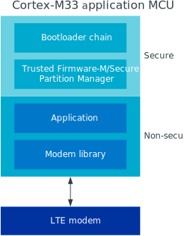

.. _ug_nrf9160:

Working with nRF9160
####################

The |NCS| provides support for developing on the nRF9160 System in Package
(SiP) using the nRF9160 DK (PCA10090), and offers samples
dedicated for this device.

.. _nrf9160_ug_intro:

Introduction
************

The nRF9160 SiP integrates an application MCU, a full LTE modem, RF front end,
and power management.
With built-in GPS support, it is dedicated for asset tracking applications.
For more details on the SiP, see the `nRF9160 product website`_.

   Overview of nRF91 application architecture

The figure illustrates the conceptual layout when targeting
an nRF9160 Cortex-M33 application MCU with TrustZone.

Application MCU
===============

The M33 TrustZone divides the application MCU into secure and non-secure domains.
When the MCU boots, it always starts executing from the secure area.
The secure bootloader chain starts the :ref:`nrf9160_ug_secure_partition_manager`, which configures a part of memory and peripherals to be non-secure and then jumps to the main application located in the non-secure area.

In Zephyr, :ref:`nrf9160_pca10090` is divided into two different boards:

* ``nrf9160_pca10090`` for firmware in the secure domain
* ``nrf9160_pca10090ns`` for firmware in the non-secure domain

Make sure to select the suitable board name when building your application.

Secure bootloader chain
-----------------------

A secure bootloader chain protects your application against running unauthorized code, and it enables you to do device firmware updates (DFU).
See :ref:`ug_bootloader` for more information.

A bootloader chain is optional.
Not all of the nRF9160 samples include a secure bootloader chain, but the ones that do use the :ref:`bootloader` sample and :doc:`mcuboot:index`.

.. _nrf9160_ug_secure_partition_manager:

Secure Partition Manager
------------------------

All nRF9160 samples require the :ref:`secure_partition_manager` sample.
It provides a reference implementation of a Secure Partition Manager firmware.
This firmware is required to set up the nRF9160 DK so that it can run user applications in the non-secure domain.

The Secure Partition Manager sample is automatically included in the build for the ``nrf9160_pca10090ns`` board.
To disable the automatic inclusion of the Secure Partition Manager sample, set the option :option:`CONFIG_SPM` to "n" in the project configuration.

Application
-----------

The user application runs in the non-secure domain.
Therefore, it must be built for the ``nrf9160_pca10090ns`` board.

The application image might require other images to be present.
Depending on the configuration, all these images can be built at the same time in a :ref:`multi-image build <ug_multi_image>`.

All nRF9160 samples include the :ref:`secure_partition_manager` sample, which can be enabled or disabled with the :option:`CONFIG_SPM` option.
Some also include the :ref:`bootloader` sample (:option:`CONFIG_SECURE_BOOT`) and :doc:`mcuboot:index` (:option:`CONFIG_BOOTLOADER_MCUBOOT`).

BSD socket
----------

All nRF9160 applications must include the BSD library.
The BSD library is the primary interface for operating the nRF9160 modem to establish LTE-M, NBIOT, and GNSS connections.

The BSD library is Nordic Semiconductor's implementation of the BSD Socket API.
See :ref:`nrfxlib:bsdlib` for detailed information.

LTE modem
=========

The LTE modem handles the LTE communication.
It is controlled through `AT commands <AT Commands Reference Guide>`_.

The firmware for the modem is available as precompiled binary.
You can download the firmware from the `nRF9160 product website (compatible downloads)`_.
The zip file contains both the full firmware and patches to upgrade from one version to another.

There are two ways to update the modem firmware:

Full upgrade
  A full upgrade of the modem firmware requires a wired connection.
  The upgrade is done through the nRF Connect Programmer, which is part of `nRF Connect for Desktop`_.
  See `Updating the nRF9160 DK cellular modem`_ in the nRF Connect Programmer User Guide for instructions.

Delta patches
  Delta patches are upgrades that contain only the difference from the last version.
  A delta patch can only upgrade the modem firmware from one specific version to another version.
  When applying a delta patch, you must therefore ensure that this patch works with the current firmware version on your device.
  Delta patches are applied as firmware over-the-air (FOTA) upgrades.
  See :ref:`nrf9160_ug_fota` for more information.

.. _nrf9160_ug_band_lock:

Band lock
*********

The band lock is a functionality of the application that lets you send an
AT command to the modem instructing it to operate only on specific bands.
Band lock is handled by the **LTE Link Control** driver and is by default
disabled in its Kconfig file.

The modem can only operate on four certified bands: 3, 4, 13, and 20.
The application cannot override this restriction.

You can, however, use the band lock to restrict modem operation to a subset of
the four bands, which might improve the performance of your application.
To check which bands are certified in your region,
visit `nRF9160 Certifications`_.

To set the band lock, edit the file :file:`drivers/lte_link_control/lte_lc.c`
and modify the ``static const char lock_bands`` define.
Each bit in this define represents one band counting from 1 to 20.
Therefore, the default setting for bands 3, 4, 13, and 20 is represented by::

	10000001000000001100

It is a non-volatile setting that must be set before activating the modem.
It disappears when the modem is reset.

For more detailed information, see the `band lock section in the AT Commands reference document`_.

.. _nrf9160_ug_network_mode:

Network mode
************

The modem supports LTE-M (Cat-M1) and Narrowband Internet of Things (NB-IoT or LTE Cat-NB).
By default, the modem starts in LTE-M mode.

When using the **LTE Link Control** driver, you can select LTE-M with :option:`CONFIG_LTE_NETWORK_MODE_LTE_M` or NB-IoT with :option:`CONFIG_LTE_NETWORK_MODE_NBIOT`.

To start in NB-IoT mode without the driver, send the following command before starting the modem protocols (by using ``AT+CFUN=1``)::

   AT%XSYSTEMMODE=0,1,0,0

To change the mode at runtime, set the modem to LTE RF OFF state before reconfiguring the mode, then set it back to normal operating mode::

   AT+CFUN=4
   AT%XSYSTEMMODE=0,1,0,0
   AT+CFUN=1

If the modem is shut down gracefully before the next boot (by using ``AT+CFUN=0``), it keeps the current setting.

For more detailed information, see the `system mode section in the AT Commands reference document`_.

.. _nrf9160_ug_fota:

FOTA upgrades
*************

You can upgrade the firmware of the nRF9160 over the air, thus without a wired connection.
Such an upgrade is called a FOTA (firmware over-the-air) upgrade.
FOTA upgrades can be used to apply delta patches to the `LTE modem`_ firmware and to replace the upgradable bootloader or the application.

.. note::
   Even though the Secure Partition Manager and the application are two individually compiled components, they are treated as a single binary blob in the context of firmware upgrades.
   When we refer to the application in this section, we therefore mean the application including the Secure Partition Manager.

A FOTA upgrade requires the following steps:

1. Make sure that your application supports FOTA upgrades.
      To download and apply FOTA upgrades, your application must use the :ref:`lib_fota_download` library.
      This library deduces the type of upgrade by inspecting the header of the firmware and invokes the :ref:`lib_dfu_target` library to apply the firmware upgrade.
      By default, the DFU target library supports all kinds of FOTA upgrades, but you can disable support for specific targets.

      In addition, the following requirements apply:

      * If you want to upgrade the application, :doc:`mcuboot:index` must be used as upgradable bootloader (:option:`CONFIG_BOOTLOADER_MCUBOOT`).
      * If you want to upgrade the upgradable bootloader, the :ref:`bootloader` must be used (:option:`CONFIG_SECURE_BOOT`).
      * If you want to upgrade the modem firmware, neither MCUboot nor the immutable bootloader are required, because the modem firmware upgrade is handled by the modem itself.

#. Create a binary file that contains the new image.
      This step does not apply for upgrades of the modem firmware.
      You can download delta patches for the modem firmware from the `nRF9160 product website (compatible downloads)`_.

      To create a binary file for an application upgrade, make sure that :option:`CONFIG_BOOTLOADER_MCUBOOT` is enabled and build the application as usual.
      The build will create several binary files (see :ref:`mcuboot:mcuboot_ncs`).
      The :file:`app_update.bin` file is the file that should be uploaded to the server.

      To create binary files for a bootloader upgrade, make sure that :option:`CONFIG_SECURE_BOOT` and :option:`CONFIG_BUILD_S1_VARIANT` are enabled and build MCUboot as usual.
      The build will create a binary file for each variant of the upgradable bootloader, one for each bootloader slot.
      See :ref:`upgradable_bootloader` for more information.

#. Make the binary file (or files) available for download.
     Upload the file or files to a web server that is compatible with the :ref:`lib_download_client` library.
     One way of doing this is to upload the files to an Amazon Web Services Simple Storage Service (AWS S3) bucket.
     See the :ref:`lib_aws_fota` documentation for instructions.

     Your application must be able to retrieve the host and file name for the binary file.
     See :ref:`lib_fota_download` for information about the format of this information, especially when providing two files for a bootloader upgrade.
     You can hardcode the information in the application, or you can use functionality like AWS jobs to provide the URL dynamically.

The full FOTA procedure depends on where the binary files are hosted for download.
See the :ref:`aws_fota_sample` sample for a full implementation using AWS.

.. _nrf9160_ug_drivs_libs_samples:

Board controller
****************

The nRF9160 DK contains an nRF52840 SoC that is used to route some of the nRF9160 SiP
pins to different components on the DK, such as the Arduino pin headers, LEDs,
and buttons. For a complete list of all the routing options available, see
the `nRF9160 DK board control section in the nRF9160 DK User Guide`_.

The nRF52840 SoC on the DK comes preprogrammed with a firmware.
If you need to restore the original firmware at some point, download the
nRF9160 DK board controller FW from the `nRF9160 DK product page`_.
To program the HEX file, use nrfjprog (which is part of the `nRF Command Line Tools`_).

If you want to route some pins differently from what is done in the
preprogrammed firmware, program the :ref:`zephyr:hello_world` sample instead of the preprogrammed firmware.
Configure the sample (located under ``samples/hello_world``) for the nrf52840_pca10090 board.
All configuration options can be found under **Board configuration** in menuconfig.
See :ref:`zephyr:nrf52840_pca10090` for detailed information about the board.

Available drivers, libraries, and samples
*****************************************

See the :ref:`drivers`, :ref:`libraries`, and :ref:`nRF9160 samples <nrf9160_samples>` sections and the respective repository folders for up-to-date information.
