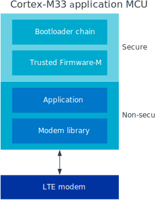

.. _ug_nrf9160:

Working with nRF9160 samples
############################

The |NCS| provides support for developing on the nRF9160 System in Package
(SiP) using the nRF9160 DK (PCA10090), and offers samples
dedicated for this device.

.. _nrf9160_ug_intro:

Introduction
============

The nRF9160 SiP integrates an application MCU, a full LTE modem, RF front end,
and power management.
With built-in GPS support, it is dedicated for asset tracking applications.
For more details on the SiP, see the `nRF9160 product website`_.

   Overview of nRF91 application architecture

The figure illustrates the conceptual layout when targeting
an nRF9160 Cortex-M33 application MCU with TrustZone.
The M33 TrustZone divides the MCU into secure and non-secure domains.
When the MCU boots, it always starts executing from the secure area,
which in this case is the **Secure Partition Manager**.
The **Secure Partition Manager** configures a part of memory and peripherals to be
non-secure and then jumps to the main application located in the non-secure area.
The **BSD Socket** library must be embedded in the application because
BSD sockets are the primary interface to the LTE modem.

.. _nrf9160_ug_secure_partition_manager:

Secure Partition Manager
========================

To use any of the nRF9160 samples, you must first compile and flash the
**Secure Partition Manager** sample.
It provides a reference implementation of a Secure Partition Manager firmware.
This firmware is required to set up the nRF9160 DK so that it can run user applications in the non-secure domain.

Note that the **Secure Partition Manager** sample is automatically included in the build for the nrf9160_pca10090ns board.
To disable the automatic inclusion of the **Secure Partition Manager** sample, set the option ``CONFIG_SPM=n`` in the project configuration.

For detailed documentation of the sample, see :ref:`secure_partition_manager`.

.. _nrf9160_ug_band_lock:

Band lock
=========

The band lock is a functionality of the application that lets you send an
AT command to the modem instructing it to operate only on specific bands.
Band lock is handled by the **LTE Link Control** driver and is by default
disabled in its Kconfig file.

The modem can only operate on four certified bands: 3, 4, 13, and 20.
The application cannot override this restriction.

You can, however, use the band lock to restrict modem operation to a subset of
the four bands, which might improve the performance of your application.
To check which bands are certified in your region,
visit `nRF9160 Certifications`_.

To set the band lock, edit the file :file:`drivers/lte_link_control/lte_lc.c`
and modify the ``static const char lock_bands`` define.
Each bit in this define represents one band counting from 1 to 20.
Therefore, the default setting for bands 3, 4, 13, and 20 is represented by::

	10000001000000001100

It is a non-volatile setting that must be set before activating the modem.
It disappears when the modem is reset.

For more detailed information, see the `band lock section in the AT Commands reference document`_.

.. _nrf9160_ug_network_mode:

Network mode
============

The modem supports LTE-M (Cat-M1) and Narrowband Internet of Things (NB-IoT or LTE Cat-NB).
By default, the modem starts in LTE-M mode.

When using the **LTE Link Control** driver, you can select LTE-M with :option:`CONFIG_LTE_NETWORK_MODE_LTE_M` or NB-IoT with :option:`CONFIG_LTE_NETWORK_MODE_NBIOT`.

To start in NB-IoT mode without the driver, send the following command before starting the modem protocols (by using ``AT+CFUN=1``)::

   AT%XSYSTEMMODE=0,1,0,0

To change the mode at runtime, set the modem to LTE RF OFF state before reconfiguring the mode, then set it back to normal operating mode::

   AT+CFUN=4
   AT%XSYSTEMMODE=0,1,0,0
   AT+CFUN=1

If the modem is shut down gracefully before the next boot (by using ``AT+CFUN=0``), it keeps the current setting.

For more detailed information, see the `system mode section in the AT Commands reference document`_.

.. _nrf9160_ug_drivs_libs_samples:

Board controller
================

The nRF9160 DK contains an nRF52840 SoC that is used to route some of the nRF9160 SiP
pins to different components on the DK, such as the Arduino pin headers, LEDs,
and buttons. For a complete list of all the routing options available, see
the `nRF9160 DK board control section in the nRF9160 DK User Guide`_.

The nRF52840 SoC on the DK comes preprogrammed with a firmware.
If you need to restore the original firmware at some point, download the
nRF9160 DK board controller FW from the `nRF9160 DK product page`_.
To program the HEX file, use nrfjprog (which is part of the `nRF5 Command Line Tools`_).

If you want to route some pins differently from what is done in the
preprogrammed firmware, program the :ref:`zephyr:hello_world` sample instead of the preprogrammed firmware.
Configure the sample (located under ``samples/hello_world``) for the nrf52840_pca10090 board.
All configuration options can be found under **Board configuration** in menuconfig.
See :ref:`zephyr:nrf52840_pca10090` for detailed information about the board.

Available drivers, libraries, and samples
=========================================

Currently the following drivers, libraries, and samples can be used to develop and test
applications on the nRF9160 SiP.

.. warning::
   The following sections are currently outdated.
   See the :ref:`drivers`, :ref:`libraries`, and :ref:`nRF9160 samples <nrf9160_samples>` sections and the respective repository folders for up-to-date information.

Drivers
*******

LTE Link Control
	The **LTE Link Control** driver offers convenience API
	for managing the LTE link using AT commands over an AT-command BSD socket.
	The driver source files are located in :file:`drivers/lte_link_control`.

Libraries
*********

nRF Cloud
	The **nRF Cloud** library enables applications to connect to
	Nordic Semiconductor’s `nRF Cloud`_.
	For details, see :ref:`lib_nrf_cloud`.

AT host
	The **AT host** library handles string termination on raw string input
	and passes these strings over to an AT command BSD socket.
	The library source files are located in :file:`lib/at_host`.

BSD Socket
	The **BSD Socket** binary library provides the main interface to the
	IP stack and the LTE modem.
	It provides sockets for UDP, TCP, DTLS, TLS, and AT commands.
	Additionally, the library offers extension API where you can manage keys
	for later use in secure connections.
	The library source files are located in :file:`lib/bsdlib`.

GPS simulator
	The **GPS simulator** simulates a simple GPS device providing NMEA strings
	with generated data that can be accessed through the GPS API.
	The driver source files are located in :file:`drivers/gps_sim`.

Sensor simulator
	The **Sensor simulator** simulates a sensor device that can be accessed
	through the sensor API.
	It is currently supporting the acceleration channels in the API.
	The driver source files are located in :file:`drivers/sensor/sensor_sim`.

Samples
*******

Secure Partition Manager
	The **Secure Partition Manager** sample provides a reference implementation
	of a first-stage boot firmware.
	It must be preflashed to the board before any other sample.
	For details, see :ref:`secure_partition_manager`.

Asset Tracker
	The **Asset Tracker** sample is a comprehensive application that demonstrates
	how to use the nRF Cloud library to connect an nRF9160 DK to
	the `nRF Cloud`_ through LTE, and transmit GPS and device orientation data.
	For details, see :ref:`asset_tracker`.

LTE Sensor Gateway
	The **LTE Sensor Gateway** sample demonstrates how to transmit sensor data
	that is collected via Bluetooth LE from an nRF9160 DK to the `nRF Cloud`_.
	For details, see :ref:`lte_sensor_gateway`.

AT Client
	The **AT Client** sample is used to send AT commands over UART to the nRF9160
	modem and read responses or events.
	You can send AT commands using a terminal or using the `LTE Link Monitor`_ application.
	The sample source files are located in :file:`samples/nrf9160/at_client`.
