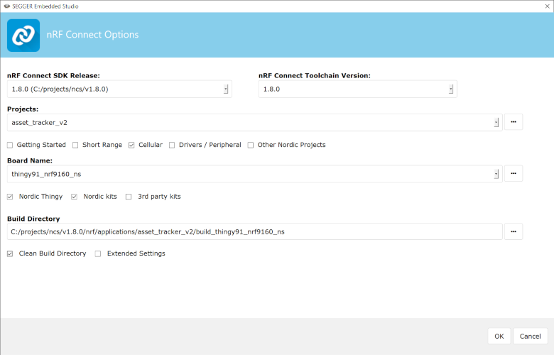

.. _ug_thingy91:

.. _thingy91_ug_intro:

Working with Thingy:91
######################

Nordic Thingy:91 is a battery-operated prototyping platform for cellular IoT systems, designed especially for asset tracking applications and environmental monitoring.

Thingy:91 integrates the following components:

* nRF9160 SiP - supporting LTE-M, NB-IoT, and Global Positioning System (GPS)
* nRF52840 SoC - supporting Bluetooth Low Energy and Near Field Communication (NFC)

You can find more information on the product in the `Thingy:91 product page`_ and in the `Nordic Thingy:91 User Guide`_.
The |NCS| provides support for developing applications on the Thingy:91.

Firmware
********

The firmware of Thingy:91 has been developed using the nRF Connect SDK.
It is open source, and can be modified according to specific needs.
The :ref:`asset_tracker` application firmware, which is pre-flashed in the Thingy:91, enables the device to use the environment sensors and provides an option of tracking the device using GPS.

The data, along with information about the device, is transmitted to Nordic Semiconductor's cloud solution, `nRF Cloud`_, where it can be visualized.
See :ref:`asset_tracker` for more information on the asset tracker application.

Operating modes
===============

Thingy:91 contains RGB indicator LEDs, which indicate the operating state of the device as described in :ref:`operating states of Thingy:91<thingy91_operating_states>`.

GPS
===

Thingy:91 has GPS, which, if activated, allows the device to be located globally using GPS signals.
To activate GPS, long-press the SW3 button.
See :ref:`Button SW3 on Thingy:91<asset_tracker_user_interface>` for information.

LTE Band Lock
=============

The modem within Thingy:91 can be configured to use specific LTE bands by using the band lock AT command.
See :ref:`nrf9160_ug_band_lock` and the `band lock section in the AT Commands reference document`_ for additional information.
The pre-flashed firmware configures the modem to use the bands currently certified on the Thingy:91 hardware.
When building the firmware, you can configure which bands should be enabled.

LTE-M / NB-IoT switching
========================

Thingy:91 has a multimode modem, which enables it to support automatic switching between LTE-M and NB-IoT.
A built-in parameter in the Thingy:91 firmware determines whether the modem first attempts to connect in LTE-M or NB-IoT mode.
If the modem fails to connect using this preferred mode within the default time-out period (10 minutes), the modem switches to the other mode.

Modem firmware
==============

The functionality of the multimode modem of Thingy:91 is based on its firmware, which is available as a precompiled binary.
You can download the modem firmware from the `Thingy:91 product website (downloads)`_.
The downloadable zip file contains both the full firmware images that can be programmed using an external debug probe and the firmware images that can be used for updating the firmware through the built-in bootloader.

.. _precompiled_fw:

Programming precompiled firmware images
****************************************

Precompiled firmware image files are useful in the following scenarios:

* Restoring the firmware to its initial image

* Updating the application firmware to a newly released version

* Updating the modem firmware

Downloading precompiled firmware images
========================================

To obtain precompiled firmware images for updating the firmware, perform the following steps:

	1. Go to the `Thingy:91 product page`_ and under the **Downloads** tab, navigate to **Precompiled firmware**.
	#. Download and extract the latest Thingy:91 firmware package.
	#. Check the :file:`CONTENTS.txt` file in the extracted folder for the location and names of the different firmware images.

.. _programming_usb:

Quick programming of precompiled firmware images
=================================================

When you have the precompiled firmware images ready, you can directly program the images onto the Thingy:91 using the `nRF Connect Programmer`_ app, which is available in `nRF Connect for Desktop`_.

In this method, the Thingy:91 is connected directly to your PC through USB.
This method makes use of the :doc:`mcuboot:index` feature and the inbuilt serial recovery mode of Thingy:91.
You can program either the nRF9160 SiP or the nRF52840 SoC component on the Thingy:91.

For the detailed procedures for programming a Thingy:91 using nRF Connect Programmer, see the following documentation:

* `Programming the nRF9160 SiP of Thingy:91 through USB`_
* `Programming the nRF52840 SoC of Thingy:91 through USB`_

Updating the modem firmware
===========================

You can update the modem firmware of Thingy:91 by using an external debug probe such as nRF9160 DK or any J-Link device supporting ARM Cortex-M33.
See `Updating the Thingy:91 modem`_ for the detailed steps to update the modem firmware.

.. _building_pgming:

Building and programming from the source code
*********************************************

You can also program the Thingy:91 by using the images obtained by building the code in an |NCS| environment.

To set up your system to be able to build a compatible firmware image, follow the :ref:`getting_started` guide for |NCS|.
The build targets of interest for Thingy:91 in |NCS| are as follows:

+---------------+--------------------------------------------------+
|Component      |  Build target                                    |
+===============+==================================================+
|nRF9160 SiP    |``nrf9160_pca20035`` for the secure version       |
|               |                                                  |
|               |``nrf9160_pca20035ns`` for the non-secure version |
+---------------+--------------------------------------------------+
|nRF52840 SoC   |``nrf52840_pca20035``                             |
+---------------+--------------------------------------------------+

You should use the build target ``nrf9160_pca20035`` or ``nrf9160_pca20035ns`` when building the application code for the nRF9160 SiP and the build target ``nrf52840_pca20035`` when building the application code for the onboard nRF52840 SoC.

.. note::

   LTE/GPS features can only be used with non-secure target.

The table below shows the different types of build files that are generated and the different scenarios in which they are used:

+--------------+----------------------------------------+--------------------------------------------------------------+
| File         | File format                            | Programming scenario                                         |
+==============+========================================+==============================================================+
|merged.hex    | Full image, HEX format                 | Using an external debug probe                                |
|              |                                        |                                                              |
|              |                                        | and nRF Connect Programmer                                   |
+--------------+----------------------------------------+--------------------------------------------------------------+
|app_signed.hex| MCUboot compatible image, HEX format   | Using the built-in bootloader                                |
|              |                                        |                                                              |
|              |                                        | and nRF Connect Programmer                                   |
+--------------+----------------------------------------+--------------------------------------------------------------+
|app_update.bin| MCUboot compatible image, binary format|* Using the built-in bootloader                               |
|              |                                        |                                                              |
|              |                                        |  and ``mcumgr`` command line tool                            |
|              |                                        |                                                              |
|              |                                        |* For FOTA updates                                            |
+--------------+----------------------------------------+--------------------------------------------------------------+

There are multiple methods of programming a sample or application onto a Thingy:91.
You can choose the method based on the availability or absence of an external debug probe to program.

.. note::

   If you do not have an external debug probe available to program the Thingy:91, you can directly program by :ref:`using the USB (MCUboot) method and nRF Connect Programmer<programming_usb>`.
   In this scenario, use the :file:`app_signed.hex` firmware image file.

.. _build_pgm_segger:

Building and programming using SEGGER Embedded Studio
=====================================================

.. include:: gs_programming.rst
   :start-after: build_SES_projimport_open_start
   :end-before: build_SES_projimport_open_end

   Opening the Asset tracker application for the nrf9160_pca20035ns build target

.. note::

   The *Board Directory* folder can be found in the following location: ``ncs/nrf/boards/arm``.

4. Click **OK** to import the project into SES.
   You can now work with the project in the IDE.

   .. include:: gs_programming.rst
      :start-after: build_SES_projimport_note_start
      :end-before: build_SES_projimport_note_end

#. To build the sample or application:

   a. Select your project in the Project Explorer.
   #. From the menu, select **Build -> Build Solution**.
      This builds the project.

   You can find the output of the build, which includes the merged HEX file containing both the application and the SPM, in the ``zephyr`` subfolder in the build directory.

.. prog_extdebugprobe_start

6. To program the sample or application:

   a. Set the Thingy:91 SWD selection switch (**SW2**) to **nRF91** or **nRF52** depending on whether you want to program the nRF9160 SiP or the nRF52840 SoC component.
   #. Connect the Thingy:91 to the debug out port on a 10-pin external debug probe, for example, nRF9160 DK (Development Kit), using a 10-pin JTAG cable.

      .. note::

         If you are using nRF9160 DK as the debug probe, make sure that **VDD_IO (SW11)** is set to 1.8 V on the nRF9160 DK.

   #. Connect the external debug probe to the PC using a USB cable.
   #. Make sure that the Thingy:91 and the external debug probe are powered on.

.. prog_extdebugprobe_end
..

   e. In SES, select **Target -> Connect J-Link**.
   #. Select **Target -> Download zephyr/merged.hex** to program the sample or application onto Thingy:91.
   #. The device will reset and run the programmed sample or application.

.. _build_pgm_cmdline:

Building and programming on the command line
============================================

Complete the :ref:`command-line build setup <build_environment_cli>` before you start building |NCS| projects on the command line.

To build and program the source code from the command line, complete the following steps:

1. Open a terminal window.
#. Go to the specific sample or application directory.
   For example, the folder path is ``ncs/nrf/applications/asset_tracker`` when building the source code for the :ref:`asset_tracker` application on the nRF9160 SiP component and ``ncs/nrf/samples/usb/usb_uart_bridge`` when building the source code for the :ref:`usb_uart_bridge_sample` sample on the nRF52840 SoC component.

#. Make sure that you have the required version of the |NCS| repository by pulling the |NCS| repository, `fw-nrfconnect-nrf`_ on GitHub using the procedures described in :ref:`dm-wf-get-ncs` and :ref:`dm-wf-update-ncs`.

#. To get the rest of the dependencies, run the ``west update`` command as follows:

   .. parsed-literal::
      :class: highlight

      west update

#. To build the sample or application code, run the ``west build`` command as follows:

   .. parsed-literal::
      :class: highlight

	  west build -b *board_name* -d *destination_directory_name*

   The parameter *board_name* should be ``nrf9160_pca20035`` or ``nrf9160_pca20035ns`` if building for the nRF9160 SiP component and ``nrf52840_pca20035`` if building for the nRF52840 SoC component.

   .. note::

	  The parameter *destination_directory_name* can be used to optionally specify the destination directory in the west command.
	  Unless a *destination_directory_name* is specified, the build files are automatically generated in ``build/zephyr/``.

.. include:: ug_thingy91.rst
   :start-after: prog_extdebugprobe_start
   :end-before: prog_extdebugprobe_end
..

   e. Program the sample or application to the device using the following command:

      .. code-block:: console

       west flash

   #. The device will reset and run the programmed sample or application.
