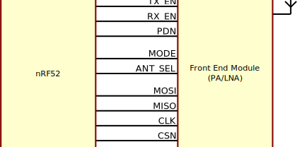
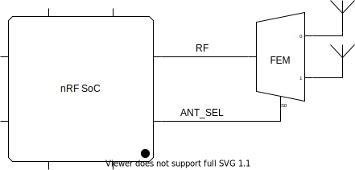

.. _ug_thread:

Working with Thread
###################

The |NCS| provides support for developing applications using the Thread protocol.

.. _thread_ug_intro:

Introduction
************

The |NCS|'s implementation is based on the OpenThread stack, which is integrated into Zephyr.
The integration with the stack and the radio driver is ensured by Zephyr's L2 layer, which acts as intermediary with Thread on the |NCS| side.

OpenThread is a portable and flexible open-source implementation of the Thread networking protocol, created by Nest in active collaboration with Nordic to accelerate the development of products for the connected home.

Among others, OpenThread has the following main advantages:

* A narrow platform abstraction layer that makes the OpenThread platform-agnostic.
* Small memory footprint.
* Support for system-on-chip (SoC), network co-processor (NCP) and radio co-processor (RCP) designs.
* Official Thread certification.

More information about Thread can be found at `OpenThread.io`_ and `Thread Group`_.

Stack architecture
==================

OpenThread's portable nature makes no assumptions about platform features.
OpenThread provides the hooks to use enhanced radio and crypto features, reducing system requirements, such as memory, code, and compute cycles.
This can be done per platform, while retaining the ability to default to a standard configuration.

.. figure:: images/ot-arch_2x.png
   :alt: OpenThread architecture

   OpenThread architecture

.. _thread_ug_supported features:

Supported features
******************

The OpenThread implementation of the Thread protocol supports all features defined in the Thread 1.1.1 specification.
This includes:

* All Thread networking layers:

    * IPv6
    * 6LoWPAN
    * IEEE 802.15.4 with MAC security
    * Mesh Link Establishment
    * Mesh Routing

* All device roles
* Border Router support

Required modules
****************

Thread requires the following Zephyr's modules to properly operate in |NCS|:

* :ref:`zephyr:ieee802154_interface` radio driver - This library is automatically enabled when working with OpenThread on Nordic Semiconductor's Development Kits.

  .. note::
        You can enable the FEM support in your samples.
        For details, see :ref:`thread_ug_radio_options`.

* :ref:`zephyr:settings_api` subsystem - This is required to allow Thread to store settings in the non-volatile memory.

Mandatory configuration
***********************

To use the Thread protocol in |NCS|, set the following Kconfig options:

* :option:`CONFIG_NET_L2_OPENTHREAD` - This option enables the OpenThread stack required for the correct operation of the Thread protocol and allows you to use them.
* :option:`CONFIG_CPLUSPLUS` - This option must be enabled, because OpenThread is implemented in C++.
* :option:`CONFIG_REBOOT` - This option is needed to ensure safe reboot.
* :option:`CONFIG_ENTROPY_GENERATOR` - Required by both OpenThread and radio driver.
* Options related to the Settings subsystem in the ``storage_partition`` partition of the internal flash:

    * :option:`CONFIG_SETTINGS`
    * :option:`CONFIG_FLASH`
    * :option:`CONFIG_FLASH_PAGE_LAYOUT`
    * :option:`CONFIG_FLASH_MAP`
    * :option:`CONFIG_MPU_ALLOW_FLASH_WRITE`
    * :option:`CONFIG_NVS`

* General setting options related to network configuration:

    * :option:`CONFIG_NETWORKING`
    * :option:`CONFIG_NET_UDP`
    * :option:`CONFIG_NET_SOCKETS`

IPv6 mandatory configuration
============================

The Thread protocol can only be used with IPv6.
IPv4 is not supported.

Enable the following options to make Thread work over IPv6:

* :option:`CONFIG_NET_IPV6`
* :option:`CONFIG_NET_CONFIG_NEED_IPV6`

Additionally, since Thread by default registers a considerable amount of IP addresses, the default IPv6 address count values must be increased.
Set the following options to the provided values:

* :option:`CONFIG_NET_IF_UNICAST_IPV6_ADDR_COUNT` to ``6``
* :option:`CONFIG_NET_IF_MCAST_IPV6_ADDR_COUNT` to ``8``

Optional configuration
**********************

Depending on your configuration needs, you can also set the following options:

* :option:`CONFIG_NET_SHELL` - This option enables Zephyr's :ref:`zephyr:shell_api` if you need to access OpenThread CLI.
* :option:`CONFIG_COAP` - This option enables Zephyr's :ref:`zephyr:coap_sock_interface` support.
* :option:`CONFIG_OPENTHREAD_COAP` - This option enables OpenThread's native CoAP API.

You can also change the default values for the following options:

* :option:`CONFIG_OPENTHREAD_CHANNEL` - By default set to ``11``.
  You can set any value ranging from ``11`` to ``26``.
* :option:`CONFIG_OPENTHREAD_PANID` - By default set to ``43981``.
  You can set any value ranging from ``0`` to ``65535``.

For other optional configuration options, see the following sections:

.. contents::
    :local:
    :depth: 2

Thread commissioning
====================

Thread commissioning is the process of adding new Thread devices to the network.
It involves two devices: a Commissioner that is already in the Thread network and a Joiner that wants to become a member of the network.

Configuring this process is optional, because the Thread :ref:`openthread_samples` in |NCS| use hardcoded network information.

If you want to manually enable the Thread network Commissioner role on a device, set the following Kconfig options to the provided values:

* :option:`CONFIG_OPENTHREAD_COMMISSIONER` to ``y``.
* :option:`CONFIG_MBEDTLS_HEAP_SIZE` to ``10240``.

To enable the Thread network Joiner role on a device, set the following Kconfig options to the provided values:

* :option:`CONFIG_OPENTHREAD_JOINER` to ``y``.
* :option:`CONFIG_MBEDTLS_HEAP_SIZE` to ``10240``.

The MBEDTLS heap size needs to be increased for both Commissioner and Joiner, because the joining process is memory-consuming and requires at least 10 KB of RAM.

You can also configure how the commissioning process is to be started:

* Automatically after Joiner's power up with the :option:`CONFIG_OPENTHREAD_JOINER_AUTOSTART` option, configured for the Joiner device.
* Started from the application.
* Triggered by Command Line Interface commands.
  In this case, the shell stack size must be increased to at least 3 KB by setting the following option:

  * :option:`CONFIG_SHELL_STACK_SIZE` to ``3072``.

For more details about the commissioning process, see `Thread Commissioning on OpenThread portal`_.

OpenThread stack logging options
================================

The OpenThread stack logging is handled with the following options:

* :option:`CONFIG_LOG` - This option enables Zephyr's :ref:`zephyr:logging_api`.
* :option:`CONFIG_OPENTHREAD_DEBUG` - This option enables logging for the OpenThread stack.

Both options must be enabled to allow logging.

This said, enabling logging is optional, because it is enabled by default for all Thread samples.
However, you must set one of the following logging levels to start receiving the logging output:

* :option:`CONFIG_OPENTHREAD_LOG_LEVEL_ERROR` - Enables logging only for errors.
* :option:`CONFIG_OPENTHREAD_LOG_LEVEL_WARNING` - Enables logging for errors and warnings.
* :option:`CONFIG_OPENTHREAD_LOG_LEVEL_INFO` - Enables logging for informational messages, errors, and warnings.
* :option:`CONFIG_OPENTHREAD_LOG_LEVEL_DEBUG` - Enables logging for debug messages, informational messages, errors, and warnings.

Zephyr L2 logging options
=========================

If you want to get logging output related to the Zephyr's L2 layer, enable one of the following Kconfig options:

* :option:`CONFIG_OPENTHREAD_L2_LOG_LEVEL_ERR` - Enables logging only for errors.
* :option:`CONFIG_OPENTHREAD_L2_LOG_LEVEL_WRN` - Enables logging for errors and warnings.
* :option:`CONFIG_OPENTHREAD_L2_LOG_LEVEL_INF` - Enables logging for informational messages, errors, and warnings.
* :option:`CONFIG_OPENTHREAD_L2_LOG_LEVEL_DBG` - Enables logging for debug messages, informational messages, errors, and warnings.

Choosing one of these options will enable writing the appropriate information in the L2 debug log.

Additionally, enabling :option:`CONFIG_OPENTHREAD_L2_LOG_LEVEL_DBG` allows you to set the :option:`CONFIG_OPENTHREAD_L2_DEBUG` option, which in turn has the following settings:

* :option:`CONFIG_OPENTHREAD_L2_DEBUG_DUMP_15_4`
* :option:`CONFIG_OPENTHREAD_L2_DEBUG_DUMP_IPV6`

These options enable dumping 802.15.4 or IPv6 frames (or both) in the debug log output.

You can disable writing to log with the :option:`CONFIG_OPENTHREAD_L2_LOG_LEVEL_OFF` option.

.. _thread_ug_device_type:

Switching device type
=====================

An OpenThread device can be configured to run as Full Thread Device (FTD) or Minimal Thread Device (MTD).
Both device types serve different roles in the Thread network.
An FTD can be both Router and End Device, while an MTD can only be an End Device.

You can configure the device type using the following Kconfig options:

* :option:`CONFIG_OPENTHREAD_FTD` - Enables the Full Thread Device (FTD) thread. This is the default configuration if none is selected.
* :option:`CONFIG_OPENTHREAD_MTD` - Enables the Minimal Thread Device (MTD) thread.

By default, when a Thread device is configured as MTD, it operates as Minimal End Device (MED).
You can choose to make it operate as Sleepy End Device (SED) by enabling the :option:`CONFIG_OPENTHREAD_MTD_SED` option.

For more information, see `Device Types on OpenThread portal`_.

.. _thread_ug_radio_options:

Radio antenna options
=====================

.. ug_thread_radio_start

The IEEE 802.15.4 radio driver module in |NCS| allows you to enable the following IEEE 802.15.4 antenna options:

.. contents::
    :local:
    :depth: 1

Wi-Fi coexistence
-----------------

A device that runs the IEEE 802.15.4 radio driver can be part of a compound device equipped with more than one radio module.
For example, it can feature both an 802.15.4 radio and a Wi-Fi module.

The radios of the device can use different modulation types, protocols, and overlapping frequency bands, which causes mutual operation disturbances.
To address this issue, a device that uses the 802.15.4 radio driver can cooperate with an external Packet Traffic Arbiter (PTA).
The PTA allows only one radio to transmit its packet at a time.

For details on the PTA and coexistence mechanisms, see the `802.15.2-2003 specification`_.

Each party that would like to transmit a frame makes a request for access to RF medium to the PTA, before it transmits a frame.
The PTA arbitrates between requests and grants access to the medium to the one of the requesting parties.
When a party actively receives a frame transmitted from elsewhere, it also requests access to the medium to increase the chance of proper reception, not interrupted by other parties that possibly cannot even detect the incoming signal.

   3-pin coexistence interface

The coexistence interface connects a 802.15.4 device with the PTA and consists of three lines: REQUEST, PRIORITY, and GRANT.

* REQUEST pin - This is the output of the 802.15.4 device and the input of the PTA.
  When this pin is active, the 802.15.4 device makes a request to the PTA for radio medium access.
  The active state of the pin is fixed to logic high.
  When the coexistence interface is disabled, this pin is driven low.
  Type of the output and the pin number to be used is configurable at compile time.
* PRIORITY pin - This is the output of the 802.15.4 device and the input of the PTA.
  The 802.15.4 device uses this pin to inform the PTA about the operation that it is performing.
  This pin is driven low for transmit operations.
  For receive operations, and when there is no 802.15.4 radio activity, this pin is driven high.
  When the coexistence interface is disabled, this pin is driven high.
  Type of the output and the pin number to be used is configurable at compile time.
* GRANT pin - This is the input of the 802.15.4 device and the output of the PTA.
  This pin is activated by the PTA when it grants access to the radio medium to the 802.15.4 device.
  The active state of the pin is fixed to low.
  The pin number to be used is configurable at compile time.

For more details about Wi-Fi coexistence, read the radio driver documentation.

Configuring Wi-Fi Coex support
~~~~~~~~~~~~~~~~~~~~~~~~~~~~~~

The Wi-Fi coexistence feature can be enabled using ``CONFIG_IEEE802154_NRF5_WIFI_COEX`` KConfig option.

By default, the Wi-Fi coexistence receive trigger is set to the energy detection mode.
In this mode, the radio driver makes a request to the PTA for radio medium access on the earliest sign of a frame being received over-the-air that is possible to detect by the device.

To select a different mode, use the following options:

* ``CONFIG_IEEE802154_NRF5_WIFI_COEX_RX_REQ_MODE_ED`` - Trigger on energy detection (default).
* ``CONFIG_IEEE802154_NRF5_WIFI_COEX_RX_REQ_MODE_PREAMBLE`` - Trigger on the preamble reception.
  In this mode, the 802.15.4 device makes a request to the PTA when synchronization header (SHR) and PHY header (PHR) fields of the frame are received.
* ``CONFIG_IEEE802154_NRF5_WIFI_COEX_RX_REQ_MODE_DESTINED`` - Trigger on the detection of a specific frame.
  In this mode, the 802.15.4 device makes a request to the PTA when addressing information contained in the PHY Service Data Unit (PSDU) is received and the 802.15.4 device is the recipient of the frame.
  Frames not destined to the device do not cause a request to the PTA.

The default behavior of the Wi-Fi coexistence feature is to trigger the request when the frame is passed for transmission by the next higher layer.

To select a different behavior, use the following options:

* ``CONFIG_IEEE802154_NRF5_WIFI_COEX_TX_REQ_MODE_FRAME_READY`` - Request transmission when the frame is ready (default).
* ``CONFIG_IEEE802154_NRF5_WIFI_COEX_TX_REQ_MODE_CCA_START`` - Request the transmission when the CCA phase starts.
* ``CONFIG_IEEE802154_NRF5_WIFI_COEX_TX_REQ_MODE_CCA_DONE`` - Request the transmission after the CCA phase has completed.

PA/LNA module (FEM support)
---------------------------

The PA/LNA module is part of |NCS|'s radio driver library.
The PA/LNA module increases the range of communication by providing APIs that act as interface for several types of external front-end modules (FEMs).
Inside the radio driver library, a three-pin FEM model support is included.

The FEMs are controlled by the enable signals that turn on a Power Amplifier (PA) or a Low Noise Amplifier (LNA).
The third signal disables the FEM during the radio inactivity, in order to save energy.

When the FEM is enabled, the radio driver toggles the three GPIO pins, based on the radio operation.
The configuration structure allows to choose the pin polarity, and time differences between the pin toggle and the intended radio operation.

   Interfacing PA/LNA with nRF52

Configuring FEM support
~~~~~~~~~~~~~~~~~~~~~~~

To enable the FEM support, set the ``CONFIG_IEEE802154_NRF5_FEM_PRESENT`` Kconfig option.

Configuring PA
    The PA feature can be turned on or off by setting the ``CONFIG_IEEE802154_NRF5_FEM_PA_PIN_CTRL_ENABLE`` Kconfig option.
    By default, if FEM is enabled, the PA feature is enabled.

    To configure the PA features, use the ``CONFIG_IEEE802154_NRF5_FEM_PA_TIME_IN_ADVANCE_US`` KConfig option.
    With this option, you can specify time in microseconds when the PA GPIO is activated before the radio is ready for transmission.
    If no value is specified, 13 us is used by default.

Configuring LNA
    To turn LNA on or off, use the ``CONFIG_IEEE802154_NRF5_FEM_LNA_PIN_CTRL_ENABLE`` Kconfig option.
    By default, if FEM is enabled, the LNA feature is enabled.

    To configure LNA feature, use the ``CONFIG_IEEE802154_NRF5_FEM_LNA_TIME_IN_ADVANCE_US`` Kconfig option.
    This option specifies time in microseconds when the LNA GPIO is activated before the radio is ready for reception.
    If no value is specified, 13 us is used by default.

Configuring Power Down
    The Power Down (PDN) requests can be turned on or off by setting CONFIG_IEEE802154_NRF5_FEM_PDN_PIN_CTRL_ENABLE. By default if FEM is enabled the PDN feature is enabled.
    To configure PDN feature following KConfig switches can be used:

    * CONFIG_IEEE802154_NRF5_FEM_PDN_SETTLE_US specifies time in microseconds between activating PDN and asserting RX_EN/TX_EN. If not specified 18us is used.
    * CONFIG_IEEE802154_NRF5_FEM_TRX_HOLD_US configures time between deasserting RX_EN/TX_EN and deactivating PDN. If not specified 5us is used.

.. note::
    The current implementation of the FEM support does not implement the SPI interface and does not change the transmission power or antenna after the initialization.

The following table shows the default pin mapping for the FEM signals:

+--------+----------+
| Signal | Pin      |
+========+==========+
| PA     | P0.22    |
+--------+----------+
| LNA    | P0.19    |
+--------+----------+
| PDN    | P0.23    |
+--------+----------+
| MODE   | P0.17    |
+--------+----------+
| MOSI   | P1.13    |
+--------+----------+
| MISO   | P1.14    |
+--------+----------+
| CLK    | P1.15    |
+--------+----------+
| CSN    | P1.21    |
+--------+----------+

If the connected FEM is nRF21540 and its SPI interface is connected with an nRF52 device, enable ``CONFIG_IEEE802154_NRF5_SPI`` to set the SPI interface to a known state that prevents unexpected data transfers.

When the FEM support is enabled and configured, there are additional peripheral requirements required by the radio driver's PA/LNA module for toggling the GPIO pins.
For these advanced configuration options, refer to the radio driver library documentation.

Antenna diversity
-----------------

The antenna diversity module allows the 802.15.4 radio device to select the appropriate antenna for transmission or reception, when the device is equipped with two antennas.
This can help improve the radio communication parameters in difficult radio environments.

Radio ANT pin is connected to those two antennas through FEM (Front End Module), which provides single pin to act as a binary switch, so that the antenna may be selected freely.

   Multiple antenna setup for antenna diversity module

There is a number of approaches that can be then used to switch the antenna to minimize the effect of phenomena that negatively impact radio communication.
In case of reception, the approach implemented by this module is based on RSSI measurements during the preamble of a received frame.

Moreover, an interface is provided for manual antenna selection, if other criteria for selecting the antenna are required.

Interface
    The antenna diversity module interfaces with FEM, which controls the antennas through a single pin used for antenna selection.
    The ANT pin of the chip should be connected to the RF interface of FEM.
    Such simple interface allows even for simple analog switch to act as FEM for antenna diversity.
    If FEM provides any other pins (for example, for enabling chip, configuration, or other operations), they are not handled by antenna diversity module.

Modes
    Antenna diversity module supports all radio operations, although different approach is used for reception-related (RX) operations than for transmission-related (TX) operations.
    This difference stems from the nature of the operations - the best antenna for RX operations can be determined on operation-to-operation basis, for example by measuring the RSSI.

    On the other hand, TX operations usually require knowing before which antenna is better for a given recipient (for example, based on previous operations), which is out of scope of radio driver and should be handled by a higher level module.

    For these reasons, the interface of antenna diversity is split into two parts, responsible for TX and RX operations, respectively.
    Each of them can be individually disabled or enabled, and the antenna manually selected.
    Additionally, RX operations support automatic mode, where optimal antenna is selected for each individual operation.

Configuring antenna diversity
~~~~~~~~~~~~~~~~~~~~~~~~~~~~~

The antenna diversity module is enabled by default for TX operations.

The antenna diversity RX operations can be configured into one of the following modes:

* ``CONFIG_IEEE802154_NRF5_ANT_DIVERSITY_MODE_DISABLED`` - RX operations are disabled (default).
* ``CONFIG_IEEE802154_NRF5_ANT_DIVERSITY_MODE_MANUAL`` - In this mode, the software is responsible for switching antennas for both RX and TX transmissions.
* ``CONFIG_IEEE802154_NRF5_ANT_DIVERSITY_MODE_AUTO`` - In the automatic mode, the radio driver will automatically select the best antenna for the RX transmission.
  It is still up for the software to select the proper antenna for TX transmissions.

Additionally, you can configure the following options:

* ``CONFIG_IEEE802154_NRF5_ANT_DIVERSITY_TOGGLE_TIME`` - Allows changing antenna switching time when waiting for the preamble detection in the auto mode.
  The default switching time is 13 us.

By default, the antenna diversity is assigned to the pin P0.20.

.. ug_thread_radio_end

Available drivers, libraries, and samples
*****************************************

See :ref:`openthread_samples` for the list of available Thread samples.

Available Thread tools
**********************

When working with Thread in |NCS|, you can use the following tools during Thread application development:

* `nRF Thread Topology Monitor`_ - This desktop application helps to visualize the current network topology.
* `nRF Sniffer for 802.15.4 based on nRF52840 with Wireshark`_ - Tool for analyzing network traffic during development.

Using Thread tools is optional.

----

Copyright disclaimer
    |Google_CCLicense|
