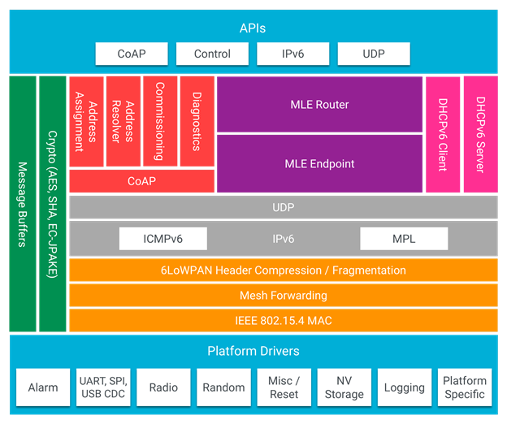

.. _ug_thread_architectures:

OpenThread architectures
########################

.. contents::
   :local:
   :depth: 2

This page describes the OpenThread stack architecture and platform designs that are possible with the OpenThread network stack on Nordic Semiconductor devices in |NCS|.

The designs are described from the least to the most complex, that is from simple applications that consist of a single chip running single or multiple protocols to scenarios in which the nRF SoC acts as a network co-processor when the application is running on a much more powerful host processor.

.. _openthread_stack_architecture:

OpenThread stack architecture
*****************************

OpenThread's portable nature makes no assumptions about platform features.
OpenThread provides the hooks to use enhanced radio and cryptography features, reducing system requirements, such as memory, code, and compute cycles.
This can be done per platform, while retaining the ability to default to a standard configuration.

   OpenThread architecture

.. _ug_thread_architectures_designs_soc_designs:

System-on-Chip designs
**********************

This single-chip solution has the combined RFIC (the IEEE 802.15.4 in case of Thread) and processor.
OpenThread and the application layer run on the local processor.

.. _thread_architectures_designs_soc_designs_single:

Single-chip, single protocol (SoC)
==================================

In this design, the application layer and OpenThread run on the same processor.
The application uses the OpenThread APIs and IPv6 stack directly.

This is the SoC design most commonly used for applications that do not make heavy computations or are battery-powered.

This design has the following advantages:

* Lowest cost.
* Lowest power consumption.
* Lowest complexity.

It also has the following disadvantages:

* For some use cases, the nRF52 Series and nRF53 Series MCUs can be too slow (for example, when the application does complex data processing).
* The application and the network share Flash and RAM space, which can limit the application functionality.
* Dual-bank DFU or an external flash is needed to update the firmware.

.. figure:: /images/thread_platform_design_soc.svg
   :alt: Thread-only architecture (nRF52)

   Thread-only architecture on nRF52 Series devices

.. figure:: /images/thread_platform_design_nRF53.svg
   :alt: Thread-only architecture (nRF53)

   Thread-only architecture on nRF53 Series devices

This platform design is suitable for the following development kits:

+--------------------------------+-----------+------------------------------------------------+-------------------------------+
|Hardware platforms              |PCA        |Board name                                      |Build target                   |
+================================+===========+================================================+===============================+
|:ref:`nRF52840 DK <ug_nrf52>`   |PCA10056   |:ref:`nrf52840dk_nrf52840 <nrf52840dk_nrf52840>`|``nrf52840dk_nrf52840``        |
+--------------------------------+-----------+------------------------------------------------+-------------------------------+
|:ref:`nRF52833 DK <ug_nrf52>`   |PCA10010   |:ref:`nrf52833dk_nrf52833 <nrf52833dk_nrf52833>`|``nrf52833dk_nrf52833``        |
+--------------------------------+-----------+------------------------------------------------+-------------------------------+
|:ref:`nRF5340 DK <ug_nrf5340>`  |PCA10095   |:ref:`nrf5340dk_nrf5340 <nrf5340dk_nrf5340>`    |``nrf5340dk_nrf5340_cpuapp``   |
|                                |           |                                                |                               |
|                                |           |                                                |``nrf5340dk_nrf5340_cpuappns`` |
+--------------------------------+-----------+------------------------------------------------+-------------------------------+
|nRF21540 DK                     |PCA10112   |:ref:`nrf21540dk_nrf52840 <nrf21540dk_nrf52840>`|``nrf21540dk_nrf52840``        |
+--------------------------------+-----------+------------------------------------------------+-------------------------------+

.. _thread_architectures_designs_soc_designs_multiprotocol:

Single-chip, multiprotocol (SoC)
================================

With nRF52 and nRF53 Series devices supporting multiple wireless technologies, including IEEE 802.15.4 and Bluetooth Low Energy (Bluetooth LE), the application layer and OpenThread still run on the same processor.

In this multiprotocol design, the SoC ensures either dynamic or switched Thread and Bluetooth LE connectivity.

This design has the following advantages:

* It leverages the benefits of highly integrated SoC, resulting in the lowest cost and the lowest power consumption.
* It allows to run Thread and Bluetooth LE simultaneously on a single chip, which reduces the overall BOM cost.

It also has the following disadvantages:

* Bluetooth LE activity can degrade the connectivity on Thread if not implemented with efficiency in mind.

.. figure:: /images/thread_platform_design_multi.svg
   :alt: Multiprotocol Thread and Bluetooth LE architecture (nRF52)

   Multiprotocol Thread and Bluetooth LE architecture on nRF52 Series devices

.. figure:: /images/thread_platform_design_nRF53_multi.svg
   :alt: Multiprotocol Thread and Bluetooth LE architecture (nRF53)

   Multiprotocol Thread and Bluetooth LE architecture on nRF53 Series devices

For more information about the multiprotocol feature, see :ref:`ug_multiprotocol_support`.

This platform design is suitable for the following development kits:

+--------------------------------+-----------+------------------------------------------------+-------------------------------+
|Hardware platforms              |PCA        |Board name                                      |Build target                   |
+================================+===========+================================================+===============================+
|:ref:`nRF52840 DK <ug_nrf52>`   |PCA10056   |:ref:`nrf52840dk_nrf52840 <nrf52840dk_nrf52840>`|``nrf52840dk_nrf52840``        |
+--------------------------------+-----------+------------------------------------------------+-------------------------------+
|:ref:`nRF52833 DK <ug_nrf52>`   |PCA10010   |:ref:`nrf52833dk_nrf52833 <nrf52833dk_nrf52833>`|``nrf52833dk_nrf52833``        |
+--------------------------------+-----------+------------------------------------------------+-------------------------------+
|:ref:`nRF5340 DK <ug_nrf5340>`  |PCA10095   |:ref:`nrf5340dk_nrf5340 <nrf5340dk_nrf5340>`    |``nrf5340dk_nrf5340_cpuapp``   |
|                                |           |                                                |                               |
|                                |           |                                                |``nrf5340dk_nrf5340_cpuappns`` |
+--------------------------------+-----------+------------------------------------------------+-------------------------------+

.. _thread_architectures_designs_cp:

Co-processor designs
********************

In the co-processor designs, with either network co-processor (NCP) or radio co-processor (RCP), the application layer runs on a host processor and communicates with OpenThread through a serial connection using a standardized host-controller protocol (Spinel).
OpenThread can run on either the radio or the host processor.

.. _thread_architectures_designs_cp_ncp:

Network Co-Processor (NCP)
==========================

The standard NCP design has Thread features on the SoC and runs the application layer on a host processor, which is typically more capable than the OpenThread device, although it has greater power demands.
The host processor communicates with the OpenThread device through a serial interface (typically UART or SPI) over the Spinel protocol.

This design is useful for gateway devices or devices that have other processing demands, like IP cameras and speakers.

This design has the following advantages:

* The higher-power host can sleep, while the lower-power OpenThread device remains active to maintain its place in the Thread network.
* Since the SoC is not tied to the application layer, development and testing of applications is independent of the OpenThread build.
* Only the network stack and a thin application reside on the NCP, which reduces the cost of the chip (RAM and Flash usage may be smaller than in an SoC solution with the application).
* It does not require the support for the dual-bank DFU.
  (Host can just replace the old image with a new one.)

It also has the following disadvantages:

* This is the most expensive option, since it requires the application processor.

.. figure:: /images/thread_platform_design_ncp.svg
   :alt: Network Co-Processor architecture

   Network Co-Processor architecture

.. note::
    |connection_options_limited|

This platform design is suitable for the following development kits:

+--------------------------------+-----------+------------------------------------------------+-------------------------------+
|Hardware platforms              |PCA        |Board name                                      |Build target                   |
+================================+===========+================================================+===============================+
|:ref:`nRF52840 DK <ug_nrf52>`   |PCA10056   |:ref:`nrf52840dk_nrf52840 <nrf52840dk_nrf52840>`|``nrf52840dk_nrf52840``        |
+--------------------------------+-----------+------------------------------------------------+-------------------------------+
|:ref:`nRF52833 DK <ug_nrf52>`   |PCA10010   |:ref:`nrf52833dk_nrf52833 <nrf52833dk_nrf52833>`|``nrf52833dk_nrf52833``        |
+--------------------------------+-----------+------------------------------------------------+-------------------------------+
|nRF21540 DK                     |PCA10112   |:ref:`nrf21540dk_nrf52840 <nrf21540dk_nrf52840>`|``nrf21540dk_nrf52840``        |
+--------------------------------+-----------+------------------------------------------------+-------------------------------+

.. _thread_architectures_designs_cp_rcp:

Radio Co-Processor (RCP)
========================

.. note::
    The RCP architecture is currently not supported in |NCS|.

This is a variant of the NCP design where the core of OpenThread lives on the host processor with only a minimal "controller" on the device with the Thread radio.
The host processor typically does not sleep in this design, in part to ensure reliability of the Thread network.

This design is useful for devices that are less sensitive to power constraints.
For example, the host processor on a video camera is always on to process video.

This design has the following advantages:

* OpenThread can use the resources on the more powerful processor.
* It enables the usage of a co-processor that is less capable in comparison with the NCP solution, which reduces the cost.

It also has the following disadvantages:

* The application processor must be woken up on each received frame, even in case a frame must be forwarded to the neighboring device.
* The RCP solution can be less responsive than NCP solution, due to the fact that each frame or command must be communicated over the serial link with the application processor (host).

.. figure:: /images/thread_platform_design_rcp.svg
   :alt: Radio Co-Processor architecture

   Radio Co-Processor architecture

.. note::
    |connection_options_limited|

.. _ug_thread_architectures_communication:

NCP/RCP communication details
=============================

The NCP/RCP transport architectures include a transmit (TX) buffer that stores all the data that are to be received by the host using the Spinel protocol.

.. _ug_thread_architectures_communication_priorities:

NCP/RCP prioritization
----------------------

Since the Spinel protocol does not enforce any prioritization for writing data, the OpenThread NCP and RCP architectures introduce a data prioritization of their own:

* High priority -- for data in the TX buffer that must be written, including data that must be written as fast as possible.
* Low priority -- for data in the TX buffer that can be delayed or can be dropped if a high priority message is awaiting to be written.

When the buffer is full, some of the low priority frames cannot be dropped and are delayed for later transmission.
This happens for example with the @ref thread_update_commands "Unsolicited update commands", where the low priority frames are themselves prioritized in the following order:

* Frames that can be delayed for later transmission ("delayable frames").
* Frames that cannot be delayed and are dropped when the TX buffer is full ("droppable frames").

.. _ug_thread_architectures_communication_rxtx:

Receiving and transmitting data
-------------------------------

The Spinel communication is based on commands and responses.
The host sends commands to NCP/RCP, and expects a response to each of them.

The commands and responses are tied together with the Transaction Identifier value (TID value) in the Spinel frame header.
Responses have a non-zero TID value, and OpenThread NCP/RCP always gives them high priority.

The pending responses that do not fit into the TX buffer are queued for later execution.
The queue is itself a buffer located above the TX buffer.
If it is full or contains any pending responses, sending of the delayable frames is postponed and all other low priority data is dropped.

Moreover, the Spinel allows sending unsolicited update commands from NCP to the host, as well as :ref:`sending logs <ug_thread_communication_logs>`.
See :ref:`ug_thread_architectures_communication_rxtx_tx` for details.

.. _ug_thread_architectures_communication_rxtx_rx:

Receiving data and RX data flows
~~~~~~~~~~~~~~~~~~~~~~~~~~~~~~~~

The section illustrates the RX data flows for UART and SPI for when the commands are received by NCP/RCP:

* Data RX flow for UART

  .. figure:: /images/thread_data_flow_rx_uart.svg
     :alt: Data RX flow for UART

     Data RX flow for UART

  In this flow:

  1. UART interface stores up to 6 bytes in the hardware FIFO.
  #. HDLC-encoded data is stored in the Driver receive buffer.
  #. HDLC data is decoded and stored in the NCP UART Driver receive buffer.
  #. Spinel commands are dispatched and handled by proper routines.

     * If a command requires a response, it will be added to the NCP response queue for later execution.

* Data RX flow for SPI

  .. figure:: /images/thread_data_flow_rx_spi.svg
     :alt: Data RX flow for SPI

     Data RX flow for SPI

  In this flow:

  1. SPI interface saves data into the NCP SPI RX buffer.
  #. NCP obtains pointer to the Spinel frame in the buffer and handles it.

     * If a command requires a response, it will be added to the NCP response queue for later execution.

.. _ug_thread_architectures_communication_rxtx_tx:

Transmitting data
~~~~~~~~~~~~~~~~~

NCP/RCP has the following process for sending responses:

1. After a command is received, the response ends up in the NCP/RCP Response Queue.
#. In the NCP/RCP Response Queue, the command is checked for the data required by the host.
#. NCP/RCP gathers the data and writes the response to the TX buffer by emptying the NCP/RCP Response Queue.

   * The process of writing the frames to the buffer is described in the :ref:`Writing to the buffer paragraph <ug_thread_writing_buffer>`.

#. NCP/RCP sends the response from the TX buffer to the host.

.. _ug_thread_update_commands:

Unsolicited update commands
~~~~~~~~~~~~~~~~~~~~~~~~~~~

The Spinel also allows sending unsolicited update commands from NCP to the host, for example when NCP or a node receives a IPv6 packet that must be forwarded to the host.

The unsolicited update commands have the following characteristics:

* They are written to the TX buffer.
* They are asynchronous.
* All have the TID value equal to zero.
* They have low priority.

The unsolicited update commands include both delayable and droppable frames (see :ref:`ug_thread_architectures_communication_priorities`), prioritized in the following order:

1. Delayable frames:

   1. MAC, IPv6 and UDP forwarding stream properties.
   #. Property value notification commands, including last status update.

#. Droppable frames:

   1. Debug stream for application.

      * This is a separate log for application that has a property ID field that allows the application to distinguish different debug streams.

   #. Log.

      * This is a log that can be used to report errors and debug information in the OpenThread stack and in Zephyr to the host :ref:`using Spinel <ug_thread_communication_logs>`.

.. _ug_thread_writing_buffer:

Writing to the buffer
~~~~~~~~~~~~~~~~~~~~~

The responses and unsolicited update commands are written to the buffer using the following process:

1. NCP/RCP attempts to empty the NCP/RCP Response Queue.
   If any response remains in the queue, it prevents the lower priority messages from being written to the buffer.

   * Network frames from the Thread stack are added to the queue and a reattempt is made later.
   * Property value notification commands are not sent and a reattempt is made later.
   * Log and debug stream frames are dropped.

#. NCP/RCP attempts to empty the OT Message Queue for pending MAC, IPv6, and UDP messages.
   The data from these pending messages is not directly copied into the NCP TX Buffer, but instead it is stored in the OT stack and associated with the Spinel frame.
   The data is copied just before transmission over UART/USB/SPI.
   This helps save the TX buffer space.
#. NCP/RCP attempts to send all pending property value notification commands.
#. If the buffer space is available and no responses are pending in the NCP/RCP Response Queue, NCP/RCP allows the logs and debug stream to be written to the TX buffer.

.. _ug_thread_architectures_communication_rxtx_tx-flows:

TX data flows
~~~~~~~~~~~~~

This section illustrates TX data flows for UART and SPI when sending responses and writing them to the TX buffer:

* Data TX flow for UART

  .. figure:: /images/thread_data_flow_tx_uart.svg
     :alt: Data TX flow for UART

     Data TX flow for UART

* Data TX flow for SPI

  .. figure:: /images/thread_data_flow_tx_spi.svg
     :alt: Data TX flow for SPI

     Data TX flow for SPI

.. _ug_thread_communication_logs:

Log messages and raw data through Spinel
~~~~~~~~~~~~~~~~~~~~~~~~~~~~~~~~~~~~~~~~

Although by default Spinel communication is based on commands and responses, logs from OpenThread and from Zephyr system can also be encoded and transmitted using Spinel.
This allows for using only one interface for frame and log transmission.

However, when using NCP with Zephyr, there is still a possibility that NCP will transmit raw data, without encoding it into Spinel frames.
This happens when some critical errors occur in Zephyr and the system wants to provide as much information about the failure as possible without using interrupts.
This exception applies mainly to log messages and is done by turning off UART interrupts and flushing everything from the TX buffer without encoding it.

----

|Google_CCLicense|
The source page is available `here <OpenThread system architecture_>`_.

.. |connection_options_limited| replace:: Spinel connections through SPI and USB are not currently available.
