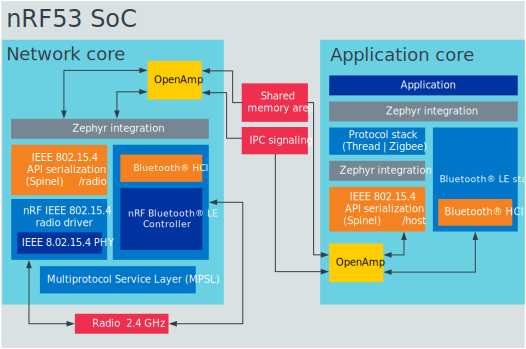

.. |multi_image| replace:: These samples are built for the application core and, by default, include the network core application as child image in a multi-image build (see :ref:`ug_nrf5340_multi_image`).

.. _ug_nrf5340:

Developing with nRF5340 DK
##########################

.. contents::
   :local:
   :depth: 2

The |NCS| provides support for developing on the nRF5340 System on Chip (SoC) using the nRF5340 DK (PCA10095).

See the `nRF5340 DK User Guide`_ for detailed information about the nRF5340 DK hardware.
To get started with the nRF5340 DK, follow the steps in :ref:`ug_nrf5340_gs`.
If you are not familiar with the |NCS| and the development environment, see the :ref:`introductory documentation <getting_started>`.

.. note::
   The nRF5340 PDK has been deprecated with the introduction of the production-level nRF5340 DK.
   To determine if you have a PDK or DK, check the version number on the sticker on your kit.
   If the version is 0.11.0 or higher, the kit is an nRF5340 DK.

   See the `nRF Connect SDK v1.4.0 documentation`_ for the last release supporting the nRF5340 PDK.

|nrf5340_audio_note|
Given its complexity, the application uses custom building and programming procedures.
Refer to its documentation for more information.

.. _ug_nrf5340_intro:

Introduction
************

nRF5340 is a wireless ultra-low-power multicore System on Chip (SoC) with two fully programmable Arm Cortex-M33 processors: a network core and an application core.

See the `nRF5340 Product Specification`_ for more information about the nRF5340 SoC.
:ref:`zephyr:nrf5340dk_nrf5340` gives an overview of the nRF5340 DK support in Zephyr.

.. _ug_nrf5340_intro_net_core:

Network core
============

The network core is an Arm Cortex-M33 processor with a reduced feature set, designed for ultra-low-power operation.
Use this core for radio communication and for real-time processing tasks involving low-level radio protocol layers.

The build target for the network core in Zephyr is ``nrf5340dk_nrf5340_cpunet``.

.. _ug_nrf5340_intro_app_core:

Application core
================

The application core is a full-featured Arm Cortex-M33 processor including DSP instructions and FPU.
Use this core for tasks that require high performance and for application-level logic.

The M33 TrustZone, one of Cortex-M Security Extensions (CMSE), divides the application MCU into Secure Processing Environment (SPE) and Non-Secure Processing Environment (NSPE).
When the MCU boots, it always starts executing from the secure area.

In Zephyr, the firmware of the application core is built using one of the following build targets:

* ``nrf5340dk_nrf5340_cpuapp`` for build targets with CMSE disabled.
* ``nrf5340dk_nrf5340_cpuapp_ns`` for build targets that have CMSE enabled and have the SPE firmware alongside the NSPE firmware.

For information about CMSE and the difference between the two environments, see :ref:`app_boards_spe_nspe`.

Trusted Firmware-M (TF-M)
-------------------------

Trusted Firmware-M provides a configurable set of software components to create a Trusted Execution Environment.
It has replaced Secure Partition Manager as the solution used by |NCS| applications and samples.
This means that when you build your application with CMSE enabled, the :ref:`TF-M <ug_tfm>` is automatically included in the build.
It is a framework for functions and use cases beyond the scope of Secure Partition Manager.

For more information about the TF-M, see :ref:`ug_tfm`.
See also :ref:`tfm_hello_world` for a sample that demonstrates how to add TF-M to an application.

.. _ug_nrf5340_intro_inter_core:

Inter-core communication
========================

Communication between the application core and the network core happens through a shared memory area.
The application core memory is mapped to the network core memory map.
This means that the network core can access and use the application core memory for shared memory communication.

Interprocessor Communication (IPC) is used to indicate to the other core that there is new data available to pick up.
The actual data exchange is handled by Open Asymmetric Multi-Processing (OpenAMP).

Zephyr includes the `OpenAMP`_ library, which provides a complete solution for exchanging messages between the cores.
The IPC peripheral is presented to Zephyr as an Interprocessor Mailbox (IPM) device.
The OpenAMP library uses the IPM SHIM layer, which in turn uses the IPC driver in `nrfx`_.

.. |note| replace:: The following instructions are for the application core.
   To upgrade the firmware on the network core, perform the steps for FOTA upgrade described below, replacing :file:`app_update.bin`, which is the file used when upgrading firmware on the application core, with :file:`net_core_app_update.bin`.
   In addition, ensure that :kconfig:option:`CONFIG_PCD_APP` is enabled for the MCUboot child image.
   For more details, see :ref:`nc_bootloader`.

.. _ug_nrf5340_intro_xip:

Execute in place (XIP) configuration
====================================

Execute in place (XIP) allows the application core to execute program code directly from the external flash memory device using the Quad Serial Peripheral Interface (QSPI).
The external flash memory supports on-the-fly encryption and decryption.
For more information, read the `Execute in place page in the nRF5340 Product Specification`_.

For placing individual source code files into defined memory regions, check the :ref:`zephyr:code_relocation_nocopy` sample in Zephyr.

.. _ug_nrf5340_intro_xip_measurements:

Indication of XIP performance
-----------------------------

The XIP code execution performance measurement was conducted to evaluate the expected performance in different operating conditions.

The :ref:`nrf_machine_learning_app` application running on the nRF5340 DK was used for the testing.
This particular application was used because its application design allows to move the Edge Impulse library to external memory.
There is only one call to the library from the wrapper module, and therefore this call is used to measure the time of execution.
Additional measurements of the current allowed to compare total energy used.

The following table lists performance numbers that were measured under different operating conditions.

.. note::
   The numbers in the table refer to current consumed only by the nRF5340 SoC.
   For complete numbers, you must add the current used by external flash, which varies between manufacturers.

.. _ug_nrf5340_intro_xip_measurements_table:

+-----------------+-----------------+--------+--------------+--------+-----------+--------------------+--------------------+--------------------------+--------------------------+
| CPU frequency   | Memory          | Cache  | QSPI speed   | Mode   | Time [ms] | Current @3.0V [mA] | Current @1.8V [mA] | Total energy @3.0V [µJ]  | Total energy @1.8V [µJ]  |
+=================+=================+========+==============+========+===========+====================+====================+==========================+==========================+
| 64 MHz          | Internal flash  | Yes    | n/a          | n/a    | 63        | 3.2                | 5.1                | 605                      | 578                      |
+-----------------+-----------------+--------+--------------+--------+-----------+--------------------+--------------------+--------------------------+--------------------------+
| 64 MHz          | External flash  | Yes    | 48 MHz       | Quad   | 68.9      | 5.63               | 8.51               | 1164                     | 1055                     |
+-----------------+-----------------+--------+--------------+--------+-----------+--------------------+--------------------+--------------------------+--------------------------+
| 64 MHz          | External flash  | Yes    | 24 MHz       | Quad   | 73.7      | 5.58               | 8.44               | 1234                     | 1120                     |
+-----------------+-----------------+--------+--------------+--------+-----------+--------------------+--------------------+--------------------------+--------------------------+
| 128 MHz         | Internal flash  | Yes    | n/a          | n/a    | 31        | 7.65               | 12.24              | 711                      | 683                      |
+-----------------+-----------------+--------+--------------+--------+-----------+--------------------+--------------------+--------------------------+--------------------------+
| 128 MHz         | External flash  | Yes    | 96 MHz       | Quad   | 34.1      | 8.99               | 14.1               | 920                      | 865                      |
+-----------------+-----------------+--------+--------------+--------+-----------+--------------------+--------------------+--------------------------+--------------------------+
| 128 MHz         | External flash  | No     | 96 MHz       | Quad   | 88.5      | 9.15               | 12.95              | 2429                     | 2063                     |
+-----------------+-----------------+--------+--------------+--------+-----------+--------------------+--------------------+--------------------------+--------------------------+
| 128 MHz         | External flash  | Yes    | 48 MHz       | Quad   | 36.4      | 8.85               | 13.9               | 966                      | 911                      |
+-----------------+-----------------+--------+--------------+--------+-----------+--------------------+--------------------+--------------------------+--------------------------+

Protocols and use cases
***********************

nRF5340 samples usually consist of two separate images: one that runs on the network core and one that runs on the application core.
For specific use cases, you can use only one of the cores.

The following sections describe the recommended architecture for using different protocols on the nRF5340 and list the provided samples.

Bluetooth Low Energy
====================

.. list-table::
   :header-rows: 1

   * - Network core
     - Application core
   * - :ref:`zephyr:bluetooth-hci-rpmsg-sample`
     - | :ref:`Bluetooth Low Energy samples <ble_samples>`
       | :ref:`Bluetooth samples in Zephyr <zephyr:bluetooth-samples>`
   * - :ref:`ble_rpc_host` (supported for development)
     - Some Bluetooth Low Energy samples, for example, :ref:`zephyr:bluetooth-beacon-sample`

When using Bluetooth® Low Energy on the nRF5340, you have two options:

* Split the Bluetooth LE Controller and the host part of the Bluetooth LE stack and run them on different cores.
* Run the full Bluetooth LE stack on the network core (currently supported for development only).

Split Controller and Host
-------------------------

When splitting the Bluetooth LE Controller and the Host, run the Bluetooth LE Controller on the network core and the host part of the Bluetooth LE stack and the application logic on the application core.

For the network core, the |NCS| provides the :ref:`zephyr:bluetooth-hci-rpmsg-sample` sample.
This Zephyr sample is designed specifically to enable the Bluetooth LE Controller functionality on a remote MCU using the `RPMsg Messaging Protocol`_ as a transport for Bluetooth HCI.
The sample implements the RPMsg transport using the `OpenAMP`_ library to communicate with a Bluetooth Host stack that runs on a separate core (in this case, the nRF5340 application core).

You can use either the SoftDevice Controller or the Zephyr Bluetooth LE Controller for this sample.
See :ref:`ug_ble_controller` for more information.

For the application core, the |NCS| provides a series of :ref:`Bluetooth Low Energy samples <ble_samples>`, in addition to the :ref:`Bluetooth samples in Zephyr <zephyr:bluetooth-samples>`.
|multi_image|

.. note::
   Most of the provided Bluetooth LE samples should run on the nRF5340 DK, but not all have been thoroughly tested.

Full Bluetooth LE stack
-----------------------

To run the full Bluetooth LE stack on the network core, the |NCS| provides the :ref:`ble_rpc_host` sample.

.. note::
   The :ref:`ble_rpc_host` sample is currently supported for development only.
   It does not support all Bluetooth Host APIs yet.

For the application core, use a compatible Bluetooth LE sample, for example, the :ref:`zephyr:bluetooth-beacon-sample` sample.

Bluetooth mesh
--------------

Bluetooth mesh operates on Bluetooth Low Energy (LE), and is implemented according to Bluetooth Mesh Profile Specification v1.0.1 and Bluetooth Mesh Model Specification v1.0.1.
For the application core, the |NCS| provides several Bluetooth mesh samples along with the :ref:`Bluetooth Low Energy samples <ble_samples>`.
In addition, you can find Bluetooth mesh samples with :ref:`Bluetooth samples in Zephyr <zephyr:bluetooth-samples>`.

IEEE 802.15.4 (Thread and Zigbee)
=================================

.. list-table::
   :header-rows: 1

   * - Network core
     - Application core
   * - :ref:`zephyr:nrf-ieee802154-rpmsg-sample`
     - | :ref:`Thread samples <openthread_samples>`
       | :ref:`Zigbee samples <zigbee_samples>`
       | :ref:`Matter samples <matter_samples>`

When using IEEE 802.15.4 on the nRF5340, run the IEEE 802.15.4 radio driver on the network core and the high-level radio stack (the host part of the Thread and Zigbee stacks) and the application logic on the application core.

.. figure:: images/ieee802154_nrf53_singleprot_design.svg
   :alt: IEEE 802.15.4 Protocol architecture in multicore SoC

   IEEE 802.15.4 Protocol architecture in multicore SoC

For the network core, the |NCS| provides the :ref:`zephyr:nrf-ieee802154-rpmsg-sample` sample.
This Zephyr sample is designed specifically to enable the nRF IEEE 802.15.4 radio driver and its serialization library on a remote MCU using the `RPMsg Messaging Protocol`_ as a transport for the nRF 802.15.4 radio driver serialization.
The sample implements the RPMsg transport using the `OpenAMP`_ library to communicate with the nRF IEEE 802.15.4 radio driver serialization host that runs on a separate core (in this case, the nRF5340 application core).

For the application core, the |NCS| provides a series of samples for the :ref:`Thread <ug_thread>`, :ref:`Zigbee <ug_zigbee>`, and :ref:`Matter <ug_matter>` protocols.
|multi_image|

Multiprotocol (Thread or Zigbee in combination with Bluetooth LE)
=================================================================

.. list-table::
   :header-rows: 1

   * - Network core
     - Application core
   * - :ref:`multiprotocol-rpmsg-sample`
     - | :ref:`Thread samples <openthread_samples>`
       | :ref:`Zigbee samples <zigbee_samples>`

nRF5340 supports running another protocol in parallel with the :ref:`nrfxlib:softdevice_controller`.
When using Thread or Zigbee in parallel with Bluetooth LE, run the low-level radio protocol layers (thus the IEEE 802.15.4 radio driver and the Bluetooth LE Controller) on the network core and the high-level radio stack (the host part of the Bluetooth LE, Thread, and Zigbee stacks) and the application logic on the application core.

   Bluetooth LE and IEEE 802.15.4 multiprotocol architecture in multicore SoC

For the network core, the |NCS| provides the :ref:`multiprotocol-rpmsg-sample` sample.
It is a combination of the :ref:`zephyr:bluetooth-hci-rpmsg-sample` sample (for Bluetooth LE) and the :ref:`zephyr:nrf-ieee802154-rpmsg-sample` sample (for IEEE 802.15.4).
This means that it enables both the Bluetooth LE Controller and the nRF IEEE 802.15.4 radio driver and simultaneously exposes the functionality of both stacks to the application core using the `RPMsg Messaging Protocol`_.
Separate RPMsg endpoints are used to obtain independent inter-core connections for each stack.

For the application core, the |NCS| provides a series of samples for the :ref:`Thread <ug_thread>` and :ref:`Zigbee <ug_zigbee>` protocols.
|multi_image|
See the :ref:`ug_multiprotocol_support` user guide for instructions on how to enable multiprotocol support for Thread or Zigbee in combination with Bluetooth.

Direct use of the radio peripheral
==================================

.. list-table::
   :header-rows: 1

   * - Network core
     - Application core
   * - | :ref:`direct_test_mode`
       | :ref:`radio_test`
       | :ref:`timeslot_sample`
     - :ref:`nrf5340_empty_app_core`

.. note::
   The above list might not be exhaustive.

Samples that directly use the radio peripheral can run on the network core of the nRF5340.
They do not require any functionality from the application core.

However, on nRF5340, the application core is responsible for starting the network core and connecting its GPIO pins (see :kconfig:option:`CONFIG_BOARD_ENABLE_CPUNET` and the code in :file:`zephyr/boards/arm/nrf5340dk_nrf5340/nrf5340_cpunet_reset.c`).
Therefore, you must always program the application core, even if the firmware is supposed to run only on the network core.

You can use the :ref:`nrf5340_empty_app_core` sample for this purpose.
Configure the network core application to automatically include this sample as a child image.
This is the default configuration for the listed network core samples.
For more information, see :kconfig:option:`CONFIG_NCS_SAMPLE_EMPTY_APP_CORE_CHILD_IMAGE` and :ref:`ug_nrf5340_multi_image`.

No radio communication
======================
.. list-table::
   :header-rows: 1

   * - Network core
     - Application core
   * - ---
     - | :ref:`NFC samples <nfc_samples>`
       | :ref:`Crypto samples <crypto_samples>`
       | :ref:`tfm_hello_world`
       | :ref:`lpuart_sample`

.. note::
   The above list might not be exhaustive.

Samples that do not need radio communication can run on the application core of the nRF5340.
They do not require any firmware on the network core.
Therefore, the network core can remain empty.

If you want to enable the network core anyway, set the :kconfig:option:`CONFIG_BOARD_ENABLE_CPUNET` option in the image for the application core.

.. _ug_nrf5340_multi_image:

Multi-image builds
*******************

If a sample consists of several images (in this case, different images for the application core and for the network core), you can build these images separately or combined as a :ref:`multi-image build <ug_multi_image>`, depending on the sample configuration.

In a multi-image build, the image for the application core is usually the parent image, and the image for the network core is treated as a child image in a separate domain.
For this to work, the network core image must be explicitly added as a child image to one of the application core images.
See :ref:`ug_multi_image_defining` for details.

.. note::
   When using the :ref:`nrf5340_empty_app_core` sample, the image hierarchy is inverted.
   In this case, the network core image is the parent image and the application core image is the child image.

Default build configuration
===========================

By default, the two images are built together for all Bluetooth LE, Thread, Zigbee, and Matter samples in the |NCS|.
Samples that are designed to run only on the network core include the :ref:`nrf5340_empty_app_core` sample as a child image.
For other samples, the images are built separately.

The build configuration depends on the following Kconfig options that must be set in the configuration of the parent image:

* :kconfig:option:`CONFIG_BT_RPMSG` - set to ``y`` in all Bluetooth LE samples for the application core
* :kconfig:option:`CONFIG_NRF_802154_SER_HOST` - set to ``y`` in all Thread, Zigbee, and Matter samples for the application core
* :kconfig:option:`CONFIG_NCS_SAMPLE_EMPTY_APP_CORE_CHILD_IMAGE` - set to ``y`` in all network core samples that require the :ref:`nrf5340_empty_app_core` sample

The combination of these options determines which (if any) sample is included in the build of the parent image:

.. list-table::
   :header-rows: 1

   * - Enabled options
     - Child image sample for the network core
     - Child image sample for the application core
   * - :kconfig:option:`CONFIG_BT_RPMSG`
     - :ref:`zephyr:bluetooth-hci-rpmsg-sample`
     - ---
   * - :kconfig:option:`CONFIG_NRF_802154_SER_HOST`
     - :ref:`zephyr:nrf-ieee802154-rpmsg-sample`
     - ---
   * - :kconfig:option:`CONFIG_BT_RPMSG` and :kconfig:option:`CONFIG_NRF_802154_SER_HOST`
     - :ref:`multiprotocol-rpmsg-sample`
     - ---
   * - :kconfig:option:`CONFIG_NCS_SAMPLE_EMPTY_APP_CORE_CHILD_IMAGE`
     - ---
     - :ref:`nrf5340_empty_app_core`

Configuration of the child image
================================

When a network sample is built automatically as a child image in a multi-image build, you can define the relevant Kconfig options (if required) in a :file:`.conf` file.
Name the file :file:`network_sample*\ .conf`, where *network_sample* is the name of the child image (for example, :file:`hci_rpmsg.conf`).
Place the file in a :file:`child_image` subfolder of the application sample directory.
See :ref:`ug_multi_image_variables` for more information.

This way of defining the Kconfig options allows to align the configurations of both images.

For example, see the :ref:`ble_throughput` child image configuration in :file:`nrf/samples/bluetooth/throughput/child_image/hci_rpmsg.conf`.

.. _ug_nrf5340_building:

Building and programming a sample
*********************************

Depending on the sample, you must program only the application core (for example, when using NFC samples) or both the network and the application core.

The steps differ depending on whether you work with |VSC| or on the command line and whether you are doing a single or multi-image build.

Using |VSC|
===========

You can build and program separate images or combined images using the |nRFVSC|.

Separate images
---------------

To build and program the application core, follow the instructions in `How to build an application`_ and use ``nrf5340dk_nrf5340_cpuapp`` or ``nrf5340dk_nrf5340_cpuapp_ns`` as the build target.

To build and program the network core, follow the instructions in `How to build an application`_ and use ``nrf5340dk_nrf5340_cpunet`` as the build target.

.. _ug_nrf5340_VSC_multi_image:

Multi-image build
-----------------

If you are working with Bluetooth LE, Thread, Zigbee, or Matter samples, the network core sample is built as a child image when you build the application core image (see :ref:`ug_nrf5340_multi_image` above).

Complete the following steps to build and program a multi-image build to the nRF5340 application core and network core:

.. |sample_path_vsc| replace:: :file:`nrf/samples/bluetooth/peripheral_lbs`

.. |vsc_sample_board_target_line| replace:: select ``nrf5340dk_nrf5340_cpuapp`` or ``nrf5340dk_nrf5340_cpuapp_ns`` as the target board

.. include:: ../../includes/vsc_build_and_run.txt

#. Program the sample or application:

   a. Connect the nRF5340 development kit to your PC using a USB cable.
   #. Make sure that the nRF5340 DK and the external debug probe are powered on.
   #. Click :guilabel:`Build` in the :guilabel:`Actions View` to start the build process.
   #. Click :guilabel:`Flash` in the :guilabel:`Actions View` to program the resulting image to your device.

Using the command line
======================

To build nRF5340 samples from the command line, use :ref:`west <zephyr:west>`.
To program the nRF5340 DK from the command line, use either west or nrfjprog (which is part of the `nRF Command Line Tools`_).

.. note::
   Programming the nRF5340 DK from the command line (with west or nrfjprog) requires the `nRF Command Line Tools`_ v10.12.0 or later.

Separate images
---------------

To build and program the application sample and the network sample as separate images, follow the instructions in :ref:`gs_programming_cmd` for each of the samples.

See the following instructions for programming the images separately:

.. tabs::

   .. group-tab:: west

      1. Open a command prompt in the build folder of the network sample and enter the following command to erase the flash memory of the network core and program the network sample::

           west flash --erase

      2. Navigate to the build folder of the application sample and enter the same command to erase the flash memory of the application core and program the application sample::

           west flash --erase

   .. group-tab:: nrfjprog

      1. Open a command prompt in the build folder of the network sample and enter the following command to erase the flash memory of the network core and program the network sample::

           nrfjprog -f NRF53 --coprocessor CP_NETWORK --program zephyr/zephyr.hex --chiperase

         .. note::
            If you cannot locate the build folder of the network sample, look for a folder with one of these names inside the build folder of the application sample:

            * :file:`rpc_host`
            * :file:`hci_rpsmg`
            * :file:`802154_rpmsg`
            * :file:`multiprotocol_rpmsg`

      2. Navigate to the build folder of the application sample and enter the following command to erase the flash memory of the application core and program the application sample::

           nrfjprog -f NRF53 --program zephyr/zephyr.hex --chiperase

      3. Reset the development kit::

           nrfjprog --pinreset

See :ref:`readback_protection_error` if you encounter an error.

Multi-image build
-----------------

To build and program a multi-image HEX file, follow the instructions in :ref:`gs_programming_cmd` for the application core sample.

To program the multi-image HEX file, you must use west.
Programming multi-image builds for different cores is not yet supported in nrfjprog.

.. _readback_protection_error:

Readback protection
-------------------

When programming the device, you might get an error similar to the following message::

    ERROR: The operation attempted is unavailable due to readback protection in
    ERROR: your device. Please use --recover to unlock the device.

This error occurs when readback protection is enabled.
To disable the readback protection, you must *recover* your device.
See the following instructions.

.. tabs::

   .. group-tab:: west

      Enter the following command to recover both cores::

        west flash --recover

   .. group-tab:: nrfjprog

      Enter the following commands to recover first the network core and then the application core::

        nrfjprog --recover --coprocessor CP_NETWORK
        nrfjprog --recover

      .. note::
         Make sure to recover the network core before you recover the application core.

         The ``--recover`` command erases the flash memory and then writes a small binary into the recovered flash memory.
         This binary prevents the readback protection from enabling itself again after a pin reset or power cycle.

         Recovering the network core erases the flash memory of both cores.
         Recovering the application core erases only the flash memory of the application core.
         Therefore, you must recover the network core first.
         Otherwise, if you recover the application core first and the network core last, the binary written to the application core is deleted and readback protection is enabled again after a reset.

.. include:: ../nrf52/developing.rst
   :start-after: fota_upgrades_intro_start
   :end-before: fota_upgrades_intro_end

.. include:: ../nrf52/developing.rst
   :start-after: fota_upgrades_over_ble_intro_start
   :end-before: fota_upgrades_over_ble_intro_end

.. include:: ../nrf52/developing.rst
   :start-after: fota_upgrades_over_ble_mandatory_mcuboot_start
   :end-before: fota_upgrades_over_ble_mandatory_mcuboot_end

Bluetooth buffers configuration introduced by the :kconfig:option:`CONFIG_NCS_SAMPLE_MCUMGR_BT_OTA_DFU_SPEEDUP` Kconfig option is also automatically applied to the network core child image by the dedicated overlay file.

.. include:: ../nrf52/developing.rst
   :start-after: fota_upgrades_over_ble_additional_information_start
   :end-before: fota_upgrades_over_ble_additional_information_end

.. include:: ../nrf52/developing.rst
   :start-after: fota_upgrades_outro_start
   :end-before: fota_upgrades_outro_end

.. include:: ../nrf52/developing.rst
   :start-after: fota_upgrades_bt_mesh_start
   :end-before: fota_upgrades_bt_mesh_end

.. note::
   Point-to-point DFU over Bluetooth Low Energy is supported by default, out-of-the-box, for all samples and applications compatible with :ref:`zephyr:thingy53_nrf5340`.
   See :ref:`thingy53_app_update` for more information about updating firmware image on :ref:`zephyr:thingy53_nrf5340`.

.. include:: ../nrf52/developing.rst
   :start-after: fota_upgrades_matter_start
   :end-before: fota_upgrades_matter_end

.. include:: ../nrf52/developing.rst
   :start-after: fota_upgrades_thread_start
   :end-before: fota_upgrades_thread_end

.. include:: ../nrf52/developing.rst
   :start-after: fota_upgrades_zigbee_start
   :end-before: fota_upgrades_zigbee_end

.. _ug_nrf5340_multi_image_dfu:

Simultaneous multi-image DFU
****************************

The simultaneous update of multiple images is available for testing since |NCS| v1.7.0.
It allows the updating of both the application core and the network core in one go.

To enable the simultaneous update of multiple images in the MCUboot, set the following options:

* :kconfig:option:`CONFIG_BOOT_UPGRADE_ONLY` - The simultaneous update of multiple images does not support network core image reversion, so you need to disable application image reversion.
* :kconfig:option:`CONFIG_PCD_APP` - Enable commands exchange with the network core.
* :kconfig:option:`CONFIG_UPDATEABLE_IMAGE_NUMBER` - Enable support for multiple update partitions by setting this option to ``2``.

.. note::

   The application core can be reverted, but doing so bricks the network core upon revertion, as the reversion process fills the network core with the content currently in the RAM that pcd uses.
   To enable this, define the ``USE_NRF53_MULTI_IMAGE_WITHOUT_UPGRADE_ONLY`` Kconfig option in the project-level Kconfig file.
   When this is option is defined, you can enable it by setting :kconfig:option`CONFIG_USE_NRF53_MULTI_IMAGE_WITHOUT_UPGRADE_ONLY`.

The :kconfig:option:`CONFIG_NRF53_MULTI_IMAGE_UPDATE` option selects this feature by default if these options and all its other dependencies are asserted.

To enable the simultaneous update of multiple images in the application, in addition to enabling the MCUboot support, set the following options:

* :kconfig:option:`CONFIG_UPDATEABLE_IMAGE_NUMBER` - Enable support for multiple update partitions by setting this option to ``2``.

Additionally, the memory partitions must be defined and include:

* ``mcuboot_primary`` and ``mcuboot_secondary`` partitions for the application core image slots.
* ``mcuboot_primary_1`` and ``mcuboot_secondary_1`` partitions for the network core image slots.
* ``pcd_sram`` partition used for command exchange between the application core and the network core (see :kconfig:option:`CONFIG_PCD_APP`).

.. note::

   The application core does not have direct access to the network core flash memory.
   The update image is passed indirectly using RAM.
   Because of this, the ``mcuboot_primary_1`` must be stored in ``ram_flash`` region.
   To enable providing such region on the device, see :kconfig:option:`CONFIG_FLASH_SIMULATOR`.

Samples and applications built for Thingy:53 enable simultaneous update of multiple images by default.
To learn more about Thingy:53, see :ref:`ug_thingy53`.

MCUboot's serial recovery of the networking core image
******************************************************

In addition to the recovery of the application core image, also the networking core image can be recovered.
When you build MCUboot for the nRF5340 DK or the Thingy:53, you can use this feature with one of the following options:

* :kconfig:option:`CONFIG_NRF53_MULTI_IMAGE_UPDATE` - Simultaneous multi-image DFU.
* :kconfig:option:`CONFIG_NRF53_RECOVERY_NETWORK_CORE` - Serial recovery for the network core in the one image pair mode, where :kconfig:option:`CONFIG_UPDATEABLE_IMAGE_NUMBER` is set to ``== 1``.

To upload the networking image, use the following command::

     ./mcumgr image upload <build_dir_path>/zephyr/net_core_app_update.bin -e -n 3 -c serial_conn

``serial_conn`` is the serial connection configuration.
For more information on MCUmgr image management, see :ref:`zephyr:image_mgmt`

To enable the serial recovery of the network core while the multi-image update is not enabled in the MCUboot, set the following options:

* select :kconfig:option:`CONFIG_BOOT_IMAGE_ACCESS_HOOK`
* select :kconfig:option:`CONFIG_FLASH_SIMULATOR`
* select :kconfig:option:`CONFIG_FLASH_SIMULATOR_DOUBLE_WRITES`
* disable :kconfig:option:`CONFIG_FLASH_SIMULATOR_STATS`
* select :kconfig:option:`CONFIG_MCUBOOT_SERIAL_DIRECT_IMAGE_UPLOAD`
* select :kconfig:option:`CONFIG_NRF53_RECOVERY_NETWORK_CORE`

Additionally, define and include the following memory partitions:

* ``mcuboot_primary`` and ``mcuboot_secondary`` - Partitions for the application core image slots.
* ``mcuboot_primary_1`` - Partition for the network core image slot.
* ``pcd_sram`` - Partition used for command exchange between the application core and the network core (see :kconfig:option:`CONFIG_PCD_APP`).

.. note::
   When using MCUboot with the :kconfig:option:`CONFIG_NRF53_RECOVERY_NETWORK_CORE` option enabled, the application core does not have direct access to the network core flash memory.
   Due to this, ``mcuboot_primary_1`` must be used as the RAM partition mediator.

Container for firmware update binaries
======================================

The build system will automatically place both the application core and the network core update binaries (:file:`app_update.bin` and :file:`net_core_app_update.bin`) into a container package named :file:`dfu_application.zip`.
This container package can be used by update tools to pass both images during the simultaneous update of multiple images.

.. _debugging:

Debugging
*********

See :ref:`gs_debugging` for information about how to debug your application.

.. _logging_cpunet:

Getting logging output
**********************

When connected to a computer, the nRF5340 DK emulates virtual COM ports.
The number of COM ports depends on the DK version you are using.

nRF5340 DK v2.0.0 COM ports
===========================

When connected to a computer, the nRF5340 DK v2.0.0 emulates two virtual COM ports.
In the default configuration, they are set up as follows:

* The first COM port outputs the log from the network core (if available).
* The second COM port outputs the log from the application core.

nRF5340 DK v1.0.0 COM ports
===========================

When connected to a computer, the nRF5340 DK v1.0.0 emulates three virtual COM ports.
In the default configuration, they are set up as follows:

* The first COM port outputs the log from the network core (if available).
* The second (middle) COM port is routed to the **P24** connector of the nRF5340 DK.
* The third (last) COM port outputs the log from the application core.

To use the middle COM port in the nRF5340 DK v1.0.0, complete the following steps:

1. Map RX, TX, CTS and RTS pins to four different pins on the development kit, using, for example, :ref:`devicetree overlays<zephyr:devicetree-intro>`.
   See the following example, using the :ref:`zephyr:dtbinding_nordic_nrf_uarte` bindings.

   .. code-block:: devicetree

      &pinctrl {
         uart0_default_alt: uart0_default_alt {
            group1 {
               psels = <NRF_PSEL(UART_TX, 0, 20)>,
                       <NRF_PSEL(UART_RX, 0, 21)>,
                       <NRF_PSEL(UART_RTS, 0, 18)>,
                       <NRF_PSEL(UART_CTS, 0, 16)>;
            };
         };

         uart0_sleep_alt: uart0_sleep_alt {
            group1 {
               psels = <NRF_PSEL(UART_TX, 0, 20)>,
                       <NRF_PSEL(UART_RX, 0, 21)>,
                       <NRF_PSEL(UART_RTS, 0, 18)>,
                       <NRF_PSEL(UART_CTS, 0, 16)>;
               low-power-enable;
            };
         };
      };

      &uart0 {
         status = "okay";
         compatible = "nordic,nrf-uarte";
         current-speed = <115200>;
         pinctrl-0 = <&uart0_default_alt>;
         pinctrl-1 = <&uart0_sleep_alt>;
         pinctrl-names = "default", "sleep";
      };

#. Wire the previously mapped pins to **TxD**, **RxD**, **CTS**, and **RTS** on the **P24** connector.
