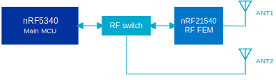

.. _ug_thingy53:

Developing with Thingy:53
#########################

.. contents::
   :local:
   :depth: 2

The Nordic Thingy:53 is a battery-operated prototyping platform for IoT Systems.

The Nordic Thingy:53 integrates the nRF5340 SoC that supports Bluetooth® Low Energy, IEEE 802.15.4 based protocols and Near Field Communication (NFC).
The nRF5340 is augmented with the nRF21540 RF FEM (Front-end Module) Range extender that has an integrated power amplifier (PA)/low-noise amplifier (LNA) and nPM1100 Power Management IC (PMIC) that has an integrated dual-mode buck regulator and battery charger.

You can find more information on the `Nordic Thingy:53`_ product page and in the `Nordic Thingy:53 Hardware`_ documentation.
The :ref:`nRF Connect SDK <index>` provides support for developing applications on the Nordic Thingy:53.

.. _thingy53_serialports:

Connecting to Thingy:53
***********************

Applications and samples for the Nordic Thingy:53 use a serial terminal to provide logs.
By default, the serial terminal is accessible through the USB CDC ACM class handled by application firmware.
The serial port is visible right after the Thingy:53 is connected to the host using a USB cable.
The CDC ACM baudrate is ignored, and transfer goes with USB speed.

.. note::
   Some of the samples and applications compatible with Thingy:53 may provide multiple instances of USB CDC ACM class.
   In that case, the first instance is used to provide logs, and the others are used for application-specific usages.

.. _thingy53_building_pgming:

Building and programming from the source code
*********************************************

You can program the Nordic Thingy:53 by using the images obtained by building the code in the |NCS| environment.

To set up your system to be able to build a compatible firmware image, follow the :ref:`getting_started` guide for the |NCS|.

.. _thingy53_build_pgm_targets:

Build targets
=============

The build targets of interest for Thingy:53 in the |NCS| are listed in the following table:

+--------------------------------+----------------------------------------------------------------------------------------------------------------------------------+
|Component                       |  Build target                                                                                                                    |
+================================+==================================================================================================================================+
| nRF5340 SoC - Application core |``thingy53_nrf5340_cpuapp`` for :ref:`Cortex-M Security Extensions (CMSE) disabled <app_boards_spe_nspe_cpuapp>`                  |
|                                |                                                                                                                                  |
|                                |``thingy53_nrf5340_cpuapp_ns`` for :ref:`CMSE enabled <app_boards_spe_nspe_cpuapp_ns>`                                            |
+--------------------------------+----------------------------------------------------------------------------------------------------------------------------------+
| nRF5340 SoC - Network core     |``thingy53_nrf5340_cpunet``                                                                                                       |
+--------------------------------+----------------------------------------------------------------------------------------------------------------------------------+

.. note::
   The |NCS| samples and applications that are compatible with the Nordic Thingy:53 follow the :ref:`thingy53_app_guide`.
   The application guide defines a consistent partition map and bootloader configuration to allow serial and OTA firmware updates.

The |NCS| by default uses :ref:`ug_multi_image` for Thingy:53.
Because of this, when you choose ``thingy53_nrf5340_cpuapp`` or ``thingy53_nrf5340_cpuapp_ns`` as the build target when building a sample or application that is compatible with Thingy:53, you will generate firmware for both the application core and network core:

* The application core firmware consists of MCUboot bootloader and an application image.
* The network core firmware consists of network core bootloader (B0n) and application firmware of the network core.

The build process generates firmware in two formats:

* Intel Hex file (:file:`merged_domains.hex`) - Used with an external debug probe.
  The file contains bootloaders and applications for both cores.
* Binary files (:file:`app_update.bin`, :file:`net_core_app_update.bin`), containing signed application firmwares for the application and network core, respectively.
  For convenience, the binary files are bundled in :file:`dfu_application.zip`, together with a manifest that describes them.
  You can use the binary files or the combined zip archive to update application firmware for both cores, with either MCUboot serial recovery or OTA DFU using Bluetooth LE.

For more information about files generated as output of the build process, see :ref:`app_build_output_files`.

See the following sections for details regarding building and programming the firmware for Thingy:53 in various environments.
If your Thingy:53 is already programmed with a Thingy:53-compatible sample or application, you can also use the MCUboot bootloader to update the firmware after you finish building.
See :ref:`thingy53_app_update` for more detailed information about updating firmware on Thingy:53.

.. _thingy53_build_pgm_vscode:

Building and programming using |VSC|
====================================

|vsc_extension_instructions|

Complete the following steps after installing the |nRFVSC|:

.. |sample_path_vsc| replace:: :file:`nrf/samples/bluetooth/peripheral_lbs`

.. |vsc_sample_board_target_line| replace:: select ``thingy53_nrf5340_cpuapp`` as the target board

.. include:: ../../includes/vsc_build_and_run.txt

#. Program the sample or application:

   a. Connect the Nordic Thingy:53 to the debug out port on a 10-pin external debug probe, for example nRF5340 DK, using a 10-pin JTAG cable.
   #. Connect the external debug probe to the PC using a USB cable.
   #. Make sure that the Thingy:53 and the external debug probe are powered on.
   #. Click :guilabel:`Flash` in the :guilabel:`Actions View`.

.. _thingy53_build_pgm_command_line:

Building and programming on the command line
============================================

You must :ref:`build_environment_cli` before you start building an |NCS| project on the command line.

To build and program the source code from the command line, complete the following steps:

1. Open a command line or terminal window.
#. Go to the specific directory for the sample or application.

   For example, the directory path is :file:`ncs/nrf/applications/machine_learning` when building the source code for the :ref:`nrf_machine_learning_app` application.

#. Make sure that you have the required version of the |NCS| repository by pulling the ``sdk-nrf`` repository on GitHub as described in :ref:`dm-wf-get-ncs` and :ref:`dm-wf-update-ncs` sections.
#. Get the rest of the dependencies using west::

      west update

#. Build the sample or application code as follows:

   .. parsed-literal::
      :class: highlight

      west build -b *build_target* -d *destination_directory_name*

   The build target should be ``thingy53_nrf5340_cpuapp`` or ``thingy53_nrf5340_cpuapp_ns`` when building samples for the application core and ``thingy53_nrf5340_cpunet`` when building for the network core.

#. Program the sample or application:

   a. Connect the Nordic Thingy:53 to the debug out port on a 10-pin external debug probe, for example nRF5340 DK, using a 10-pin JTAG cable.
   #. Connect the external debug probe to the PC using a USB cable.
   #. Make sure that the Nordic Thingy:53 and the external debug probe are powered on.
   #. Use the following command to program the sample or application to the device::

         west flash

   The device resets and runs the programmed sample or application.

.. _thingy53_app_update:

Updating firmware image
=======================

You can program the firmware on the Nordic Thingy:53 using an external debug probe and 10-pin JTAG cable, as described in :ref:`thingy53_building_pgming`, using either :ref:`Visual Studio Code <thingy53_build_pgm_vscode>` or :ref:`command line <thingy53_build_pgm_command_line>`.
You can also update applications running on both the network and application core using the built-in MCUboot bootloader and `nRF Connect Programmer`_ or the `nRF Programmer`_ app for Android and iOS.
You can also update the prebuilt application images that way.

See :ref:`thingy53_gs_updating_firmware` for details about updating firmware image.

.. _thingy53_app_update_debug:

Firmware update using external debug probe
------------------------------------------

If you are using an external debug probe, such as the nRF5340 DK, or any J-Link device supporting ARM Cortex-M33, you do not have to use applications that follow the :ref:`thingy53_app_guide`.
In that case, you can program the Thingy:53 in a similar way as nRF5340 DK.
See :ref:`ug_nrf5340` for details.

.. note::
   You need to program a sample or application compatible with the Nordic :ref:`thingy53_app_guide` to bring back serial recovery and DFU OTA.

.. _thingy53_app_update_mcuboot:

Firmware update using MCUboot bootloader
----------------------------------------

The Thingy:53-compatible samples and applications include the MCUboot bootloader that you can use to update firmware.
This method uses signed binary files :file:`app_update.bin` and :file:`net_core_app_update.bin` (or :file:`dfu_application.zip`).
You can program the precompiled firmware image using one of the following ways:

* Use the :doc:`mcuboot:index-ncs` feature and the built-in serial recovery mode of Thingy:53.
  In this scenario Thingy is connected directly to your PC through USB.
* Update the firmware over-the-air (OTA) using Bluetooth LE and the nRF Programmer mobile application for Android or iOS.
  To use this method, the application that is currently programmed on Thingy:53 must support it.
  All precompiled images support OTA using Bluetooth.

See :ref:`thingy53_gs_updating_firmware` for the detailed procedures on how to program a Thingy:53 using `nRF Connect Programmer`_ or the nRF Programmer for Android or iOS.

.. _thingy53_app_guide:

Thingy:53 application guide
***************************

The Nordic Thingy:53 does not have a built-in J-Link debug IC.
Because of that, the samples and applications that are compatible with the Nordic Thingy:53 by default include the MCUboot bootloader with serial recovery support.
You can update applications compatible with the Nordic Thingy:53 using the DFU functionality with either `nRF Connect Programmer`_ or the `nRF Programmer`_ mobile application.

Enabling DFU and MCUboot requires consistency in configuration of the samples and applications.
For a sample or application to be compatible with Thingy:53, the application must comply with the configurations described in the following sections.

.. note::
   To use your application with the Nordic Thingy:53 preprogrammed bootloader, you must only set the proper configuration for the Partition Manager and MCUboot.
   Configurations that enable the other features are not mandatory, but you can enable them if needed.

   All applications compatible with the Nordic Thingy:53 in the |NCS| also support the additional features.
   Refer to the source code of the samples and applications for examples of implementation.

.. _thingy53_app_partition_manager_config:

Partition manager configuration
===============================

The samples compatible with the Nordic Thingy:53 use :ref:`partition_manager` to define memory partitions.
The memory layout must stay consistent, so that MCUboot can perform proper image updates and clean up the settings storage partition.
To ensure that partition layout does not change between builds, the sample must use a static partition layout that is consistent between all compatible samples in the |NCS|.
The memory partitions are defined in the :file:`pm_static_thingy53_nrf5340_cpuapp.yml` and :file:`pm_static_thingy53_nrf5340_cpuapp_ns.yml` files in the :file:`zephyr/boards/arm/thingy53_nrf5340` directory.

The PCD SRAM partition is locked by the MCUboot bootloader to prevent the application from modifying the network core firmware.
Trying to access data on this partition results in an ARM fault.

The MCUboot bootloader needs a flash controller overlay for the network core image update.
The overlay is applied automatically.

.. _thingy53_app_mcuboot_bootloader:

MCUboot bootloader
==================

Each sample must enable the MCUboot bootloader and use the same configuration of the bootloader as all of the Nordic Thingy:53-compatible samples in the |NCS|.
This ensures that the sample includes the MCUboot bootloader and that an MCUboot-compatible image is generated when the sample is built.
When using |NCS| to build the MCUboot bootloader for the Thingy:53, the configuration is applied automatically from the MCUboot repository.

The MCUboot bootloader supports serial recovery and a custom command to erase the settings storage partition.
Erasing the settings partition is needed to ensure that an application is not booted with incompatible content loaded from the settings partition.

Use the following Kconfig options to enable the MCUboot bootloader:

* :kconfig:option:`CONFIG_BOOTLOADER_MCUBOOT`
* :kconfig:option:`CONFIG_IMG_MANAGER`
* :kconfig:option:`CONFIG_MCUBOOT_IMG_MANAGER`
* :kconfig:option:`CONFIG_IMG_ERASE_PROGRESSIVELY`

In addition, set the :kconfig:option:`CONFIG_UPDATEABLE_IMAGE_NUMBER` option to ``2`` and set an image version, such as ``"1.0.0+0"``, using the :kconfig:option:`CONFIG_MCUBOOT_IMAGE_VERSION` Kconfig option.

See :file:`thingy53_nrf5340_cpuapp.conf` in a compatible sample for how this is done.

.. _thingy53_app_usb:

USB
===

An application compatible with the Nordic Thingy:53 is expected to enable USB CDC ACM as backend for logging.
The logs are provided using USB CDC ACM to allow accessing them without additional hardware.

Most of the applications and samples compatible with the Nordic Thingy:53 use only a single instance of USB CDC ACM that works as the logger's backend.
No other USB classes are used.
These samples can share a common USB product name, vendor ID, and product ID.
If a sample supports additional USB classes or more than one instance of USB CDC ACM, it must use a dedicated product name, vendor ID, and product ID.

To enable the USB device stack and the CDC ACM class:

* Use the options :kconfig:option:`CONFIG_USB_DEVICE_STACK` and :kconfig:option:`CONFIG_USB_CDC_ACM`.
* Set the default log level with the :kconfig:option:`CONFIG_USB_CDC_ACM_LOG_LEVEL_ERR` and :kconfig:option:`CONFIG_USB_DEVICE_LOG_LEVEL_ERR` Kconfig options.
* Enable the UART log backend with the :kconfig:option:`CONFIG_LOG_BACKEND_UART` Kconfig option and disable SEGGER RTT with both the :kconfig:option:`CONFIG_LOG_BACKEND_RTT` and :kconfig:option:`CONFIG_USE_SEGGER_RTT` Kconfig options.

See :file:`thingy53_nrf5340_cpuapp.conf` in a compatible sample for how this is done.

In addition, you have to call the :c:func:`usb_enable` function from your application to initialize the USB stack.

See the :file:`thingy53.c` source file in a compatible sample for how this is done.

.. _thingy53_app_antenna:

Antenna selection
=================

The Nordic Thingy:53 has an RF front-end with two 2.4 GHz antennas:

* **ANT1** is connected to the nRF5340 through the nRF21540 RF FEM and supports TX gain of up to +20 dBm.
* **ANT2** is connected to the nRF5340 through the RF switch and supports TX output power of up to +3 dBm.

   Nordic Thingy:53 - Antenna connections

The samples in the |NCS| that are compatible with the Nordic Thingy:53 use **ANT1** by default, with the nRF21540 gain set to +10 dBm.
You can configure the TX gain with the :kconfig:option:`CONFIG_MPSL_FEM_NRF21540_TX_GAIN_DB` Kconfig option to select between +10 dBm or +20 dBm gain.
To use the **ANT2** antenna, disable the :kconfig:option:`CONFIG_MPSL_FEM` Kconfig option in the network core's child image configuration.

.. note::
   Transmitting with TX output power above +10 dBM is not permitted in some regions.
   See the `Nordic Thingy:53 Regulatory notices`_ in the `Nordic Thingy:53 Hardware`_ documentation for the applicable regulations in your region before changing the configuration.

.. _thingy53_app_fota_smp:

FOTA and SMP
============

FOTA updates on the Nordic Thingy:53 are supported using MCUmanager's Simple Management Protocol (SMP) over Bluetooth.
The application acts as a GATT server and allows the connected Bluetooth Central to perform the firmware update for both the application and network core.
The Bluetooth configuration is updated to allow quick DFU data transfer.

The application supports SMP handlers related to:

* Image management.
* Operating System (OS) management -- used to reboot the device after the firmware upload is complete.
* Erasing settings partition -- used to ensure that a new application is not booted with incompatible content in the settings partition written by the previous application.

To enable the MCUmanager library and handling of SMP commands over Bluetooth, use the options :kconfig:option:`CONFIG_MCUMGR` and :kconfig:option:`CONFIG_MCUMGR_SMP_BT`.
Also, disable encryption and authentication requirement for the Bluetooth SMP transport using :kconfig:option:`CONFIG_MCUMGR_SMP_BT_AUTHEN`.

You need to enable the MCUmanager handlers for image and OS management.
Use the options :kconfig:option:`CONFIG_MCUMGR_CMD_IMG_MGMT` and :kconfig:option:`CONFIG_MCUMGR_CMD_OS_MGMT`.

You also have to enable the MCUmanager processing of basic Zephyr group commands and storage erase commands.
Use the options :kconfig:option:`CONFIG_MCUMGR_GRP_ZEPHYR_BASIC` and :kconfig:option:`CONFIG_MCUMGR_GRP_BASIC_CMD_STORAGE_ERASE`.

See :file:`thing53_nrf5340_cpuapp.conf` in a compatible sample for how this is done.

In addition, the application must call the functions :c:func:`os_mgmt_register_group` and :c:func:`img_mgmt_register_group` to register the image and OS management command handlers.
The application must also call :c:func:`smp_bt_register` to register the SMP Bluetooth Service.

See the :file:`thingy53.c` source file in a compatible sample for how this is done.

.. _thingy53_app_external_flash:

External flash
==============

During a FOTA update, there might not be enough space available in internal flash storage to store the existing application and network core images as well as the incoming images, so the incoming images must be stored in external flash storage.
This means that a sample compatible with the Nordic Thingy:53 must enable the external flash using the QSPI driver.
Enable the option :kconfig:option:`CONFIG_NORDIC_QSPI_NOR`, and set :kconfig:option:`CONFIG_NORDIC_QSPI_NOR_FLASH_LAYOUT_PAGE_SIZE` to ``4096`` and :kconfig:option:`CONFIG_NORDIC_QSPI_NOR_STACK_WRITE_BUFFER_SIZE` to ``16``.
See :file:`thingy53_nrf5340_cpuapp.conf` in a compatible sample for how this is done.

.. _thingy53_compatible_applications:

Samples and applications compatible with Thingy:53
==================================================

The following samples and applications in the |NCS| are already compatible with Thingy:53:

* Applications:

  * :ref:`matter_weather_station_app`
  * :ref:`zigbee_weather_station_app`
  * :ref:`nrf_machine_learning_app`

* Samples:

  * :ref:`peripheral_lbs`
  * :ref:`peripheral_uart`
  * :ref:`bluetooth_mesh_light`
  * :ref:`bluetooth_mesh_light_lc`
  * :ref:`bluetooth_mesh_light_switch`
  * :ref:`bluetooth_mesh_sensor_server`
