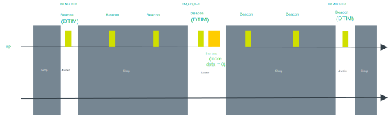
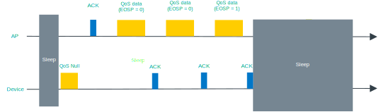

.. _ug_nrf70_developing_powersave:

Operating in power save modes
#############################

.. contents::
   :local:
   :depth: 2

The nRF70 Series device supports multiple power save modes, enabling the device to minimize power consumption by shutting down most of the digital logic and RF circuits.

.. _ug_nrf70_developing_powersave_device_states:

nRF70 Series device states
**************************

The power save state of the nRF70 Series device is described through a combination of the physical Power state of the logic or circuits and the logical Functional state as observed by the access point (AP).

Power state
===========

The nRF70 Series device can operate in either of the following two power states:

* **Active:** The device is **ON** constantly so that it can receive and transmit the data.
* **Sleep:** The device is **OFF** to majority of the blocks that can not receive and transmit the data.
  In this state, the device consumes low power (~15 µA).

Functional state
================

The state information of the device at the access point database can be either Active or Power Save.
The device is in the Active state after the connection to a network.

The state change information must be given to an access point by a successful frame exchange.
The nRF70 Series device can operate in either of the following two functional states:

* **Active:** The device is in the Active state permanently.
  If the data exists, the access point can schedule transmission of the data to the device immediately.
* **Power Save (PS):** The device is in the Sleep state most of the time, but can also be woken up to transmit and receive data.
  In this state, the access point buffers the required frames intended for the device.
  The device can make a transition between the Active and Sleep states according to the IEEE 802.11 power save protocol.

.. _ug_nrf70_developing_powersave_power_save_mode:

Power Save mode
***************

The nRF70 Series device can operate in Active mode or Power Save mode.
When the device changes from Active mode to Power Save mode, it informs the access point through a successful frame exchange.

Once the frame exchange completes, the access point buffers all the frames (multicast and broadcast) that are addressed to the device.
The device wakes up to receive buffered traffic for every Delivery Traffic Indication Message (DTIM) beacon and goes back to the Sleep state for the remaining period.

The following Power Save modes are supported and can be configured by the user or application:

* **Permanent Active:** The device is in the Active mode.
  The power consumption is high, but the performance is best in this mode.
* **Static Power Save:** The device is in the Power Save mode.
  This mode saves the most power but provides the lowest throughput.
  This mode is not supported in the current release.
* **Dynamic Power Save:** The device switches between Active and Power Save mode depending on the activity.
  It enters the Power Save mode due to inactivity (timer expiry) and returns to the Active mode due to application traffic.
  nRF70 Series devices operate in this mode by default.
  The user or application can change the device to the Permanent Active mode using the ``NET_REQUEST_WIFI_PS`` network management API.

.. _ug_nrf70_developing_powersave_dtim:

Delivery Traffic Indication Message (DTIM)
******************************************

Wi-Fi interface can be configured in either Delivery Traffic Indication Message or Target Wake Time (TWT) power save modes.
DTIM is the default configuration and enabled by the application based on the traffic profile.
TWT can be enabled if the connected access point is Wi-Fi 6 capable.

Devices in DTIM Power Save mode can wake at any time to transmit uplink traffic, but can only receive downlink traffic (broadcast, multicast or unicast) immediately after receiving a DTIM beacon.
To make the device in Power Save mode aware that the access point has buffered downlink traffic, the access point uses the Traffic Indication Map (TIM) element present in the beacon frames.
The device in Power Save mode wakes up to receive the DTIM beacon and checks the status of the TIM element.
This element indicates whether there are any buffered group frames or unicast frames that need to be retrieved from the access point.

.. _ug_nrf70_developing_powersave_dtim_group:

Group frames
============

Group addressed frames are directed to all connected devices.
When there is at least one device in PS mode in the Basic Service Set (BSS), the access point buffers the broadcast and multicast traffic and transmits at specific time to ensure that all associated devices can receive it.

The buffered group traffic is delivered immediately after a DTIM beacon.
The following figure illustrates the group frame data retrieval mechanism in DTIM Power Save mode:

   Group frames

.. _ug_nrf70_developing_powersave_dtim_unicast:

Unicast frames
==============

Unicast frames are directed to an intended device.
When a device in the PS mode parses a TIM element indicating any individually addressed buffered frames, retrieving the buffered frames depends on the IEEE power save operation modes.

Legacy Power Save mode
----------------------

The Legacy PS mode mechanism is based on the PS-Poll frame retrieving the buffered frames from the AP.
The PS-Poll frame is a short Control Frame containing the Association Identifier (AID) value of the device.
In the Legacy PS mode, when the device receives a beacon with its AID in the TIM element, it initiates the frame delivery by transmitting a PS-POLL control frame to the AP.
The AP acknowledges the PS-Poll frame and responds with a single buffered frame.

The device stays active and retrieves the buffered frame.
The AP also indicates that there are buffered frames for the device using the **More Data** subfield.
The device continues to retrieve buffered frames using PS-Poll frames until there are no more frames and the **More Data** subfield is set to ``0``.
The device goes back into the Sleep state after retrieving all the buffered frames.

The following figure illustrates the unicast frame data retrieval mechanism in Legacy Power Save mode:

.. figure:: images/nRF70_ug_legacy_power_save.svg
   :alt: Legacy Power Save mode

   Legacy Power Save mode

Wireless Multimedia (WMM) Power Save mode
-----------------------------------------

The Wireless Multimedia Power Save mode uses the Automatic Power Save Delivery (APSD) mechanism to retrieve the individual unicast-buffered traffic.
A device in the PS mode starts the Service Period (SP) by sending a trigger frame that is a QoS Data/QoS Null frame.

When the device receives a beacon with its AID in the TIM element, it initiates the SP by transmitting the trigger frame to the AP.
The AP sends one or more individually addressed buffered frames to the device.
The device remains active until the AP ends the SP by setting the End Of Service Period (EOSP) bit to ``1`` in the **QoS Control** field of the last QoS Data frame sent to the device.

The following figure illustrates the unicast frame data retrieval mechanism in WMM Power Save mode:

   WMM Power Save mode

Legacy Power Save mode is the default option in nRF70 Series devices.
The user or application can configure the WMM mode using the ``NET_REQUEST_WIFI_PS_MODE`` network management API.
The WMM mode does not deliver a significant performance or power difference when compared to Legacy mode in Dynamic Power Save operation.

The average power consumption of the device is affected by the DTIM period.
The typical value is three beacons, for example, 307 ms for a beacon period of 100-time units.
The higher DTIM period results in increased power saving and higher latency to the application data.

.. _ug_nrf70_developing_powersave_twt:

Target Wake Time (TWT)
**********************

Target Wake Time is a new feature in Wi-Fi 6.
It allows an access point and devices to wake up at the negotiated times.
The access point and devices reach a TWT agreement that defines when a station is active and ready to receive and transmit data.

TWT mechanism allows each device to negotiate its period with the AP to transmit and receive data packets.
Stations will be active only at TWT Service Period and remain in the sleep state for the rest of the time.

.. note::
   The device is not expected to be active for a DTIM beacon that does not receive any buffered broadcast or multicast frames.
   Applications are expected to keep note of this and set up TWT sessions based on their traffic profile.

An access point has more control over the network in TWT mode and decides which device is going to transmit and when.
The AP decides how many and which Resource Units (RU) are to be used (an RU is a contiguous set of subcarriers).
TWT offers more efficient scheduling of transmissions.

Devices can remain in the sleep state even longer, if required.
Before Wi-Fi 6, a device would sleep for a DTIM period, wake up, exchange data, and then return to the sleep state for another DTIM period, repeating continuously.
With the introduction of TWT in Wi-Fi 6, a device can sleep for seconds, minutes, or even hours.
Some devices can be configured to communicate once a day to perform a transmission and sleep for the rest of the day.

The figure below illustrates the initiation of two independent TWT sessions.
The TWT session commences with a trigger frame from the AP at a time determined during the TWT establishment frame exchange (TWT1 and TWT2 for devices 1 and 2 respectively).

   TWT wakeup sequence

Modes of operation in TWT mode
==============================

When the device is in the TWT mode, the following are the two modes of operation:

* **Individual:** The device can choose when to wake up and sleep.
  It can negotiate an agreement with the AP to wake up for receiving or transmitting the data.
* **Broadcast:** The AP provides the schedule to all devices that support broadcast TWT.
  This mode is not supported in the current release.

Here is an example of a typical sequence of states in a TWT use case:

1. Scan the network.
#. Connect to an access point.
#. Complete the application-level handshake.
#. Set up a TWT session using the following Wi-Fi shell command:

   .. code-block:: console

      wifi twt setup

#. Tear down the TWT session.

   * An application can tear down an ongoing TWT session and enter DTIM Power Save mode, if it is expecting group addressed frames, and set up a TWT session again as applicable.
   * Devices are not expected to schedule transmission outside the TWT Service Period.
     An application can tear down an ongoing TWT session and schedule, if there is a requirement for immediate transmission.
   * To tear down a TWT session, use the following Wi-Fi shell commands:

     .. code-block:: console

        wifi twt teardown
        wifi twt teardown_all

Key parameters
==============

Following are the two key parameters of Target Wake Time:

* **TWT Wake Duration**

  * The minimum amount of time that the TWT requesting device needs to be active to complete the frame exchanges during the TWT wake interval.
  * Valid range for duration is 1 ms to 256 ms.
  * The application must choose the right duration based on the traffic pattern.

* **TWT Wake Interval**

  * Interval between successive TWT wake periods.
  * Valid range for duration is one ms to a few days.
  * The application must choose the right interval based on the traffic in receive direction.

The following figure illustrates the two key parameters of Target Wake Time:

.. figure:: images/nRF70_ug_twt_wake_interval.svg
   :alt: TWT Wake Duration and Interval

   TWT Wake Duration and Interval

.. _ug_nrf70_developing_powersave_usage:

Usage
*****

DTIM-based power save is the default configuration of the device after connection to an access point.
The wake-up and sleep period of the device is aligned to DTIM period advertised in the AP beacon.
The access point is in control of DTIM period and can be configured while setting up the network.

A higher DTIM period provides higher power saving in devices, but it adds latency to the download traffic.
The latency of the DTIM period is seen in the device for the initial downlink traffic.
A device can wake up and schedule uplink traffic at any time and latency of a few milliseconds is observed.

When operating in DTIM Power Save mode, the nRF70 Series device:

* wakes up to receive DTIM beacons and decode TIM.
* receives all broadcast or multicast frames after DTIM beacon.
* retrieves all unicast frames using either PS-POLL or Trigger frames.
* maintains the Wi-Fi connection by responding to the keep alive packet exchange at any point of time.

TWT-based power save allows devices to sleep for longer intervals than the DTIM power save.
It is suitable for the devices that have low levels of periodic uplink traffic.
As the device sleeps longer and does not wake up to receive DTIM beacons, it misses all multicast or broadcast frames.
The TWT session is expected to be set up by the application after the network level negotiation, after which it is not expected to receive any multicast or broadcast frames.

.. _ug_nrf70_developing_powersave_api:

Power Save API
**************

The following shell commands and network management APIs are provided for power save operations:

.. list-table:: Wi-Fi Power Save network management APIs
   :header-rows: 1

   * - Network management APIs
     - Command
     - Description
     - Expected output
   * - net_mgmt(NET_REQUEST_WIFI_PS)
     - wifi ps on
     - Turn on power save feature
     - Power Save enabled
   * - net_mgmt(NET_REQUEST_WIFI_PS)
     - wifi ps off
     - Turn off power save feature
     - Power Save disabled
   * - net_mgmt(NET_REQUEST_WIFI_PS_MODE)
     - wifi ps_mode legacy
     - Config mode as Legacy
     -
   * - net_mgmt(NET_REQUEST_WIFI_PS_MODE)
     - wifi ps_mode wmm
     - Config mode as WMM
     -
   * - net_mgmt(NET_REQUEST_WIFI_TWT)
     - wifi twt setup 0 0 1 1 0 1 1 1 65 524
     - | Set up TWT:
       | TWT interval - 524 ms
       | TWT wake interval - 65 ms
     - TWT operation TWT setup with dg - 1, flow_id - 1 requested
   * - net_mgmt(NET_REQUEST_WIFI_TWT)
     - wifi twt teardown 0 0 1 1
     - Tear down TWT session
     - TWT operation TWT setup with dg - 1, flow_id - 1 requested
   * - net_mgmt(NET_REQUEST_WIFI_TWT)
     - wifi twt teardown_all
     - Tear down all sessions
     - TWT operation TWT teardown all flows

See the :ref:`wifi_shell_sample` sample for more information.

.. _ug_nrf70_developing_powersave_profiling:

Power profiling
***************

The Power Profiler Kit II of Nordic Semiconductor can be used to measure the power consumption of nRF70 Series devices in Low-power mode.
To measure the power consumption of the nRF70 Series device, complete the following steps:

1. Remove the jumper on **P23** (VBAT jumper).
#. Connect **GND** on the PPK2 kit to any **GND** on the DK.
   You can use the **P21** pin **1** labeled as **GND** (-).
#. Connect the **Vout** on the PPK2 kit to the **P23** pin **1** on the DK.

   .. figure:: images/power_profiler2_pc_nrf7002_dk.svg
      :alt: Typical configuration for measuring power on the DK

      Typical configuration for measuring power on the DK

#. Configure PPK2 as a source meter with 3.6 volts.

   * The following image shows the Power Profiler Kit II example output for DTIM wakeup.
     200 mA pulse in the figure are artifacts of the PPK2 and can be ignored.

   .. figure:: images/power_profiler_dtim_wakeup.png
      :alt: Power profiler output for DTIM wakeup

      Power Profiler Kit II output for DTIM wakeup

   * The following image shows the Power Profiler Kit II output for DTIM period of 3.

   .. figure:: images/power_profiler_dtim_output.png
      :alt: Power profiler output for DTIM period of 3

      Power Profiler Kit II output for DTIM period of 3

   * The following image shows the Power Profiler Kit II output for TWT interval of one minute.

   .. figure:: images/power_profiler_twt.png
      :alt: Power profiler output for TWT

      Power Profiler Kit II output for TWT
