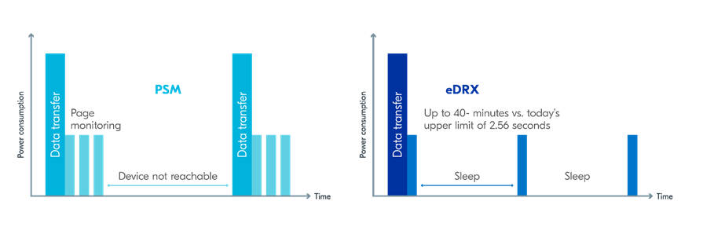

.. _ug_nrf91_features:

Features of nRF91 Series
########################

.. contents::
   :local:
   :depth: 2

Introduction
************

The nRF9160 SiP integrates an application MCU, a full LTE modem, an RF front end, and power management.
With built-in GNSS support, it is a great choice for asset tracking applications.

For more details on the SiP, see the `nRF9160 product website`_ and the `nRF9160 Product Specification`_.

The following figure illustrates the conceptual layout when targeting an nRF9160 Cortex-M33 application MCU with TrustZone:

.. figure:: images/nrf9160_ug_overview.svg
   :alt: Overview of nRF91 application architecture

   Overview of nRF91 application architecture

Supported boards
================

Devices in the nRF91 Series are supported by the following boards in the `Zephyr`_ open source project and in |NCS|.

.. list-table::
   :header-rows: 1

   * - DK or Prototype platform
     - PCA number
     - Build target
     - Documentation
   * - :ref:`zephyr:nrf9160dk_nrf9160`
     - PCA10090
     - ``nrf9160dk_nrf9160_ns``
     - | `Product Specification <nRF9160 Product Specification_>`_
       | :ref:`Getting started <ug_nrf9160_gs>`
       | `User Guide <nRF9160 DK Hardware_>`_
   * - Thingy91
     - PCA20035
     - ``thingy91_nrf9160_ns``
     - | :ref:`Getting started <ug_thingy91_gsg>`
       | `User Guide <Nordic Thingy:91 User Guide_>`_

Application MCU
===============

The application core is a full-featured Arm Cortex-M33 processor including DSP instructions and FPU.
Use this core for tasks that require high performance and for application-level logic.

The M33 TrustZone, one of Cortex-M Security Extensions (CMSE), divides the application MCU into Secure Processing Environment (SPE) and Non-Secure Processing Environment (NSPE).
When the MCU boots, it always starts executing from the secure area.
The secure bootloader chain starts the :ref:`Trusted Firmware-M (TF-M) <ug_tfm>`, which configures a part of memory and peripherals to be non-secure, and then jumps to the user application located in the non-secure area.

For information about CMSE and the difference between the two environments, see :ref:`app_boards_spe_nspe`.

Secure bootloader chain
-----------------------

A secure bootloader chain protects your application against running unauthorized code, and it enables you to do device firmware updates (DFU).
See :ref:`ug_bootloader` for more information.

A bootloader chain is optional.
Not all of the nRF9160 samples include a secure bootloader chain, but the ones that do use the :ref:`bootloader` sample and :doc:`mcuboot:index-ncs`.

Trusted Firmware-M (TF-M)
-------------------------

Trusted Firmware-M provides a configurable set of software components to create a Trusted Execution Environment.
It has replaced Secure Partition Manager as the solution used by |NCS| applications and samples.
This means that when you build your application for ``_ns`` build targets, TF-M is automatically included in the build.
TF-M is a framework for functions and use cases beyond the scope of Secure Partition Manager.

For more information about the TF-M, see :ref:`ug_tfm`.
See also :ref:`tfm_hello_world` for a sample that demonstrates how to add TF-M to an application.

Application
-----------

The user application runs in NSPE.
Therefore, it must be built for the ``nrf9160dk_nrf9160_ns`` or ``thingy91_nrf9160_ns`` build target.

The application image might require other images to be present.
Some samples include the :ref:`bootloader` sample (:kconfig:option:`CONFIG_SECURE_BOOT`) and :doc:`mcuboot:index-ncs` (:kconfig:option:`CONFIG_BOOTLOADER_MCUBOOT`).
Depending on the configuration, all these images can be built at the same time in a :ref:`multi-image build <ug_multi_image>`.

.. _lte_modem:

LTE modem
=========

The LTE modem handles LTE communication.
It is controlled through `AT commands <AT Commands Reference Guide_>`_.

The firmware for the modem is available as a precompiled binary.
You can download the firmware from the `nRF9160 product website (compatible downloads)`_.
The zip file contains both the full firmware and patches to upgrade from one version to another.
A delta patch can only upgrade the modem firmware from one specific version to another version (for example, v1.2.1 to v1.2.2).
If you need to perform a major version update (for example, v1.2.x to v1.3.x), you need an external flash with a minimum size of 4 MB.

Different versions of the LTE modem firmware are available, and these versions are certified for the mobile network operators having their own certification programs.
See the `Mobile network operator certifications`_ for more information.

.. note::

   Most operators do not require certifications other than GCF or PTCRB.
   For the current status of GCF and PTCRB certifications, see `nRF9160 certifications`_.

.. _nrf9160_update_modem_fw:

There are two ways to update the modem firmware:

Full upgrade
  You can use either a wired or a wireless connection to do a full upgrade of the modem firmware:

  * When using a wired connection, you can use either the `nRF Connect Programmer`_, which is part of `nRF Connect for Desktop`_, or the `nRF pynrfjprog`_ Python package.
    Both methods use the Simple Management Protocol (SMP) to provide an interface over UART, which enables the device to perform the update.

    * You can use the nRF Connect Programmer to perform the update, regardless of the images that are part of the existing firmware of the device.
      For example, you can update the modem on an nRF9160 DK using the instructions described in :ref:`nrf9160_gs_updating_fw_modem` in the nRF9160 DK Getting Started guide.

    * You can also use the nRF pynrfjprog Python package to perform the update, as long as a custom application image integrating the ``lib_fmfu_mgmt`` subsystem is included in the existing firmware of the device.
      See the :ref:`fmfu_smp_svr_sample` sample for an example on how to integrate the :ref:`subsystem <lib_fmfu_mgmt>` in your custom application.

  * When using a wireless connection, the upgrade is applied over-the-air (OTA).
    See :ref:`nrf9160_fota` for more information.

 See :ref:`nrfxlib:nrf_modem_bootloader` for more information on the full firmware updates of modem using :ref:`nrfxlib:nrf_modem`.

Delta patches
  Delta patches are upgrades that contain only the difference from the last version.
  See :ref:`nrfxlib:nrf_modem_delta_dfu` for more information on delta firmware updates of modem using :ref:`nrfxlib:nrf_modem`.
  When applying a delta patch, you must therefore ensure that this patch works with the current firmware version on your device.
  Delta patches are applied as firmware over-the-air (FOTA) upgrades.
  See :ref:`nrf9160_fota` for more information.

Modem library
=============

The |NCS| applications for the nRF9160-based devices that communicate with the nRF9160 modem firmware must include the :ref:`nrfxlib:nrf_modem`.
The :ref:`nrfxlib:nrf_modem` is released as an OS-independent binary library in the :ref:`nrfxlib` repository and it is integrated into |NCS| through an integration layer, ``nrf_modem_lib``.

The Modem library integration layer fulfills the integration requirements of the Modem library in |NCS|.
For more information on the integration, see :ref:`nrf_modem_lib_readme`.

.. _modem_trace:

Modem trace
-----------

The modem traces of the nRF9160 modem can be captured using the nRF Connect Trace Collector.
For more information on how to collect traces using nRF Connect Trace Collector, see the `Trace Collector`_ documentation.
When the :kconfig:option:`CONFIG_NRF_MODEM_LIB_TRACE` Kconfig option is enabled, the modem traces are enabled in the modem and are forwarded to the :ref:`modem_trace_module`.

.. note::
   For the :ref:`serial_lte_modem` application and the :ref:`at_client_sample` sample, you must also run ``AT%xmodemtrace=1,2`` to manually activate the predefined trace set.

You can set the trace level using the AT command ``%XMODEMTRACE``.
See `modem trace AT command documentation`_ for more information.

If the existing trace backends are not sufficient, it is possible to implement custom trace backends.
You can implement your own custom modem traces to store the traces on an external flash.
You can then upload the traces to the cloud for remote analysis when needed.
For more information on the implementation of a custom trace backend, see :ref:`adding_custom_modem_trace_backends`.

.. _nrf9160_fota:

FOTA upgrades
=============

|fota_upgrades_def|
FOTA upgrades can be used to apply delta patches to the :ref:`lte_modem` firmware, full :ref:`lte_modem` firmware upgrades, and to replace the upgradable bootloader or the application.

.. note::
   Even though the Trusted Firmware-M and the application are two individually compiled components, they are treated as a single binary blob in the context of firmware upgrades.
   Any reference to the application in this section is meant to indicate the application including the Trusted Firmware-M.

To perform a FOTA upgrade, complete the following steps:

1. Make sure that your application supports FOTA upgrades.
      To download and apply FOTA upgrades, your application must use the :ref:`lib_fota_download` library.
      This library deduces the type of upgrade by inspecting the header of the firmware and invokes the :ref:`lib_dfu_target` library to apply the firmware upgrade.
      In its default configuration, the DFU target library is set to support all the types of FOTA upgrades except full modem firmware upgrades, but you can freely enable or disable the support for specific targets.

      In addition, the following requirements apply:

      * To upgrade the application, you must use :doc:`mcuboot:index-ncs` as the upgradable bootloader (:kconfig:option:`CONFIG_BOOTLOADER_MCUBOOT` must be enabled).
      * If you want to upgrade the upgradable bootloader, the :ref:`bootloader` must be used (:kconfig:option:`CONFIG_SECURE_BOOT`).
      * If you want to upgrade the modem firmware through modem delta updates, neither MCUboot nor the immutable bootloader are required, because the modem firmware upgrade is handled by the modem itself.
      * If you want to perform a full modem firmware upgrade, an |external_flash_size| is required.

#. Create a binary file that contains the new image.

      .. note::
         This step does not apply for upgrades of the modem firmware.
         You can download delta patches and full binaries of the modem firmware from the `nRF9160 product website (compatible downloads)`_.

      |fota_upgrades_building|
      The :file:`app_update.bin` file is the file that should be uploaded to the server.

      To create binary files for a bootloader upgrade, make sure that :kconfig:option:`CONFIG_SECURE_BOOT` and :kconfig:option:`CONFIG_BUILD_S1_VARIANT` are enabled and build MCUboot as usual.
      The build will create a binary file for each variant of the upgradable bootloader, one for each bootloader slot.
      See :ref:`upgradable_bootloader` for more information.

#. Make the binary file (or files) available for download.
      Upload the serialized :file:`.cbor` binary file or files to a web server that is compatible with the :ref:`lib_download_client` library.

The full FOTA procedure depends on where the binary files are hosted for download.

FOTA upgrades using nRF Cloud
-----------------------------

FOTA upgrades can be managed through a comprehensive management portal on `nRF Cloud`_, either fully hosted on nRF Cloud or accessible from a customer cloud using the `nRF Cloud REST API`_.
If you are using nRF Cloud, see the `nRF Cloud Getting Started FOTA documentation`_ for instructions.

Currently, delta modem firmware FOTA files are available in nRF Cloud under :guilabel:`Firmware Updates` in the :guilabel:`Device Management` tab on the left.
If you intend to obtain FOTA files from nRF Cloud, see the additional requirements in :ref:`lib_nrf_cloud_fota`.

You can upload custom application binaries to nRF Cloud for application FOTA updates.
After :ref:`nrf9160_gs_connecting_dk_to_cloud`, you can upload the files to your nRF Cloud account as a bundle after navigating to :guilabel:`Device Management` on the left and clicking :guilabel:`Firmware Updates`.

FOTA upgrades using other cloud services
----------------------------------------

FOTA upgrades can alternatively be hosted from a customer-developed cloud services such as solutions based on AWS and Azure.
If you are uploading the files to an Amazon Web Services Simple Storage Service (AWS S3) bucket, see the :ref:`lib_aws_fota` documentation for instructions.
Samples are provided in |NCS| for AWS (:ref:`aws_iot` sample) and Azure (:ref:`azure_fota_sample` sample).

Your application must be able to retrieve the host and file name for the binary file.
See the :ref:`lib_fota_download` library documentation for information about the format of this information, especially when providing two files for a bootloader upgrade.
You can hardcode the information in the application, or you can use a functionality like AWS jobs to provide the URL dynamically.

Samples and applications implementing FOTA
------------------------------------------

* :ref:`http_full_modem_update_sample` sample - performs a full firmware OTA update of the modem.
* :ref:`http_modem_delta_update_sample` sample - performs a delta OTA update of the modem firmware.
* :ref:`http_application_update_sample` sample - performs a basic application FOTA update.
* :ref:`aws_iot` sample - performs a FOTA update using MQTT and HTTP, where the firmware download is triggered through an AWS IoT job.
* :ref:`azure_fota_sample` sample - performs a FOTA update from the Azure IoT Hub.
* :ref:`asset_tracker_v2` application - performs FOTA updates of the application, modem (delta), and boot (if enabled). It also supports nRF Cloud FOTA as well as AWS or Azure FOTA. Only one must be configured at a time.

.. _nrf9160_ug_gnss:

GNSS
****

An nRF9160-based device is a highly versatile device that integrates both cellular and GNSS functionality.
Note that GNSS functionality is only available on the SICA variant and not on the SIAA or SIBA variants.
See `nRF9160 SiP revisions and variants`_ for more information.

There are many GNSS constellations (GPS, BeiDou, Galileo, GLONASS) available but GPS is the most mature technology.
An nRF9160-based device supports both GPS L1 C/A (Coarse/Acquisition) and QZSS L1C/A at 1575.42 MHz.
This frequency band is ideal for penetrating through layers of the atmosphere (troposphere and ionosphere) and suitable for various weather conditions.
GNSS is designed to be used with a line of sight to the sky.
Therefore, the performance is not ideal when there are obstructions overhead or if the receiver is indoors.

The GNSS operation in an nRF9160-based device is time-multiplexed with the LTE modem.
Therefore, the LTE modem must either be completely deactivated or in `RRC idle mode <Radio Resource Control_>`_ or `Power Saving Mode (PSM)`_ when using the GNSS receiver.
See the `nRF9160 GPS receiver Specification`_ for more information.
Customers who are developing their own hardware with the nRF9160 are strongly recommended to use the `nRF9160 Antenna and RF Interface Guidelines`_ as a reference.
See `GPS interface and antenna`_ for more details on GNSS interface and antenna.

.. note::

   Starting from |NCS| v1.6.0 (Modem library v1.2.0), the GNSS socket is deprecated and replaced with the :ref:`GNSS interface <gnss_interface>`.

Obtaining a fix
===============

GNSS provides lots of useful information including 3D location (latitude, longitude, altitude), time, and velocity.

The time to obtain a fix (also referred to as Time to First Fix (TTFF)) will depend on the time when the GNSS receiver was last turned on and used.

Following are the various GNSS start modes:

* Cold start - GNSS starts after being powered off for a long time with zero knowledge of the time, current location, or the satellite orbits.
* Warm start - GNSS has some coarse knowledge of the time, location, or satellite orbits from a previous fix that is more than around 37 minutes old.
* Hot start - GNSS fix is requested within an interval of around 37 minutes from the last successful fix.

Each satellite transmits its own `Ephemeris`_ data and common `Almanac`_ data:

* Ephemeris data - Provides information about the orbit of the satellite transmitting it. This data is valid for four hours and becomes inaccurate after that.
* Almanac data - Provides coarse orbit and status information for each satellite in the constellation. Each satellite broadcasts Almanac data for all satellites.

The data transmission occurs at a slow data rate of 50 bps.
The orbital data can be received faster using A-GPS.

Due to the clock bias on the receiver, there are four unknowns when looking for a GNSS fix - latitude, longitude, altitude, and clock bias.
This results in solving an equation system with four unknowns, and therefore a minimum of four satellites must be tracked to acquire a fix.

Enhancements to GNSS
====================

When GNSS has not been in use for a while or if the device is in relatively weak signaling conditions, it might take longer to acquire a fix.
To improve this, Nordic Semiconductor has implemented the following methods for acquiring a fix in a shorter time:

•	A-GPS or P-GPS or a combination of both
•	Low accuracy mode

Assisted GPS (A-GPS)
---------------------

A-GPS is commonly used to improve the Time to first fix (TTFF) by utilizing a connection (for example, over cellular) to the internet to retrieve the Almanac and Ephemeris data.
A connection to an internet server that has the Almanac and Ephemeris data is several times quicker than using the slow 50 bps data link to the GPS satellites.
There are many options to retrieve this A-GPS data.
Two such options are using `nRF Cloud`_ and SUPL.
|NCS| provides example implementations for both these options.
The A-GPS solution available through nRF Cloud has been optimized for embedded devices to reduce protocol overhead and data usage.
This, in turn, results in the download of reduced amount of data, thereby reducing data transfer time, power consumption, and data costs.
See :ref:`nrfxlib:gnss_int_agps_data` for more information about the retrieval of A-GPS data.

Predicted GPS (P-GPS)
---------------------

P-GPS is a form of assistance, where the device can download up to two weeks of predicted satellite Ephemerides data.
Normally, devices connect to the cellular network approximately every two hours for up-to-date satellite Ephemeris information or they download the Ephemeris data from the acquired satellites.
P-GPS enables devices to determine the exact orbital location of the satellite without connecting to the network every two hours with a trade-off of reduced accuracy of the calculated position over time.
Note that P-GPS requires more memory compared to regular A-GPS.

Also, note that due to satellite clock inaccuracies, not all functional satellites will have Ephemerides data valid for two weeks in the downloaded P-GPS package.
This means that the number of satellites having valid predicted Ephemerides reduces in number roughly after ten days.
Hence, the GNSS module needs to download the Ephemeris data from the satellite broadcast if no predicted Ephemeris is found for that satellite to be able to use the satellite.

.. note::
   |gps_tradeoffs|

nRF Cloud A-GPS compared with SUPL library
------------------------------------------

The :ref:`lib_nrf_cloud_agps` library is more efficient to use when compared to the :ref:`SUPL <supl_client>` library, and the latter takes a bit more memory on the device.
Another advantage of nRF Cloud A-GPS library is that the data is encrypted whereas SUPL uses plain socket.
Also, no licenses are required from external vendors to use nRF Cloud A-GPS, whereas for commercial use of SUPL, you must obtain a license.
The :ref:`lib_nrf_cloud_agps` library is also highly integrated into `Nordic Semiconductor's IoT cloud platform`_.

Low Accuracy Mode
-----------------

Low accuracy mode allows the GNSS receiver to accept a looser criterion for a fix with four or more satellites or by using a reference altitude to allow for a fix using only three satellites.
This has a tradeoff of reduced accuracy.
This reference altitude can be from a recent valid normal fix or it can be artificially injected.
See :ref:`nrfxlib:gnss_int_low_accuracy_mode` for more information about low accuracy mode and its usage.

Samples using GNSS in |NCS|
===========================

There are many examples in |NCS| that use GNSS.
Following is a list of the samples and applications with some information about the GNSS usage:

* :ref:`asset_tracker_v2` application - Uses nRF Cloud for A-GPS or P-GPS or a combination of both. The application obtains GNSS fixes and transmits them to nRF Cloud along with sensor data.
* :ref:`serial_lte_modem` application - Uses AT commands to start and stop GNSS and has support for nRF Cloud A-GPS and P-GPS. The application displays tracking and GNSS fix information in the serial console.
* :ref:`gnss_sample` sample - Does not use assistance by default but can be configured to use nRF Cloud A-GPS or P-GPS or a combination of both. The sample displays tracking and fix information as well as NMEA strings in the serial console.

.. _nrf9160_gps_lte:

Concurrent GNSS and LTE
=======================

An nRF9160-based device supports GNSS in LTE-M and NB-IoT.
Concurrent operation of GNSS with optional power-saving features, such as extended Discontinuous Reception (eDRX) and Power Saving Mode (PSM), is also supported, and recommended.

The following figure shows how the data transfer occurs in an nRF9160-based device with power-saving in place.

See `Energy efficiency`_ for more information.

Asset Tracker enables the concurrent working of GNSS and LTE in eDRX and PSM modes when the device is in `RRC idle mode <Radio Resource Control_>`_.
The time between the transition of a device from RRC connected mode (data transfer mode) to RRC idle mode is dependent on the network.
Typically, the time ranges between 5 seconds to 70 seconds after the last data transfer on LTE.
Sensor and GNSS data are sent to the cloud only during the data transfer phase.

.. _nrf9160_ug_band_lock:

Band lock
*********

The band lock is a functionality of the application that lets you send an AT command to the modem instructing it to operate only on specific bands.
The band lock is handled by the LTE Link Control driver.
By default, the functionality is disabled in the driver's Kconfig file.

The modem can operate in the following E-UTRA Bands: 1, 2, 3, 4, 5, 8, 12, 13, 17, 18, 19, 20, 25, 26, 28, and 66.
To check which bands are supported for a particular modem firmware version, see the `nRF9160 product website (compatible downloads)`_.

You can use the band lock to restrict modem operation to a subset of the supported bands, which might improve the performance of your application.
To check which bands are certified in your region, visit `nRF9160 Certifications`_.

To set the LTE band lock, enable the :ref:`lte_lc_readme` library in your project configuration file :file:`prj.conf`, by setting the Kconfig option :kconfig:option:`CONFIG_LTE_LINK_CONTROL`  to ``y``.

Then, enable the LTE band lock feature and the band lock mask in the configuration file of your project, as follows::

   CONFIG_LTE_LOCK_BANDS=y
   CONFIG_LTE_LOCK_BAND_MASK="10000001000000001100"

The band lock mask allows you to set the bands on which you want the modem to operate.
Each bit in the :kconfig:option:`CONFIG_LTE_LOCK_BAND_MASK` option represents one band.
The maximum length of the string is 88 characters (bit string, 88 bits).

The band lock is a non-volatile setting that must be set before activating the modem.
It disappears when the modem is reset.
To prevent this, you can set the modem in *power off* mode, by either:

* Sending the AT command ``AT+CFUN=0`` directly.
* Calling the :c:func:`lte_lc_power_off` function while the *LTE Link Control Library* is enabled.

Both these options save the configurations and historical data in the Non-Volatile Storage before powering off the modem.

As a recommendation, turn off the band lock after the connection is established and let the modem use the historical connection data to optimize the network search, in case the device is disconnected or moved.

For more detailed information, see the `band lock section in the AT Commands reference document`_.

.. _nrf9160_ug_network_mode:

Network mode
************

The modem supports LTE-M (Cat-M1) and Narrowband Internet of Things (NB-IoT or LTE Cat-NB).
By default, the modem starts in LTE-M mode.
However, this is highly configurable.

When using the LTE Link Control driver, you can select LTE-M with :kconfig:option:`CONFIG_LTE_NETWORK_MODE_LTE_M` or NB-IoT with :kconfig:option:`CONFIG_LTE_NETWORK_MODE_NBIOT`.

To start in NB-IoT mode without the driver, send the following command before starting the modem protocols (by using ``AT+CFUN=1``)::

   AT%XSYSTEMMODE=0,1,0,0

To change the mode at runtime, set the modem to LTE RF OFF state before reconfiguring the mode, then set it back to normal operating mode::

   AT+CFUN=4
   AT%XSYSTEMMODE=0,1,0,0
   AT+CFUN=1

If the modem is shut down gracefully before the next boot (by using ``AT+CFUN=0``), it keeps the current setting.

For more detailed information, see the `system mode section in the AT Commands reference document`_.
