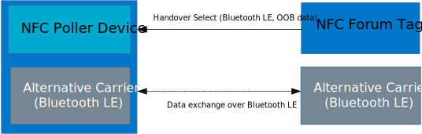
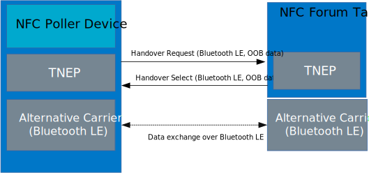

.. _central_nfc_pairing:

Bluetooth: Central NFC pairing
##############################

.. contents::
   :local:
   :depth: 2

The Central NFC pairing sample demonstrates Bluetooth® LE out-of-band pairing using an :ref:`st25r3911b_nfc_readme` and the NFC TNEP protocol.
You can use it to test the touch-to-pair feature between Nordic Semiconductor's devices with :ref:`st25r3911b_nfc_readme` and an NFC Tag device with Bluetooth LE support.

The sample shows the usage of NFC NDEF :ref:`nfc_ch` and :ref:`tnep_poller_readme` with the :ref:`Connection Handover service<nfc_tnep_ch_readme>`.
It provides minimal Bluetooth functionality in the Central role, and on GATT level it implements only the Device Information Service.

The sample supports pairing in one of the following modes:

* LE Secure Connections Just Works pairing
* LE Secure Connections OOB pairing
* Legacy OOB pairing
* Legacy Just Works pairing
* Negotiated Handover (TNEP protocol) - two-way OOB pairing

Requirements
************

The sample supports the following development kits:

.. table-from-sample-yaml::

The sample has the following additional requirements:

* NFC Reader ST25R3911B Nucleo expansion board (X-NUCLEO-NFC05A1)
* NFC Tag 2 Tag device or NFC Tag 4 Tag device

Overview
********

When the sample starts, it initializes and starts the :ref:`st25r3911b_nfc_readme`, and waits for a Type 2 Tag or a Type 4 Tag to appear in the field.
When the tag is detected, the sample identifies its type, then reads it, and parses its content.
After successful parsing, the tag content is printed on the serial port.
The sample does not start scanning immediately, but only when the NFC tag is read by an NFC Poller, or when the exchange of data over the TNEP Connection Handover Service is finished.

NFC data exchange
*****************

This sample can read Bluetooth LE OOB data from the Static NFC Tag or exchange the OOB data with an NFC Tag device with TNEP support.

Static Handover
===============
A tag in the Static Handover mode, contains a Handover Select Message with carrier information NDEF records or a single Carrier Configuration Record.

Negotiated Handover
===================

In Negotiated Handover, two NFC Forum Devices identify a matching set of alternative carriers by exchanging lists of potential alternative carriers.
In case of the OOB data for Bluetooth LE the NFC Devices can exchange OOB data 2-ways.
Handover messages are exchanged using the TNEP Single response communication mode.
The NFC Poler Device can be the Handover Requester or Handover Selector Device, the role is taken based on the NFC Tag first NDEF message.

User interface
**************

Button 3:
  Turns on NFC Field to detect next NFC Tag Device with Bluetooth LE OOB data.

Button 4:
   Removes all bonded devices and terminates current connections.
   Turns on the NFC Field if it is inactive after last operation.

Building and running
********************

.. |sample path| replace:: :file:`samples/bluetooth/central_nfc_pairing`

.. include:: /includes/build_and_run.txt

Testing
=======

|test_sample|

1. Touch the :ref:`st25r3911b_nfc_readme` with a Type 2 Tag or Tag 4 Tag.
   The Tag Device can support the TNEP protocol.
   You can use the corresponding :ref:`peripheral_nfc_pairing` sample as the Tag Device.
   This sample supports the TNEP.
#. Observe the output log.
   The content of the exchanged NDEF messages is printed there.
#. Check the security level of the paring on the terminal.
#. Move the NFC antenna away from the :ref:`st25r3911b_nfc_readme`.
#. Press **Button 3** when connected to turn on the :ref:`st25r3911b_nfc_readme` field and initialize new pairing.
#. Press **Button 4** to disconnect and erase bonding data.

Dependencies
************

This sample uses the following |NCS| libraries:

* :ref:`st25r3911b_nfc_readme`
* :ref:`tnep_poller_readme`
* :ref:`nfc_ndef_parser_readme`
* :ref:`nfc_t4t_apdu_readme`
* :ref:`nfc_t4t_isodep_readme`
* :ref:`nfc_t4t_hl_procedure_readme`
* :ref:`nfc_t4t_ndef_file_readme`
* :ref:`nfc_ndef_le_oob`
* :ref:`nfc_ch`
* :ref:`nfc_ndef_le_oob_rec_parser_readme`
* :ref:`nfc_ndef_ch_rec_parser_readme`
* :ref:`nfc_ndef_parser_readme`
* :ref:`dk_buttons_and_leds_readme`
* :ref:`nrf_bt_scan_readme`

The sample uses the following Zephyr libraries:

* :file:`include/zephyr.h`
* :file:`include/device.h`
* :ref:`GPIO Interface <zephyr:api_peripherals>`
