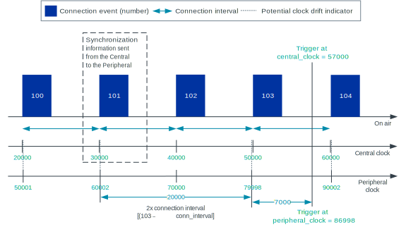

.. _bluetooth_conn_time_synchronization:

Bluetooth: Connection time synchronization
##########################################

.. contents::
   :local:
   :depth: 2

This sample demonstrates an optimized, microsecond-accurate synchronization of connections that are happening over Bluetooth® Low Energy Asynchronous Connection-oriented Logical transport (ACL).

Requirements
************

The sample supports the following development kits:

.. table-from-sample-yaml::

You need at least two development kits to test this sample:

* To demonstrate time synchronization between a Central and one Peripheral, you need two development kits.
* To demonstrate time synchronization between a Central and two Peripherals, you need three development kits.

You can use mix different development kits from the list above.

Additionally, the sample requires connecting each development kit to a serial terminal and using a terminal emulator (for example, the `Serial Terminal app`_).

To observe that the LEDs are toggled synchronously, use a logic analyzer or an oscilloscope.

Overview
********
.. tabs::

   .. group-tab:: nRF52 and nRF53 DKs

      The Central and Peripheral devices toggle **LED 2** synchronously and within a few microseconds of one another.

   .. group-tab:: nRF54 DKs

      The Central and Peripheral devices toggle **LED 1** synchronously and within a few microseconds of one another.

The LEDs are toggled at the timestamp specified by the Central device.

Clock synchronization
=====================

The Central and the Peripheral devices have their own, independent, free-running clocks.
To synchronize the clocks, both devices need a common reference of time.
For Bluetooth LE ACL connections, the common time reference is the anchor point of a connection event, as described in `Bluetooth Core Specification`_, vol 6, part B, section 4.5.1.
The :ref:`softdevice_controller` provides the local clock at these points in time through the use of `HCI events`_.
By sending the anchor point information to the peer device, the application can find the time difference between the two clocks.
In this sample application, the Central sends its time reference ``(anchor_point_us_central_clock, anchor_point_event_counter)`` at a fixed interval.

When a Peripheral synchronizes its clock to the clock of the Central, an additional optimization can be done (which is applied in this sample).
The Peripheral knows that the time between the anchor points on the central clock is equal to ``connection_interval``.
Therefore, the Peripheral can use its local anchor point information from future connection events for clock synchronization.

The figure below shows how the Peripheral obtains the local peripheral trigger time for a given central clock trigger time.
The Peripheral uses the synchronization information from the clock of the Central together with the local anchor point information.

   Clock synchronization between the Central and the Peripheral.

Timed trigger accuracy
======================

There are multiple factors that influence the accuracy of timed triggers.

Time since the last clock synchronization
  In this sample, the Peripheral clocks are synchronized every time new anchor point information is available.
  That is, for every connection event where the Peripheral successfully receives a packet from the Central.
  For this reason, the expected time between clock synchronizations is equal to the configured connection interval of 10 milliseconds.

How much the Central and Peripheral clock drift apart
  The Bluetooth specification defines that the combined sleep clock accuracy can at worst equal 1000 Parts Per Million (PPM).
  That is, for each second the clocks can drift at maximum 1 ms.
  The development kits are equipped with a low frequency clock crystal with an accuracy in the range of 20 to 100 PPM.

How much the Central and Peripheral clock jitter
  The Bluetooth specification defines that the sleep clock jitter can at worst equal 16 µs.
  The SoftDevice Controller anchor points are obtained with a jitter of around 1 µs.

How accurately the timed activity is triggered.
  In this sample, the timed trigger (toggling of a LED) is triggered using a microsecond-accurate timer.
  This gives an accuracy of 0.5 µs.

The worst case offset between the Central trigger and Peripheral trigger occurs when all the components mentioned above drift and jitter in different directions.
In many cases, the offset will be less.
See the following equations:

.. code-block::

   worst_case_offset = drift + clock_jitter + trigger_jitter
   worst_case_offset = (c_sca_ppm + p_sca_ppm) * conn_interval + c_clock_jitter + p_clock_jitter + c_trigger_accuracy + p_trigger_accuracy
   worst_case_offset = (50 ppm + 50 ppm) * 10 ms + 1 µs + 1 µs + 0.5 µs + 0.5 µs
   worst_case_offset = 1 µs + 2 µs + 1 µs
   worst_case_offset = 4 µs

Hardware resource usage
=======================

This sample requires fewer hardware resources when it is run on an nRF54 Series device compared to the nRF52 or nRF53 Series devices.
On an nRF54L Series device, only one GRTC channel and one PPI channel are needed to set up accurate toggling of an LED.
On an nRF54H Series device, two local DPPI channels are used to connect the GRTC and the LED to the local PPIB instances.
A PPIB channel is used to connect the two PPIB instances.
On nRF52 and nRF53 Series devices, you need one RTC peripheral, one TIMER peripheral, one EGU channel, four PPI channels, and one PPI group.

User interface
**************
.. tabs::

   .. group-tab:: nRF52 and nRF53 DKs

      LED 2:
         Blinks simultaneously on all devices after synchronization takes place.

   .. group-tab:: nRF54 DKs

      LED 1:
         Blinks simultaneously on all devices after synchronization takes place.

Building and running
********************

.. |sample path| replace:: :file:`samples/bluetooth/conn_time_sync`

.. include:: /includes/build_and_run.txt

Testing
=======

After programming the sample to all development kits, perform the following steps to test it:

1. Connect to the kits with a terminal emulator (for example, the `Serial Terminal app`_).
   See :ref:`test_and_optimize` for the required settings and steps.
#. Reset the kits.
#. In one of the terminal emulators, type ``c`` to start the application in the Central role.
#. In the other terminal emulators, type ``p`` to start the application in the Peripheral role.
#. Observe that the LEDs turn on and that the timing measurements are printed in the terminal emulator's log.
#. Optionally, connect a logic analyzer or an oscilloscope to observe that all the devices toggle the LEDs with the microsecond accuracy.

Sample output
*************

The result should look similar to the following output:

* For the Central:

  .. code-block:: console

     Starting connection time sync sample.
     Choose device role - type c (central) or p (peripheral):
     Central. Starting scanning
     I: SoftDevice Controller build revision:
     I: 43 77 a9 de 2d 55 e0 08 |Cw..-U..
     I: 0a c7 0f e5 07 18 61 5b |......a[
     I: 72 dd e6 08             |r...
     I: HW Platform: Nordic Semiconductor (0x0002)
     I: HW Variant: nRF52x (0x0002)
     I: Firmware: Standard Bluetooth controller (0x00) Version 67.43383 Build 3763678686
     I: Identity: E8:DC:8D:B3:47:69 (random)
     I: HCI: version 5.4 (0x0d) revision 0x1208, manufacturer 0x0059
     I: LMP: version 5.4 (0x0d) subver 0x1208
     Scanning started
     Device found: CF:99:32:A5:4B:11 (random) (RSSI -26)
     Connected: CF:99:32:A5:4B:11 (random)
     Scanning started
     Service discovery completed
     Sent to conn index 0: c_anchor point (time=21839836, counter=19), c_trigger_time 21880962, value 0
     Device found: CF:99:32:A5:4B:11 (random) (RSSI -24)
     Sent to conn index 0: c_anchor point (time=21959836, counter=31), c_trigger_time 22009960, value 1
     Sent to conn index 0: c_anchor point (time=22089836, counter=44), c_trigger_time 22138897, value 0
     Connected: CF:99:32:A5:4B:11 (random)
     Sent to conn index 0: c_anchor point (time=22219836, counter=57), c_trigger_time 22267955, value 1
     Service discovery completed
     Sent to conn index 0: c_anchor point (time=22349836, counter=70), c_trigger_time 22396862, value 0
     Sent to conn index 1: c_anchor point (time=22347336, counter=16), c_trigger_time 22396862, value 0
     Sent to conn index 0: c_anchor point (time=22489836, counter=84), c_trigger_time 22534862, value 1
     Sent to conn index 1: c_anchor point (time=22487336, counter=30), c_trigger_time 22534862, value 1
     Sent to conn index 0: c_anchor point (time=22629836, counter=98), c_trigger_time 22672893, value 0
     Sent to conn index 1: c_anchor point (time=22627336, counter=44), c_trigger_time 22672893, value 0
     Sent to conn index 0: c_anchor point (time=22769836, counter=112), c_trigger_time 22810894, value 1
     Sent to conn index 1: c_anchor point (time=22767336, counter=58), c_trigger_time 22810894, value 1

* For the Peripherals:

  .. code-block:: console

     Starting connection time sync sample.
     Choose device role - type c (central) or p (peripheral):
     Peripheral. Starting advertising
     I: SoftDevice Controller build revision:
     I: 43 77 a9 de 2d 55 e0 08 |Cw..-U..
     I: 0a c7 0f e5 07 18 61 5b |......a[
     I: 72 dd e6 08             |r...
     I: HW Platform: Nordic Semiconductor (0x0002)
     I: HW Variant: nRF52x (0x0002)
     I: Firmware: Standard Bluetooth controller (0x00) Version 67.43383 Build 3763678686
     I: Identity: FA:BB:79:57:D6:45 (random)
     I: HCI: version 5.4 (0x0d) revision 0x1208, manufacturer 0x0059
     I: LMP: version 5.4 (0x0d) subver 0x1208
     Advertising started
     Connected: E8:DC:8D:B3:47:69 (random)
     Received: c_anchor point (time=22347336, counter=16), c_trigger_time 22396862, value 0
     Received: c_anchor point (time=22487336, counter=30), c_trigger_time 22534862, value 1
     Received: c_anchor point (time=22627336, counter=44), c_trigger_time 22672893, value 0
     Received: c_anchor point (time=22767336, counter=58), c_trigger_time 22810894, value 1
     Received: c_anchor point (time=22907336, counter=72), c_trigger_time 22948833, value 0
     Received: c_anchor point (time=23037336, counter=85), c_trigger_time 23086773, value 1
     Received: c_anchor point (time=23177336, counter=99), c_trigger_time 23224865, value 0
     Received: c_anchor point (time=23317336, counter=113), c_trigger_time 23362957, value 1

Dependencies
************

This sample uses the following `sdk-nrfxlib`_ library:

* :ref:`nrfxlib:softdevice_controller`

In addition, it uses the following Zephyr libraries:

* :file:`include/console.h`
* :ref:`zephyr:kernel_api`:

  * :file:`include/kernel.h`

* :file:`include/sys/printk.h`
* :file:`include/zephyr/types.h`
* :ref:`zephyr:bluetooth_api`:

  * :file:`include/bluetooth/bluetooth.h`
  * :file:`include/bluetooth/conn.h`
  * :file:`include/bluetooth/hci.h`
  * :file:`include/bluetooth/scan.h`
