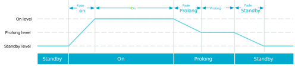

.. _bluetooth_mesh_light_lc:

Bluetooth Mesh: Light fixture
#############################

.. contents::
   :local:
   :depth: 2

The Bluetooth® Mesh light fixture sample demonstrates how to set up a light control mesh server model application, and control a dimmable LED with Bluetooth Mesh using the :ref:`bt_mesh_onoff_readme`.

This sample demonstrates how to implement the following :ref:`ug_bt_mesh_nlc`:

  * Basic Lightness Controller NLC Profile
  * Energy Monitor NLC Profile

Requirements
************

The sample supports the following development kits:

.. table-from-sample-yaml::

The sample also requires a smartphone with Nordic Semiconductor's nRF Mesh mobile app installed in one of the following versions:

  * `nRF Mesh mobile app for Android`_
  * `nRF Mesh mobile app for iOS`_

.. note::
   |thingy53_sample_note|

.. include:: /includes/tfm.txt

Overview
********

This sample can be used to control the state of light sources.
In addition to generic on and off functions, it allows changing the light level (brightness) of an LED light and shows how the light can react to supported sensor messages.
It also demonstrates how the Sensor models and the device properties can be used to report additional light source usage data.

The sample instantiates the following models:

 * :ref:`bt_mesh_lightness_srv_readme`
 * :ref:`bt_mesh_light_ctrl_srv_readme`
 * :ref:`bt_mesh_scene_srv_readme`
 * :ref:`bt_mesh_sensor_srv_readme`

As both Light Lightness Server and the Light LC Server extend the Generic OnOff Server, the two models need to be instantiated on separate elements.
For more information, see documentation on :ref:`bt_mesh_light_ctrl_srv_readme`.

Devices are nodes with a provisionee role in a mesh network.
Provisioning is performed using the `nRF Mesh mobile app`_.
This mobile application is also used to configure key bindings, and publication and subscription settings of the Bluetooth Mesh model instances in the sample.
After provisioning and configuring the mesh models supported by the sample in the `nRF Mesh mobile app`_, you can control the dimmable LED on the development kit from the app.

Provisioning
============

The provisioning is handled by the :ref:`bt_mesh_dk_prov`.
It supports four types of out-of-band (OOB) authentication methods, and uses the Hardware Information driver to generate a deterministic UUID to uniquely represent the device.

Models
======

The following table shows the mesh light fixture composition data for this sample:

.. table::
   :align: center

   +-------------------------------+----------------------------+
   | Element 1                     | Element 2                  |
   +===============================+============================+
   | Config Server                 | Gen. OnOff Server          |
   +-------------------------------+----------------------------+
   | Health Server                 | Light LC Server            |
   +-------------------------------+----------------------------+
   | Gen. Level Server             | Light LC Setup Server      |
   +-------------------------------+----------------------------+
   | Gen. OnOff Server             |                            |
   +-------------------------------+----------------------------+
   | Gen. DTT Server               |                            |
   +-------------------------------+----------------------------+
   | Gen. Power OnOff Server       |                            |
   +-------------------------------+----------------------------+
   | Gen. Power OnOff Setup Server |                            |
   +-------------------------------+----------------------------+
   | Light Lightness Server        |                            |
   +-------------------------------+----------------------------+
   | Light Lightness Setup Server  |                            |
   +-------------------------------+----------------------------+
   | Scene Server                  |                            |
   +-------------------------------+----------------------------+
   | Scene Setup Server            |                            |
   +-------------------------------+----------------------------+
   | Sensor Server                 |                            |
   +-------------------------------+----------------------------+
   | Sensor Setup Server           |                            |
   +-------------------------------+----------------------------+

The models are used for the following purposes:

* The first element contains a Config Server and a Health Server.
  The Config Server allows configurator devices to configure the node remotely.
  The Health Server provides ``attention`` callbacks that are used during provisioning to call your attention to the device.
  These callbacks trigger blinking of the LEDs.
* The next seven models in the first element are the product of a single instance of the Light Lightness Server.
  The application implements callbacks for the Light Lightness Server to control an LED on the device using the PWM (pulse width modulation) driver.
* The next two models in the first element are the product of a single instance of the Scene Server.
  The Scene Server allows the device to store and recall scenes.
* The last two models in the first element are the product of a single instance of the Sensor Server.
  The Sensor Server allows the device to report the value of the :c:var:`bt_mesh_sensor_precise_tot_dev_energy_use` property.
* The three models in the second element are the product of a single instance of the Light Lightness Control (LC) Server.
  The Light LC Server controls the Light Lightness Server in the first element, deciding on parameters such as fade time, lighting levels for different states, and inactivity timing.
  In this sample, the Light LC Server is enabled by default at first boot.

Other nodes can control the Light Lightness Server through the Light LC Server, by sending On/Off messages to the Light LC Server or to the Generic OnOff Server in the second element.

.. note::
   It is possible to bypass the Light LC Server by directly communicating with the Light Lightness Server on the first element.

For more details, see :ref:`bt_mesh_lightness_srv_readme` and :ref:`bt_mesh_light_ctrl_srv_readme`.

Other nodes can store or recall scenes through Scene Server, by sending Scene messages.
They can also fetch the current value of the :c:var:`bt_mesh_sensor_precise_tot_dev_energy_use` property by sending Sensor Get messages.

The model handling is implemented in :file:`src/model_handler.c`, which uses the :ref:`dk_buttons_and_leds_readme` library and the :ref:`zephyr:pwm_api` API to control the LEDs on the development kit.

User interface
**************

.. tabs::

   .. group-tab:: nRF21, nRF52 and nRF53 DKs

      Buttons:
        Can be used to input the out-of-band (OOB) authentication value during provisioning.
        All buttons have the same functionality during this procedure.
        If the :ref:`emds_readme` feature is enabled and the provisioning and configuration are complete, **Button 4** can be used to trigger storing for data with emergency data storage and halt the system.

      LEDs:
        Show the OOB authentication value during provisioning if the "Push button" OOB method is used.
        **LED 1** outputs the current light level of the Light Lightness Server in the first element.
        If the :ref:`emds_readme` feature is enabled and **Button 4** is pressed **LEDs 2** to **LED 4** will light up to show that the board is halted.

      .. note::
        :zephyr:board:`thingy53` supports only one RGB LED.
        Each RGB LED channel is used as separate LED.

      .. note::
        :zephyr:board:`thingy53` and the :zephyr:board:`nrf52840dongle` do not support emergency data storage.

   .. group-tab:: nRF54 DKs

      Buttons:
        Can be used to input the out-of-band (OOB) authentication value during provisioning.
        All buttons have the same functionality during this procedure.
        If the :ref:`emds_readme` feature is enabled and the provisioning and configuration are complete, **Button 3** can be used to trigger storing for data with emergency data storage and halt the system.

      LEDs:
        Show the OOB authentication value during provisioning if the "Push button" OOB method is used.
        **LED 1** outputs the current light level of the Light Lightness Server in the first element.
        If the :ref:`emds_readme` feature is enabled and **Button 3** is pressed **LEDs 1** to **LED 3** will light up to show that the board is halted.

Configuration
*************

|config|

.. tabs::

   .. group-tab:: nRF52 DK (nRF52832)

      Due to limited RAM on the nRF52832 device, the Friend feature is disabled for this DK.

   .. group-tab:: nRF53 DKs

      |nrf5340_mesh_sample_note|

The Kconfig option :kconfig:option:`CONFIG_BT_MESH_LIGHT_CTRL_REG_SPEC` is set by default as it is necessary for the :ref:`bt_mesh_light_ctrl_srv_readme` model according to the `Bluetooth Mesh model specification`_.
The option enables a separate module called illuminance regulator.
For more information about the module, see the documentation on :ref:`bt_mesh_light_ctrl_reg_readme` and :ref:`bt_mesh_light_ctrl_reg_spec_readme`.

Source file setup
=================

This sample is split into the following source files:

* A :file:`main.c` file to handle initialization.
* A file for handling mesh models, :file:`model_handler.c`.
* A file for handling PWM driven control of the dimmable LED, :file:`lc_pwm_led.c`.

FEM support
===========

.. include:: /includes/sample_fem_support.txt

Emergency data storage
======================

To build this sample with support for emergency data storage (EMDS), set :makevar:`EXTRA_CONF_FILE` to :file:`overlay-emds.conf` using the respective :ref:`CMake option <cmake_options>`.
This will save replay protection list (RPL) data and some of the :ref:`bt_mesh_lightness_srv_readme` data to the emergency data storage instead of to the :ref:`settings_api`.
When using EMDS, certain considerations need to be taken regarding hardware choices in your application design.
See :ref:`emds_readme_application_integration` in the EMDS documentation for more information.

For more information about configuration files in the |NCS|, see :ref:`app_build_system`.

Building and running
********************

.. |sample path| replace:: :file:`samples/bluetooth/mesh/light_ctrl`

.. include:: /includes/build_and_run_ns.txt

.. |sample_or_app| replace:: sample
.. |ipc_radio_dir| replace:: :file:`sysbuild/ipc_radio`

.. include:: /includes/ipc_radio_conf.txt

.. _bluetooth_mesh_light_ctrl_testing:

Testing
=======

After programming the sample to your development kit, you can test it by using a smartphone with `nRF Mesh mobile app`_ installed.
Testing consists of provisioning the device and configuring it for communication with the mesh models.

.. tabs::

   .. group-tab:: nRF21, nRF52 and nRF53 DKs

      When the development kit is started, it will keep its previous Light state as the ``BT_MESH_ON_POWER_UP_RESTORE`` is set for the :ref:`bt_mesh_lightness_srv_readme`.
      When :ref:`emds_readme` is enabled it is important that the **Button 4** is used to store the data before the development kit is halted and then restarted.

   .. group-tab:: nRF54 DKs

      When the development kit is started, it will keep its previous Light state as the ``BT_MESH_ON_POWER_UP_RESTORE`` is set for the :ref:`bt_mesh_lightness_srv_readme`.
      When :ref:`emds_readme` is enabled it is important that the **Button 3** is used to store the data before the development kit is halted and then restarted.

Provisioning the device
-----------------------

.. |device name| replace:: :guilabel:`Mesh Light Fixture`

.. include:: /includes/mesh_device_provisioning.txt

Configuring models
------------------

See :ref:`ug_bt_mesh_model_config_app` for details on how to configure the mesh models with the nRF Mesh mobile app.

Configure the Generic OnOff Server model on each element on the **Mesh Light Fixture** node:

* Bind the model to **Application Key 1**.

  Once the model is bound to the application key, you can control the LED on the device.
* Open the Generic OnOff Server in the second element, then tap :guilabel:`ON` at the bottom of the Generic On Off Controls.

You should now see the following actions:

1. The LED fades from 0% to 100% over a defined transition time following the message **Standby > On**.
#. The LED stays at 100% for three seconds **On**.
#. The LED fades from 100% to :kconfig:option:`CONFIG_BT_MESH_LIGHT_CTRL_SRV_LVL_PROLONG` over five seconds **On > Prolong**.
#. The LED stays at :kconfig:option:`CONFIG_BT_MESH_LIGHT_CTRL_SRV_LVL_PROLONG` for three seconds **Prolong**.
#. The LED fades from :kconfig:option:`CONFIG_BT_MESH_LIGHT_CTRL_SRV_LVL_PROLONG` to :kconfig:option:`CONFIG_BT_MESH_LIGHT_CTRL_SRV_LVL_STANDBY` over five seconds **Prolong > Standby**.

The default value of :kconfig:option:`CONFIG_BT_MESH_LIGHT_CTRL_SRV_LVL_PROLONG` is 10000 (~15%).
The default value of :kconfig:option:`CONFIG_BT_MESH_LIGHT_CTRL_SRV_LVL_STANDBY` is 0 (0%).

   Light level transitions over time

.. note::
   The configuration of light levels, fade time, and timeouts can be changed by altering the configuration parameters in the :file:`prj.conf` file, and rebuilding the sample.

This sample can be configured to report energy usage sensor data to any device implementing the :ref:`bt_mesh_sensor_cli_readme` model by configuring the Sensor Server model on the **Mesh Light Fixture** node:

* Bind the model to **Application Key 1**. Make sure to bind the same application key to the peer Sensor Client.

The Sensor Server model is now configured and able to receive messages from and send data to the peer Sensor Client.

.. _bluetooth_mesh_light_lc_occupancy_mode:

Occupancy mode
--------------

You can combine this sample with the :ref:`bluetooth_mesh_sensor_server` sample to trigger the :ref:`Occupancy On <bt_mesh_light_ctrl_srv_occupancy_on_event>` event on the Light LC Server by the Occupancy sensor.

To do this, first configure the Light LC Server on the **Mesh Light Fixture** node:

* Bind the model to **Application Key 1**.
* Set the subscription parameters: Create a dedicated group address.

Prepare the :ref:`bluetooth_mesh_sensor_server` sample:

* Build, run and provision the **Mesh Sensor** node as described in the sample's documentation.

Configure the Sensor Server that is instantiated on the Element 2 of the :ref:`bluetooth_mesh_sensor_server` sample:

* Bind the model to **Application Key 1**.
* Set the publication parameters:

  * Destination/publish address: Select the same group as the Light LC Server is subscribed to.

To evaluate occupancy inputs when light is not in **Standby** state:

* Open the **Mesh Light Fixture** node in the mobile app.
* Open the Generic OnOff Server in the second element, then tap :guilabel:`ON` at the bottom of the Generic On Off Controls.
  This will bring the Light LC Server out of **Standby** state.
* Now, when the Light LC Server is not in the **Standby** state, press and release ``Button 2`` on the **Mesh Sensor** node to extend the light's **On** state (otherwise the light will turn off after some time as per the state machine's action).
* If the Light LC Server enters the **Standby** state, Occupancy sensor inputs will not have any effect because the default value of the Light LC Occupancy Mode state is ``0``.

When using the `nRF Mesh mobile app for iOS`_, you can change the value of the Light LC Occupancy Mode state to ``1``, and see how Occupancy sensor inputs will turn the light ON from the **Standby** state.
Do this in the following way:

* Open the **Mesh Light Fixture** node in the mobile app for iOS.
* Go to the Light LC Server configuration that is located on the Element 2.
* Scroll down to the **OCCUPANCY MODE** and tap :guilabel:`ON` to enable the Occupancy mode in the **Standby** state.
* When the Light LC Server is in the **Standby** state, press ``Button 2`` on the **Mesh Sensor** node.

Dependencies
************

This sample uses the following |NCS| libraries:

* :ref:`bt_mesh_lightness_srv_readme`
* :ref:`bt_mesh_light_ctrl_srv_readme`
* :ref:`bt_mesh_scene_srv_readme`
* :ref:`bt_mesh_sensor_srv_readme`
* :ref:`bt_mesh_dk_prov`
* :ref:`dk_buttons_and_leds_readme`

In addition, it uses the following Zephyr libraries:

* :file:`include/drivers/hwinfo.h`
* :ref:`zephyr:kernel_api`:

  * :file:`include/kernel.h`

* :ref:`zephyr:pwm_api`:

  * :file:`drivers/pwm.h`

* :ref:`zephyr:bluetooth_api`:

  * :file:`include/bluetooth/bluetooth.h`

* :ref:`zephyr:bluetooth_mesh`:

  * :file:`include/bluetooth/mesh.h`

The sample also uses the following secure firmware component:

* :ref:`Trusted Firmware-M <ug_tfm>`
