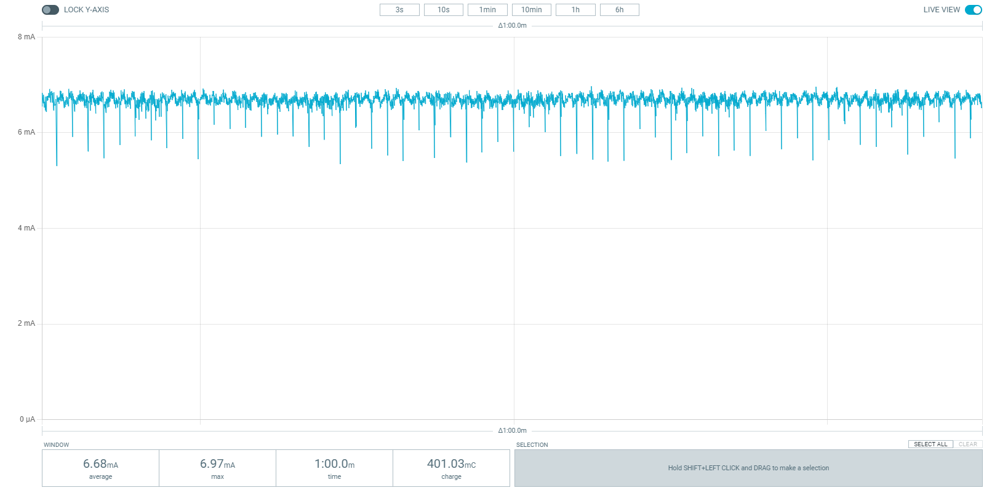
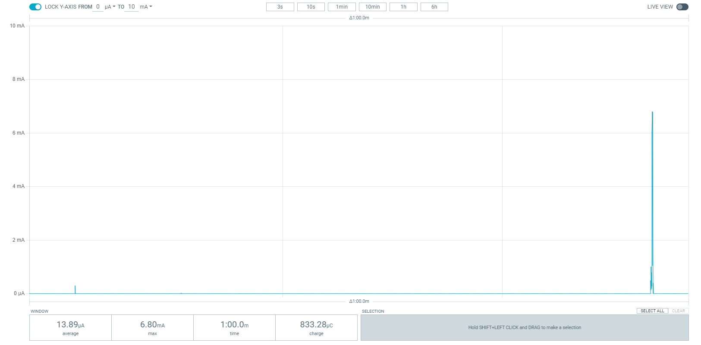

.. _bluetooth_mesh_light_switch:

Bluetooth Mesh: Light switch
############################

.. contents::
   :local:
   :depth: 2

The :ref:`ug_bt_mesh` light switch sample can be used to change the state of light sources on other devices within the same mesh network.
It also demonstrates how to use Bluetooth® Mesh models by using the Generic OnOff Client model in an application.

Use the light switch sample with the :ref:`bluetooth_mesh_light` sample to demonstrate its function in a Bluetooth Mesh network.

This sample also provides the `Low Power node support`_.

Requirements
************

The sample supports the following development kits:

.. table-from-sample-yaml::

You need at least two development kits:

* One development kit where you program this sample application (the client)
* At least one development kit where you program the :ref:`bluetooth_mesh_light` sample application (the server), and configure according to the mesh light sample's :ref:`testing guide <bluetooth_mesh_light_testing>`

For provisioning and configuring of the mesh model instances, the sample requires a smartphone with Nordic Semiconductor's nRF Mesh mobile app installed in one of the following versions:

* `nRF Mesh mobile app for Android`_
* `nRF Mesh mobile app for iOS`_

.. note::
   |thingy53_sample_note|

.. include:: /includes/tfm.txt

Low Power node requirements
===========================

The configuration overlay :file:`overlay-lpn.conf` is optimized for the following boards:

* nrf52dk/nrf52832

* nrf52840dk/nrf52840

* nrf52833dk/nrf52833

However, the same configuration can be applied to other platforms that support the Bluetooth Mesh Light Switch sample, as long as the device supports at least four buttons.

Overview
********

The Bluetooth Mesh light switch sample demonstrates how to set up a mesh client model application, and control LEDs with the Bluetooth Mesh using the :ref:`bt_mesh_onoff_readme`.
To display any functionality, the sample must be paired with a device with the :ref:`bluetooth_mesh_light` sample running in the same mesh network.

In both samples, devices are nodes with a provisionee role in a mesh network.
Provisioning is performed using the `nRF Mesh mobile app`_.
This mobile application is also used to configure key bindings, and publication and subscription settings of the Bluetooth Mesh model instances in the sample to enable them to communicate with the servers.

The Generic OnOff Client model is used for manipulating the Generic OnOff state associated with the Generic OnOff Server model.
The light switch sample implements the Generic OnOff Client model.

The sample instantiates up to four instances of the Generic OnOff Client model to control the state of LEDs on servers (implemented by the :ref:`bluetooth_mesh_light` sample).
One instance of the Generic OnOff Client model is instantiated in the light switch sample for each button available on the development kit that is used.
When a user presses any of the buttons, an OnOff Set message is sent out to the configured destination address.

After provisioning and configuring the mesh models supported by the sample using the `nRF Mesh mobile app`_, you can control the LEDs on the other (server) development kits from the app.

Provisioning
============

Provisioning is handled by the :ref:`bt_mesh_dk_prov`.
It supports four types of out-of-band (OOB) authentication methods, and uses the Hardware Information driver to generate a deterministic UUID to uniquely represent the device.

Models
======

The following table shows the mesh light switch composition data for this sample:

.. table::
   :align: center

   =================  =================  =================  =================
   Element 1          Element 2          Element 3          Element 4
   =================  =================  =================  =================
   Config Server      Gen. OnOff Client  Gen. OnOff Client  Gen. OnOff Client
   Health Server
   Gen. OnOff Client
   =================  =================  =================  =================

.. note::
   When used with :zephyr:board:`thingy53`, Elements 3 and 4 are not available.
   :zephyr:board:`thingy53` supports only two buttons.

The models are used for the following purposes:

* :ref:`bt_mesh_onoff_cli_readme` instances in available elements are controlled by the buttons on the development kit.
* Config Server allows configurator devices to configure the node remotely.
* Health Server provides ``attention`` callbacks that are used during provisioning to call your attention to the device.
  These callbacks trigger blinking of the LEDs.

The model handling is implemented in :file:`src/model_handler.c`, which uses the :ref:`dk_buttons_and_leds_readme` library to detect button presses on the development kit.

If the model is configured to publish to a unicast address, the model handler calls :c:func:`bt_mesh_onoff_cli_set` to turn the LEDs of a mesh light device on or off.
The response from the target device updates the corresponding LED on the mesh light switch device.
If the model is configured to publish to a group address, it calls :c:func:`bt_mesh_onoff_cli_set_unack` instead, to avoid getting responses from multiple devices at once.

Low Power node support
======================

The mesh light switch sample can also be run as a Low Power node (LPN), giving the possibility of lowering the power consumption.

.. tabs::

   .. group-tab:: nRF21, nRF52 and nRF53 DKs

      While running the sample with the LPN configuration, the fourth :ref:`bt_mesh_onoff_cli_readme` instance will be omitted.
      Instead, **Button 4** will be used to temporarily enable Node ID advertisement on the LPN device.

      Running continuous proxy advertisement with Network ID consumes considerable power, and is therefore disabled in the configuration.
      Instead, the user can manually enable the Node ID advertisement for a period of 30 seconds by pressing **Button 4** on the device.
      This will give the user a short period of time to connect directly to the LPN, and thus perform necessary configuration of the device.

   .. group-tab:: nRF54 DKs

      While running the sample with the LPN configuration, the fourth :ref:`bt_mesh_onoff_cli_readme` instance will be omitted.
      Instead, **Button 3** will be used to temporarily enable Node ID advertisement on the LPN device.

      Running continuous proxy advertisement with Network ID consumes considerable power, and is therefore disabled in the configuration.
      Instead, the user can manually enable the Node ID advertisement for a period of 30 seconds by pressing **Button 3** on the device.
      This will give the user a short period of time to connect directly to the LPN, and thus perform necessary configuration of the device.

After the connection to the LPN is terminated, and the Node ID advertisement has stopped, the LPN will return to its previous state.

Friendship establishment will happen automatically after provisioning the LPN light switch, given that a :ref:`bluetooth_mesh_light` sample is running and is provisioned into the same mesh network.

.. note::
   While running the sample as an LPN, logging over the serial interface will be disabled.

Power consumption measurements
------------------------------

The following table shows a list of the supported boards for the LPN configuration, the average power consumption running as a standard (non-LPN) node, and the average power consumption running as an LPN node:

.. table::
   :align: center

   ===================  ========================  ====================
   Board                Avg. consumption non-LPN  Avg. consumption LPN
   ===================  ========================  ====================
   nrf52dk/nrf52832     7.14 mA                    13.69 µA
   nrf52840dk/nrf52840  6.71 mA                    14.63 µA
   nrf52833dk/nrf52833  6.10 mA                    14.43 µA
   ===================  ========================  ====================

The following applies to the LPN measurements presented in this table:

* They are taken after the provisioning and configuration have completed, and after the LPN has established a friendship to a neighboring node.

* The measurement period is approximately ten minutes, and without any light switch events (for example when idle).

* The current consumption is measured using the `Power Profiler Kit II (PPK2)`_.

* The measurements are done on the SoC only (meaning the measurements do not include power consumed by development kit LEDs for example).

Power consumption for nRF52840 running as standard node (Captured in nRF Connect for Desktop: Power Profiler).

Power consumption for nRF52840 running as LPN, showing consumed power over a single LPN polling period. The rightmost spike represents the LPN polling the friend node. (Captured in nRF Connect for Desktop: Power Profiler).

.. _bluetooth_mesh_light_switch_user_interface:

User interface
**************

Buttons:
      During the provisioning process, the buttons can be used for OOB input.
      Once the provisioning and configuration are completed, the buttons are used to initiate certain actions and control the respective Generic OnOff Client instances.
      When pressed, the button publishes an OnOff message using the configured publication parameters of its model instance, and toggles the LED state on a :ref:`mesh light <bluetooth_mesh_light>` device.

LEDs:
   During the provisioning process, on board LEDs are used to output the OOB actions.
   Once the provisioning and configuration are completed, the LEDs are used to reflect the status of actions, and they show the last known OnOff state of the corresponding button.

.. note::
   :zephyr:board:`thingy53` supports only one RGB LED.
   Each RGB LED channel is used as separate LED.

The LPN assignments
===================

.. tabs::

   .. group-tab:: nRF21, nRF52 and nRF53 DKs

      Button 4:
         When pressed, enables the Node ID advertisement for a short period of time.

   .. group-tab:: nRF54 DKs

      Button 3:
         When pressed, enables the Node ID advertisement for a short period of time.

Configuration
*************

|config|

|nrf5340_mesh_sample_note|

Source file setup
=================

The light switch sample is split into the following source files:

* :file:`main.c` used to handle initialization.
* :file:`model_handler.c` used to handle mesh models.

LPN configuration
=================

To make the light switch run as an LPN, set :makevar:`EXTRA_CONF_FILE` to :file:`overlay-lpn.conf` when building the sample using the respective :ref:`CMake option <cmake_options>`.
For example, when building from the command line, use the following command, where *board_target* is the target for the development kit for which you are building:

.. parsed-literal::
   :class: highlight

   west build -b *board_target* -p -- -DEXTRA_CONF_FILE="overlay-lpn.conf"

The configuration overlay :file:`overlay-lpn.conf` enables the LPN feature, and alters certain configuration options to further lower the power consumption.
To review the specific alterations, open and inspect the :file:`overlay-lpn.conf` file.

For more information about configuration files in the |NCS|, see :ref:`app_build_system`.

FEM support
===========

.. include:: /includes/sample_fem_support.txt

Building and running
********************

Make sure to enable the Bluetooth Mesh in |NCS| before building and testing this sample.
See :ref:`Bluetooth Mesh user guide <ug_bt_mesh>` for more information.

.. |sample path| replace:: :file:`samples/bluetooth/mesh/light_switch`

.. include:: /includes/build_and_run_ns.txt

.. |sample_or_app| replace:: sample
.. |ipc_radio_dir| replace:: :file:`sysbuild/ipc_radio`

.. include:: /includes/ipc_radio_conf.txt

.. _bluetooth_mesh_light_switch_testing:

Testing
=======

.. note::
   The light switch sample cannot demonstrate any functionality on its own, and needs a device with the :ref:`bluetooth_mesh_light` sample running in the same mesh network.
   Before testing mesh light switch, go through the mesh light's :ref:`testing guide <bluetooth_mesh_light_testing>` with a different development kit.

After programming the sample to your development kit, you can test it by using a smartphone with `nRF Mesh mobile app`_ installed.
Testing consists of provisioning the device and configuring it for communication with the mesh models.

Provisioning the device
-----------------------

.. |device name| replace:: :guilabel:`Mesh Light Switch`

.. include:: /includes/mesh_device_provisioning.txt

Configuring models
------------------

See :ref:`ug_bt_mesh_model_config_app` for details on how to configure the mesh models with the nRF Mesh mobile app.

.. note::
   When :ref:`configuring mesh models using the nRF Mesh mobile app<ug_bt_mesh_model_config_app>`, make sure that you are connected directly to the **Mesh Light Switch LPN** when configuring the LPN. When using the mobile app for iOS, make sure that automatic proxy connection is disabled.

Configure the Generic OnOff Client model on each element on the **Mesh Light Switch** node:

* Bind the model to **Application Key 1**.
* Set the publication parameters:

  * Destination/publish address: Set the **Publish Address** to the first unicast address of the Mesh Light node.
  * Retransmit count: Set the count to zero (**Disabled**), to prevent the model from sending each button press multiple times.

Once the provisioning and the configuration of the client node and at least one of the server nodes are complete, you can use buttons on the client development kit.
The buttons will control the LED lights on the associated servers, as described in :ref:`bluetooth_mesh_light_switch_user_interface`.

Dependencies
************

This sample uses the following |NCS| libraries:

* :ref:`bt_mesh_onoff_cli_readme`
* :ref:`bt_mesh_dk_prov`
* :ref:`dk_buttons_and_leds_readme`

In addition, it uses the following Zephyr libraries:

* :file:`include/drivers/hwinfo.h`
* :ref:`zephyr:kernel_api`:

  * :file:`include/kernel.h`

* :ref:`zephyr:bluetooth_api`:

  * :file:`include/bluetooth/bluetooth.h`

* :ref:`zephyr:bluetooth_mesh`:

  * :file:`include/bluetooth/mesh.h`

The sample also uses the following secure firmware component:

* :ref:`Trusted Firmware-M <ug_tfm>`
