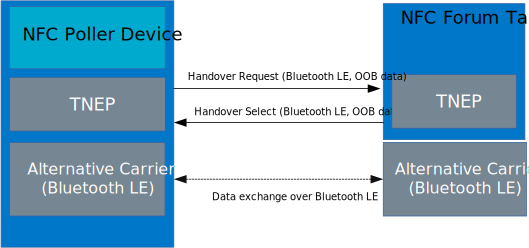

.. _peripheral_nfc_pairing:

Bluetooth: NFC pairing
######################

.. contents::
   :local:
   :depth: 2

The NFC pairing sample demonstrates Bluetooth® LE out-of-band pairing using an NFC tag and the NFC TNEP protocol.
You can use it to test the touch-to-pair feature between Nordic Semiconductor's devices and an NFC polling device with Bluetooth LE support, for example, a mobile phone.

The sample shows the usage of NFC NDEF :ref:`nfc_ch` and :ref:`tnep_tag_readme` with the :ref:`Connection Handover service<nfc_tnep_ch_readme>`.
It provides minimal Bluetooth functionality in Peripheral role and on GATT level it implements only the Device Information Service.

The sample supports pairing in one of the following modes:

* LE Secure Connections Just Works pairing
* LE Secure Connections OOB pairing
* Legacy OOB pairing
* Legacy Just Works pairing
* Negotiated Handover (TNEP protocol) - two-way OOB pairing

Requirements
************

The sample supports the following development kits:

.. table-from-sample-yaml::

.. include:: /includes/tfm.txt

The sample has the following additional requirements:

* NFC polling device (for example, a smartphone or a tablet with NFC support).
* NFC polling device with TNEP support (when testing the two-way OOB pairing).
  You can use the corresponding :ref:`central_nfc_pairing` as an NFC Polling Device.

Overview
********

When the application starts, it initializes and starts the NFCT peripheral that is used for pairing.
The application does not start advertising immediately, but only when the NFC tag is read by an NFC polling device, for example a smartphone or a tablet with NFC support, or when the exchange of data over the TNEP Connection Handover Service has completed.
The message that the tag sends to the NFC device contains the data required to initiate pairing.
To start the NFC data transfer, the NFC device must touch the NFC antenna that is connected to the development kit.

After reading the tag or exchanging data over TNEP, the initiator can connect and pair with the device that is advertising.
The connection state of the device is signaled by the LEDs.
When the connection is lost due to a timeout, the library automatically triggers direct advertising.

NFC data exchange
*****************

This sample can exchange OOB data with an NFC Forum Polling device with TNEP support or can be read as a Static Tag by NFC Forum Polling Devices that do not support TNEP.

Static Handover
===============

A tag in the Static Handover mode, contains a Handover Select Message with carrier information NDEF records or a single Carrier Configuration Record.

.. figure:: images/nfc_static_connection_handover.svg
   :alt: Static Handover

Negotiated Handover
===================

In Negotiated Handover, two NFC Forum Devices identify a matching set of alternative carriers by exchanging lists of potential alternative carriers.
In case of the OOB data for Bluetooth LE, the NFC devices can exchange OOB data in a two-way manner.
Handover messages are exchanged using the TNEP Single Response communication mode.
The NFC Poller Device can have the Handover Requester or Handover Selector Device role.
The role is assumed based on the first NDEF message from the NFC Tag.

You can configure this sample to take the Connection Handover Selector role or the Connection Requester role.
The Connection Handover Selector role is default for this sample.
You can change the default role by choosing ``CONFIG_NFC_TAG_CH_SELECTOR`` or ``CONFIG_NFC_TAG_CH_REQUESTER``.

User interface
**************

.. tabs::

   .. group-tab:: nRF52 and nRF53 DKs

      Button 4:
         Removes all bonded devices and terminates current connections.

      LED 1:
         Indicates that a Bluetooth connection is established.

      LED 2:
         Indicates that an NFC field is present.

   .. group-tab:: nRF54 DKs

      Button 3:
         Removes all bonded devices and terminates current connections.

      LED 0:
         Indicates that a Bluetooth connection is established.

      LED 1:
         Indicates that an NFC field is present.

Building and running
********************

.. |sample path| replace:: :file:`samples/bluetooth/peripheral_nfc_pairing`

.. include:: /includes/build_and_run_ns.txt

Testing
=======

After programming the sample to your development kit, complete the following steps to test it:

Testing with NFC Poller Device
------------------------------

.. tabs::

   .. group-tab:: nRF52 and nRF53 DKs

      1. Touch the NFC antenna with the smartphone or tablet and observe that **LED 2** is lit.
      #. Confirm pairing with :guilabel:`Nordic_NFC_pairing` in a pop-up window on the smartphone or tablet and observe that **LED 1** lights up.
      #. Move the smartphone or tablet away from the NFC antenna and observe that **LED 2** turns off.

   .. group-tab:: nRF54 DKs

      1. Touch the NFC antenna with the smartphone or tablet and observe that **LED 1** is lit.
      #. Confirm pairing with :guilabel:`Nordic_NFC_pairing` in a pop-up window on the smartphone or tablet and observe that **LED 0** lights up.
      #. Move the smartphone or tablet away from the NFC antenna and observe that **LED 1** turns off.

Testing with NFC TNEP Poller Device
-----------------------------------

For nRF52 and nRF53 DKs, perform the following steps:

   1. Touch the NFC antenna with the NFC Poller Device, for example :ref:`central_nfc_pairing` and observe that **LED 2** is lit.
   #. Observe the output log.
      The content of the exchanged NDEF messages is printed there.
   #. Check the security level of the paring on the terminal.
   #. Move the NFC antenna away from the NFC Poller Device.

Dependencies
************

This sample uses the following |NCS| libraries:

* :ref:`nfc_ndef_parser_readme`
* :ref:`nfc_t4t_ndef_file_readme`
* :ref:`nfc_ndef_le_oob`
* :ref:`nfc_ch`
* :ref:`nfc_ndef_le_oob_rec_parser_readme`
* :ref:`nfc_ndef_ch_rec_parser_readme`
* :ref:`nfc_ndef_parser_readme`
* :ref:`dk_buttons_and_leds_readme`

In addition, it uses the Type 4 Tag library from nrfxlib:

* :ref:`nrfxlib:nfc_api_type4`

It uses the following Zephyr libraries:

* :file:`include/zephyr.h`
* :file:`include/device.h`
* :ref:`GPIO Interface <zephyr:api_peripherals>`

The sample also uses the following secure firmware component:

* :ref:`Trusted Firmware-M <ug_tfm>`
