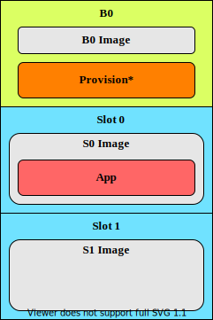
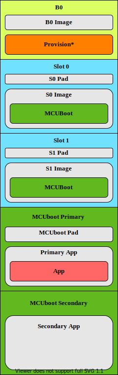

.. _bootloader:

|NSIB|
######

.. contents::
   :local:
   :depth: 2

The |NSIB| (NSIB), previously also known as *B0* or ``b0``, is a secure bootloader built and maintained by Nordic Semiconductor.
It is specifically tailored for the :ref:`immutable bootloader architecture <immutable_bootloader>` of a secure boot chain.
It can verify and boot a second-stage bootloader or application while providing a persistent and reliable :ref:`Root of Trust (RoT) <ug_bootloader_chain_of_trust>`.

See :ref:`ug_bootloader` for more information about the full bootloader chain.

.. note::

   Currently, the NSIB does not support performing firmware updates over the SMP transport.
   If the application using the NSIB requires SMP-based firmware updates, such as Bluetooth® LE DFU, :ref:`include MCUboot as a second-stage bootloader <ug_bootloader_adding_upgradable>`.

.. _bootloader_rot:

Requirements
************

The NSIB supports the following development kits:

.. table-from-sample-yaml::

The NSIB can only boot images that enable the firmware information module, see the :ref:`doc_fw_info` module.

Overview
********

The NSIB implements a simple and reliable :ref:`Root of Trust (RoT) <ug_bootloader_chain_of_trust>` for a secure boot chain, as described in the :ref:`immutable_bootloader` conceptual documentation.

For locking the flash memory, the NSIB uses the :ref:`fprotect_readme` driver.

For the signature verification, to save space, NSIB only stores the hashes of the provisioned keys and compares only the hashes of these keys.
The next image has metadata containing the full public key that corresponds to the private key used to sign the firmware.
This public key is checked against the provisioned hashes of public keys to determine if the image is valid.
All public key hashes at lower indices than the matching hash are permanently invalidated at this point.
You can use this mechanism to decommission compromised keys.

.. note::
   Make sure you provide NSIB with your own keys, as described in :ref:`bootloader_provisioning`, before you program it.

At the end of the RoT establishment, the NSIB also shares some of its functionality through an external API (``EXT_API``).
For more information on the process, see :ref:`doc_bl_crypto`.
For more information on ``EXT_API``, see :ref:`doc_fw_info_ext_api`.

.. _bootloader_provisioning:

Provisioning
============

The public key hashes are not compiled with the source code of the NSIB.
Instead, they must be written to the device in a process called *provisioning*.

The hashes are automatically generated by the build system based on the specified private key and the additional public keys.

By default, the hashes are placed directly into the NSIB HEX file and then automatically provisioned when the HEX file is programmed to the device.

However, in a more realistic manufacturing process, you can program the NSIB HEX file and the HEX file containing the hashes separately, using the Python scripts located in the :file:`scripts/bootloader` folder.

In either case, the NSIB accesses the provisioned data at run time using the :ref:`doc_bl_storage` library.

.. _bootloader_provisioning_otp:

OTP regions
-----------

The one-time programmable (OTP) region is a special region of the *User Information Configuration Registers* (UICR) that only allows flash memory writes in half-word lengths, and *only* when the target half-word has the value of ``0xFFFF``.

On the SoCs that support an OTP region, such as the nRF9160 and nRF5340, the provisioned data is held in the OTP region instead of the internal flash memory.

Because of these design constraints, the following limitations apply:

* The public key hash must not contain half-words with the value ``0xFFFF``, as such hashes cannot be guaranteed to be immutable when placed in the OTP region.
  If any such hashes are provisioned, the NSIB will refuse to boot.
  If your public key hash is found to contain this value, :ref:`it must be regenerated<ug_fw_update_keys>`.

* Provisioned data cannot be written more than once to the target device.
  When programming images that contain flash memory content in the UICR region, such as the NSIB image, the UICR must first be erased.

.. note::
   On the nRF9160 and nRF5340, the UICR can only be erased by erasing the entire flash memory.

To erase the entire flash memory, do the following:

.. tabs::

   .. tab:: Command Line

      Using west:

      .. code-block:: console

         west flash --erase

      Using nrfjprog:

      .. code-block:: console

         nrfjprog -f NRF91 --eraseall

   .. tab:: |VSC|

      Using the :guilabel:`Actions View` in |nRFVSC|:

         1. Go to the :guilabel:`Actions View`.
         #. Move the cursor over the :guilabel:`Flash` action.
         #. Click :guilabel:`Erase And Flash To Board` on the right side of the :guilabel:`Flash` action.

      Using the |VSC| Command Palette:

         1. Open the |VSC| Command Palette.
         #. Type ``Erase and Flash to Board`` and select the highlighted option.

.. _bootloader_flash_layout:

Flash memory layout
===================

The flash memory layout is defined by the :file:`samples/bootloader/pm.yml` file, which establishes four main partitions:

* *B0* - The NSIB image.
* *Provision* - The provisioned data.
* *S0* - Slot 0.
* *S1* - Slot 1.

The default location for placing the next image in the boot chain is *S0*.
This would result, for example, in a flash memory layout like the following, when using the ``nrf52840dk_nrf52840`` board:

   B0 flash memory layout

.. note::
   When the *Provision* area is in the OTP region, it will not appear in the flash memory layout.
   See :ref:`bootloader_provisioning_otp` for more information.

.. _bootloader_pre_signed_variants:

Pre-signed variants
-------------------

When two slots are present, two images must be built.
One that is executable from slot 0, and the other one from slot 1.
Building the image for slot 1 is done by enabling the :kconfig:option:`CONFIG_BUILD_S1_VARIANT` option.

When the image for the next stage in the boot chain is upgraded, the new image is written to the slot with the oldest image version.
See :ref:`bootloader_monotonic_counter` for more information about versioning.

If this image is faulty and cannot be booted, the other partition will always hold a working image that is booted instead.

When using the ``nrf52840dk_nrf52840`` board, this would produce a flash memory layout like the following:

   B0 flash memory layout with MCUboot

.. _bootloader_signature_keys:

Signature keys
==============

The ECDSA-p256 key type is supported for validating the next image in the boot chain.

By default, when not explicitly defined, a private/public key pair is generated during the build.
However, these key pairs should only be used during development.
See :ref:`ug_fw_update_development_keys` for more details.

For details on creating and using custom signature keys, refer to the :ref:`ug_bootloader_adding_immutable_keys` documentation.

.. _bootloader_monotonic_counter:

Monotonic counter
=================

.. bootloader_monotonic_counter_start

A non-volatile *monotonic counter* can be stored in the *Provision* area and is used to implement anti-rollback protection.

Counter updates are written to slots in the *Provision* area, with each new counter update occupying a new slot.
For this reason, the number of counter updates, and therefore firmware version updates, is limited.

Using a counter is optional and can be configured for the application using configuration options.
You can also configure the supported number of updates, but the number is limited by the size of the *Provision* area and how much of that area is taken up by other features, like public key hashes.
In addition, you can configure what firmware version of the image you want to boot.

For NSIB, the configuration options are :kconfig:option:`CONFIG_SB_MONOTONIC_COUNTER`, :kconfig:option:`CONFIG_SB_NUM_VER_COUNTER_SLOTS`, and :kconfig:option:`CONFIG_FW_INFO_FIRMWARE_VERSION`.

For MCUboot, the configuration options are :kconfig:option:`CONFIG_MCUBOOT_HARDWARE_DOWNGRADE_PREVENTION`, :kconfig:option:`CONFIG_MCUBOOT_HW_DOWNGRADE_PREVENTION_COUNTER_SLOTS`, and :kconfig:option:`CONFIG_MCUBOOT_HW_DOWNGRADE_PREVENTION_COUNTER_VALUE`.

To set options for child images, such as NSIB and MCUboot, see the :ref:`ug_multi_image_variables` section.

.. bootloader_monotonic_counter_end

Configuration
*************

|config|

.. _bootloader_build_and_run:

Building and running
********************

.. |sample path| replace:: :file:`samples/bootloader`

.. include:: /includes/build_and_run.txt

.. caution::
   The NSIB should be included as a child image in a multi-image build, rather than being built stand-alone.
   While it is technically possible to build the NSIB by itself and merge it into other application images, this process is not supported.
   To reduce the development time and potential issues with this route, let the existing |NCS| infrastructure for multi-image builds handle the integration.

For building and running the NSIB with an application, see :ref:`ug_bootloader_adding_immutable`.

Building and running using |VSC|
================================

.. include:: /includes/build_and_run_bootloader.txt

To add the NSIB as a child image to your application, complete the following steps:

1. :ref:`Create a private key in PEM format <ug_fw_update_keys>`.
#. Enable the |NSIB| through Kconfig as follows:

   a. Select :guilabel:`Kconfig` in the :guilabel:`Actions View` to open the nRF Kconfig tab.
   #. Expand :guilabel:`Modules` > :guilabel:`nrf` > :guilabel:`Nordic nRF Connect` > :guilabel:`Bootloader` and set :guilabel:`Use Secure Bootloader` to enable :kconfig:option:`CONFIG_SECURE_BOOT`.
   #. Expand :guilabel:`Use Secure Bootloader`.
      Under :guilabel:`Private key PEM file` (:kconfig:option:`CONFIG_SB_SIGNING_KEY_FILE`), enter the path to the private key that you created.

      You can also modify other additional configuration options, but that is not recommended.
      The default settings are suitable for most use cases.

      .. note::
         If you need more flexibility with signing, or if you do not want the build system to handle your private key, choose :kconfig:option:`CONFIG_SB_SIGNING_CUSTOM`, and also specify :kconfig:option:`CONFIG_SB_SIGNING_COMMAND` and :kconfig:option:`CONFIG_SB_SIGNING_PUBLIC_KEY`.
         You can use the :guilabel:`Search modules` bar in nRF Kconfig to find these options.
         These options allow you to define the signing command.

   #. Click :guilabel:`Save`.

#. Select :guilabel:`Build` in the :guilabel:`Actions View` to start the build process.
   The build process creates two images, one for the NSIB and one for the application, and merges them.

#. Select :guilabel:`Flash` in the :guilabel:`Actions View` to program the resulting image to your device.

Testing
=======

See :ref:`ug_bootloader_testing` for testing of the expected runtime behavior of the NSIB when built with an application.

Dependencies
************

The following |NCS| libraries are used:

* :ref:`partition_manager`
* :ref:`doc_fw_info`
* :ref:`fprotect_readme`
* :ref:`doc_bl_crypto`
* :ref:`doc_bl_validation`
* :ref:`doc_bl_storage`

It uses the following `sdk-nrfxlib`_ libraries:

* :ref:`nrfxlib:nrf_cc310_bl_readme`
* :ref:`nrfxlib:nrf_oberon_readme`
