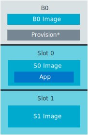

 .. _bootloader:

|NSIB|
######

.. contents::
   :local:
   :depth: 2

The |NSIB| (NSIB), previously also known as *B0* or ``b0``, is a secure bootloader built and maintained by Nordic Semiconductor.
It is specifically tailored for the :ref:`immutable bootloader architecture <immutable_bootloader>` of a secure boot chain.
It can verify and boot a second-stage bootloader or application while providing a persistent and reliable *Root of Trust* (RoT).

See :ref:`ug_bootloader` for more information about the full bootloader chain.

.. note::

   Currently, this immutable bootloader does not support firmware updates over the SMP transport for either an upgradable bootloader or an application.
   If the application using this bootloader requires SMP-based firmware updates, such as Bluetooth® LE DFU, :ref:`include MCUboot as a second-stage bootloader <ug_bootloader_adding_upgradable>`.

.. _bootloader_rot:

Requirements
************

The sample supports the following development kits:

.. table-from-sample-yaml::

Overview
********

The sample accomplishes a simple and reliable *Root of Trust* (RoT) for a secure boot chain as follows:

1. Locks the flash memory.

   To enable the RoT, the bootloader sample locks the flash memory that contains both the sample bootloader and its configuration.
   Locking is done using the hardware that is available on the given architecture.

   For additional details on locking, see the :ref:`fprotect_readme` driver.

#. Selects the next stage in the boot chain.

   The next stage in the boot chain can either be another bootloader or an application.

   When you enable the |NSIB| and use MCUboot as the second stage bootloader, there are two slots in which the second stage bootloader can reside.
   The second stage bootloader in each slot has a version number associated with it, and the bootloader sample selects the second stage bootloader with the highest version number.

   For information about creating a second stage bootloader, see :ref:`ug_bootloader_adding_upgradable`.

#. Verifies the next stage in the boot chain.

   After selecting the image to boot next, the bootloader sample verifies the image validity using one of the provisioned public key hashes.

   The image for the next boot stage has a set of metadata associated with it.
   This metadata contains the full public key corresponding to the private key used to sign the firmware.
   The bootloader sample checks the public key against a set of provisioned keys.

   .. note::

      To save space, only the hashes of the provisioned keys are stored and only the hashes of the keys are compared.
      See :ref:`bootloader_provisioning` for more details.

   If the public key in the metadata matches one of the valid provisioned public key hashes, the image is considered valid.

   All public key hashes at lower indices than the matching hash are permanently invalidated at this point.
   This means that images can no longer be validated with those public keys.
   For example, if an image is successfully validated with the public key at index 2, public keys 0 and 1 are invalidated.
   You can use this mechanism to decommission broken keys.

   If the public key does not match any remaining valid provisioned hashes, the validation process fails.

#. Boots the next stage in the boot chain.

   After verifying the next boot stage, the bootloader sample uninitializes all peripherals that it used and boots the next boot stage.

#. Shares the cryptographic library through an external API.

   The bootloader sample shares some of its functionality through an external API (``EXT_API``).

   For more information on the process, see the :file:`bl_crypto.h` file.
   For more information on ``EXT_API``, see :ref:`doc_fw_info_ext_api`.

.. _bootloader_provisioning:

Provisioning
============

The public key hashes are not compiled with the source code of the bootloader sample.
Instead, they must be stored in a separate memory region through a process called *provisioning*.

By default, the bootloader sample automatically generates and provisions public key hashes directly into the bootloader HEX file, based on the specified private key and the additional public keys.

Alternatively, to facilitate the manufacturing process of a device using the bootloader sample, it is possible to decouple this process and program the sample HEX file and the HEX file containing the public key hashes separately.
If you choose to do so, use the Python scripts located in the :file:`scripts/bootloader` folder to create and provision the keys manually.

In both cases, the bootloader access the provisioned data using the :ref:`doc_bl_storage` library.

.. _bootloader_provisioning_otp:

OTP Regions
-----------

On some SoCs/SiPs, such as the nRF9160 or nRF5340, the provisioned data is held in the *one-time programmable* (OTP) region in the *User Information Configuration Registers* (UICR).
OTP regions are special regions of the flash memory that only allow flash memory writes in half-word lengths, and *only* when the target half-word is the value ``0xFFFF``.

Because of these design constraints, the following limitations apply:

* The public key hash cannot contain half-words with the value ``0xFFFF``, as such hashes cannot be guaranteed to be immutable when placed in the OTP region.
  Therefore, the bootloader refuses to boot if any hash contains a half-word with the value ``0xFFFF``.
  If your public key hash is found to contain this value, :ref:`regenerate it <ug_fw_update_keys>` or use another public key.

* Writing data to an OTP region means that provisioned data cannot be written more than once to the target device.
  When programming images that contain flash memory content for this region, such as the bootloader or images containing the bootloader, the UICR must first be erased.

.. note::
   On the nRF9160 and nRF5340, the UICR can only be erased by erasing the entire flash memory.

To perform a full erase, do the following:

.. tabs::

   .. tab:: Command Line

      Using west:

      .. code-block:: console

         west flash -d *build_directory* --erase

      Using nrfjprog:

      .. code-block:: console

         nrfjprog -f NRF91 --eraseall

   .. tab:: |VSC|

      Using the :guilabel:`Actions View` in |nRFVSC|:

         1. Go to the :guilabel:`Actions View`.
         #. Move the cursor over the :guilabel:`Flash` action.
         #. Click :guilabel:`Erase And Flash To Board` on the right side of the :guilabel:`Flash` action.

      Using the |VSC| Command Palette:

         1. Open the |VSC| Command Palette.
         #. Type ``Erase and Flash to Board`` and select the highlighted option.

.. _bootloader_flash_layout:

Flash memory layout
===================

The flash memory layout is defined by the :file:`samples/bootloader/pm.yml` file, which establishes four main partitions:

* *B0* - Contains the bootloader sample.
* *Provision* - Stores the provisioned data.
* *S0* - Defines one of the two potential storage areas for the second stage bootloader.
* *S1* - Defines the other one of the two potential storage areas for the second stage bootloader.

The default location for placing the next image in the boot chain is *S0*.
This would result, for example, in a flash memory layout like the following, when using the ``nrf52840dk_nrf52840`` board:

   B0 flash memory layout

.. _bootloader_pre_signed_variants:

Pre-signed variants
-------------------

When the application uses a second-stage upgradable bootloader, *S1* can be programmed with the same image as *S0* when compiled with the :kconfig:option:`CONFIG_BUILD_S1_VARIANT` option.
This ensures that the upgradable bootloader can be executed from either slot chosen by the |NSIB|.

When the upgradable bootloader is upgraded, the new image is placed into the slot not in use by the current version of the bootloader.
At boot, the |NSIB| checks the version information for the images in *S0* and *S1* and boots the one with the highest version.
See :ref:`bootloader_monotonic_counter` for more information about versioning.

If this image is faulty and cannot be booted, the other partition will always hold a working image that is booted instead.

When using the ``nrf52840dk_nrf52840`` board, this would produce a flash memory layout like the following:

.. figure:: ../../doc/nrf/images/b0_mcuboot_flash_layout.svg
   :alt: B0 flash memory layout with MCUboot

   B0 flash memory layout with MCUboot

.. note::

   In devices that store provisioning data in an OTP region, the *Provision* area does not appear in the flash memory layout.
   See :ref:`bootloader_provisioning_otp` for more information.

.. _bootloader_signature_keys:

Signature Keys
==============

This bootloader supports the ECDSA-p256 key type for validating the next image in the boot chain.

By default, when not explicitly defined, a private/public key pair is generated during the build.
However, these key pairs should only be used during development.
See :ref:`ug_fw_update_development_keys` for more details.

For details on creating and using custom signature keys with this sample, refer to the :ref:`ug_bootloader_adding_immutable_keys` documentation.

.. _bootloader_monotonic_counter:

Monotonic Counter
=================

.. bootloader_monotonic_counter_start

Firmware versions using the |NSIB| are kept in the form of a *monotonic counter*, a hardware-based version that prevents booting an image with a lower counter value.
Counter values are kept as slots in the flash memory, with each new counter value occupying a new slot.
See :kconfig:option:`CONFIG_SB_MONOTONIC_COUNTER` for more details.

To set the counter value of an application, build it using the :kconfig:option:`CONFIG_FW_INFO_FIRMWARE_VERSION` option:

.. code-block::

   CONFIG_FW_INFO_FIRMWARE_VERSION=<integer>

The number of slots available for counter values depends on the type of nRF devices being used.
For default values and ranges, see :kconfig:option:`CONFIG_SB_NUM_VER_COUNTER_SLOTS`.

.. bootloader_monotonic_counter_end

Configuration
*************

|config|

FEM support
===========

.. include:: /includes/sample_fem_support.txt

.. _bootloader_build_and_run:

Building and running
********************

.. |sample path| replace:: :file:`samples/bootloader`

.. include:: /includes/build_and_run.txt

The bootloader sample should be included as a child image in a multi-image build, rather than being built stand-alone.
While it is possible to build this sample by itself and merge it into other application images, this process is not officially supported by the |NCS|.
To reduce the development time and potential issues with this route, let the existing |NCS| infrastructure for multi-image builds handle the integration.

For building and running this sample with an application, see :ref:`ug_bootloader_adding_immutable`.

Building and running using |VSC|
================================

.. include:: /includes/build_and_run_bootloader.txt

To add the bootloader sample as a child image to your application, complete the following steps:

1. :ref:`Create a private key in PEM format <ug_fw_update_keys>`.
#. Enable the |NSIB| through Kconfig as follows:

   a. Select :guilabel:`Kconfig` in the :guilabel:`Actions View` to open the nRF Kconfig tab.
   #. Expand :guilabel:`Modules` > :guilabel:`nrf` > :guilabel:`Nordic nRF Connect` > :guilabel:`Bootloader` and set :guilabel:`Use Secure Bootloader` to enable :kconfig:option:`CONFIG_SECURE_BOOT`.
   #. Expand :guilabel:`Use Secure Bootloader`.
      Under :guilabel:`Private key PEM file` (:kconfig:option:`CONFIG_SB_SIGNING_KEY_FILE`), enter the path to the private key that you created.

      You can also modify other additional configuration options, but that is not recommended.
      The default settings are suitable for most use cases.

      .. note::
         If you need more flexibility with signing, or if you do not want the build system to handle your private key, choose :kconfig:option:`CONFIG_SB_SIGNING_CUSTOM`, and also specify :kconfig:option:`CONFIG_SB_SIGNING_COMMAND` and :kconfig:option:`CONFIG_SB_SIGNING_PUBLIC_KEY`.
         You can use the :guilabel:`Search modules` bar in nRF Kconfig to find these options.
         These options allow you to define the signing command.

   #. Click :guilabel:`Save`.

#. Select :guilabel:`Build` in the :guilabel:`Actions View` to start the build process.
   The build process creates two images, one for the bootloader and one for the application, and merges them.

#. Select :guilabel:`Flash` in the :guilabel:`Actions View` to program the resulting image to your device.

Testing
=======

See :ref:`ug_bootloader_testing` for testing the expected runtime behavior of this bootloader when built with an application.

Dependencies
************

This sample uses the following |NCS| libraries:

* :ref:`partition_manager`
* :ref:`doc_fw_info`
* :ref:`fprotect_readme`
* :ref:`doc_bl_crypto`
* :ref:`doc_bl_validation`
* :ref:`doc_bl_storage`

It uses the following `sdk-nrfxlib`_ libraries:

* :ref:`nrfxlib:nrf_cc310_bl_readme`
* :ref:`nrfxlib:nrf_oberon_readme`
