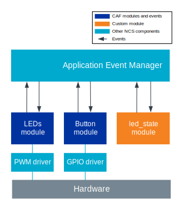

.. _caf_preview_sample:

Common Application Framework preview
####################################

.. contents::
   :local:
   :depth: 2

This sample demonstrates how to use :ref:`lib_caf` (CAF) to build event-based applications with ready-for-use modules and events.
It uses both stock CAF modules available in the |NCS| and a custom module created specifically for the sample.

.. _caf_sample_requirements:

Requirements
************

The sample supports the following development kits:

.. table-from-sample-yaml::

Overview
********

The following diagram illustrates the sample application structure.

   Common Application Framework preview sample structure

The sample uses the following CAF modules:

* :ref:`caf_buttons` - The sample uses this module to receive events related to a button press.
* :ref:`caf_leds` - The sample uses this module to control the LED effects displayed on available LEDs.

Additionally, the sample uses its own custom module called ``led_state``.
This custom module serves the following purposes:

* Listening to button events sent by the :ref:`caf_buttons`.
* Sending LED effect events to the :ref:`caf_leds`.

For more information about adding your own modules, see :ref:`caf_overview_modules_custom` on the CAF overview page.

User interface
**************

Button 1:
  Changes the LED effect displayed on the LED to the next defined LED effect:

  * The first default LED effect toggles the blinking of the LED, with the period set to 400 ms.
  * The second default LED effect toggles the breathing of the LED, with the period set to 400 ms.
  * The third default LED effect toggles a looped effect where LED blinks three times with 400 ms period and then turns off for 1000 ms.

Button 2:
   Switches the active LED: Switches the active LED to the next available LED.
   The previously active LED keeps its LED effect, and the new active LED turns on.

LEDs 1-4:
   Depending on the button presses:

   * If you press **Button 1**, the active LED displays the defined LED effect.
   * If you press **Button 2**, the active LED turns off and the next available turns on.

Configuration
*************

|config|

Defining LED effects
====================

The configuration for each board is different and defined in the overlay file available in the respective directory in the :file:`boards` directory.
Additionally, each of the stock CAF modules has a header configuration file for each board, because the LEDs of each board are connected to different GPIO pins.
These files are available in the :file:`configuration` directory and you can modify them.

For example, the sample defines a few LED effects that can be displayed on LEDs.
By pressing the buttons, you can change the displayed effect for the LED or toggle another LED.

The LED effects are defined in :file:`led_state_def.h` file.
The following snippet demonstrates the default LED effect configuration:

  .. code-block:: none

     static const struct led_effect led_effect[] = {
        [LED_EFFECT_ID_OFF] = LED_EFFECT_LED_OFF(),
        [LED_EFFECT_ID_BLINK] = LED_EFFECT_LED_BLINK(200, LED_COLOR(255, 255, 255)),
        [LED_EFFECT_ID_BREATH] = LED_EFFECT_LED_BREATH(200, LED_COLOR(255, 255, 255)),
        [LED_EFFECT_ID_CLOCK] = LED_EFFECT_LED_CLOCK(3, LED_COLOR(255, 255, 255)),
     };

When testing the sample, you can change the defined effects or add your own effects to the ``led_effect`` table.

Building and running
********************
.. |sample path| replace:: :file:`samples/caf`

.. include:: /includes/build_and_run.txt

Testing
=======

After programming the sample to your development kit, you can test it by performing the following steps:

1. Observe that the **LED 1** turns on.
   This is the LED that is currently being controlled by the application.
#. Press **Button 1** on the development kit to toggle the next LED effect of the **LED 1**.
   The LED color starts blinking.
#. Press **Button 2** to switch to the next LED.
   The **LED 1** keeps blinking and the **LED 2** turns on.
#. Press **Button 1**.
   The **LED 2** starts blinking similarly to **LED 1**.
#. Press **Button 1** again and see the **LED 2** starts breathing with a 400-ms period.
#. Press **Button 1** again and see the LED clock effect.
   The **LED 2** blinks three times with a 400-ms period.
   It then turns off for 1000 ms.
   The effect is looped forever.

Dependencies
************

This sample uses the following |NCS| libraries:

* :ref:`lib_caf`

In addition, it uses the following Zephyr drivers:

* :ref:`zephyr:pwm_api`
* :ref:`zephyr:logging_api`
