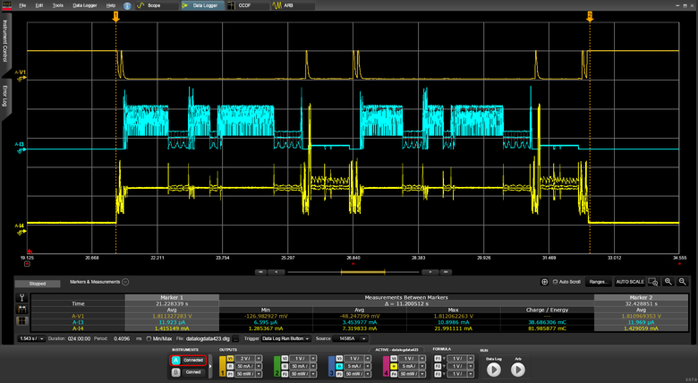
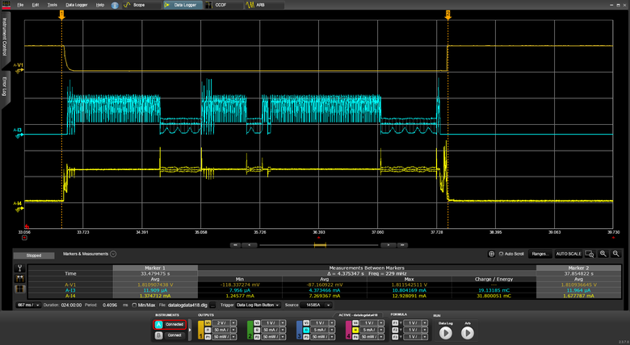
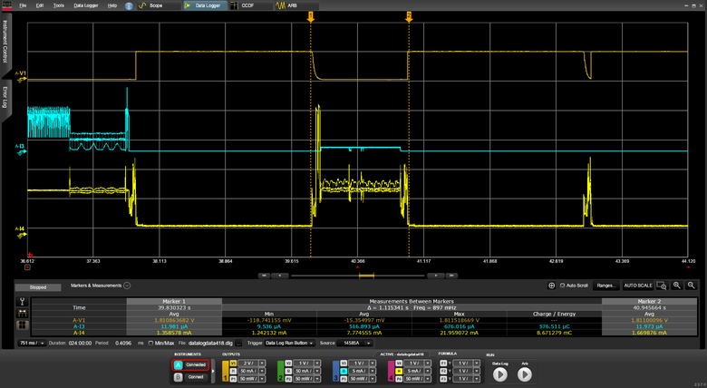
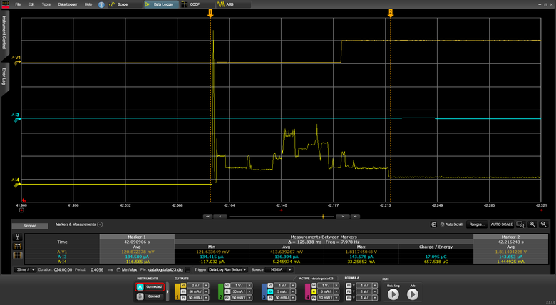

.. _ironside_se_snapshot_capture_recover:

IronSide SE: Snapshot capture and recover
#########################################

.. contents::
   :local:
   :depth: 2

The Snapshot capture and recover sample demonstrates the |ISE| snapshot capture and recovery features.
This feature helps in recovering the content of the MRAM when corruption due to bit flips caused by magnetic fields occurs.

Requirements
************

The sample supports the following development kit:

.. table-from-sample-yaml::

The sample also requires your development kit to be on the latest version of |ISE|.
For more information, see :ref:`abi_compatibility`.

Overview
********

The sample performs multiple snapshot capture and recovery operations, followed by an infinite loop of reboot cycles.

In each cycle, the sample validates the boot report, increments an |ISE| NV counter (:ref:`ug_nrf54h20_ironside_se_counter_service`), logs the snapshot status, and executes a *capture → recovery → cold* reboot sequence.

To keep execution bounded and repeatable, the sequence stops when the counter reaches ``SNAPSHOT_MAX_CYCLES`` in :file:`src/main.c`.
After reaching this limit, the sample enters a heartbeat loop.

During the heartbeat loop, the sample periodically performs high-volume MRAM read sweeps over a large region.
If |ISE| detects corruption in this region, it triggers snapshot recovery.

You can apply a magnet during the heartbeat loop to intentionally corrupt the MRAM and observe that the device recovers.

UICR configuration
==================

The sample configures the following UICR settings:

* **UICR.LOCK** - Not written by :file:`sysbuild/uicr.conf`.
  After each boot, the sample reads the NV counter.
  If the value is ``0``, it calls ``uicr_deploy_lock_contents()`` and performs a cold reboot.

* **PROTECTEDMEM** - Protects ``cpuapp_boot_partition`` and ``periphconf_partition`` (72 KB).
  This layout is consistent with other |ISE| samples, where ``periphconf`` is placed immediately after the boot partition.

* **UICR.SNAPSHOT.REGIONS** - Defines snapshot regions.
  Region 0 is located at physical address ``0x0E030000`` (72 KB) and covers the boot and ``periphconf`` partitions.
  Additional regions defined in :file:`sysbuild/uicr.conf` cover secure storage and the MRAM area used by the sample stress path.

Building and running
********************

.. |sample path| replace:: :file:`samples/ironside_se/snapshot_capture_recover`

.. include:: /includes/build_and_run.txt

To reset the persistent state, including all counters, before starting a clean execution, run the following command:

.. code-block:: console

   west flash --recover

Testing
*******

After programming the sample to your development kit, complete the following steps to test it:

1. |connect_terminal|
#. Reset the development kit.
#. Observe the console output as the sample locks UICR on the first boot, then runs several snapshot capture and recovery cycles (the NV counter increments on each boot).
#. After ``SNAPSHOT_MAX_CYCLES`` boots, the sample enters a heartbeat loop and periodically logs MRAM read sweeps.
#. Optionally, apply a strong magnet near the device while it is in the heartbeat loop and reset or wait for the next boot to observe |ISE| snapshot recovery after MRAM corruption.

Power measurements
******************

The following measurements were obtained with ``VDDH`` set to 3.0 V and ``VDD_flash`` set to 1.8 V.
The full boot sequence includes two snapshot captures and two snapshot recoveries.

The following table lists the measured charge and duration for each operation.

.. list-table::
   :header-rows: 1

   * - Operation
     - ``VDDH`` charge
     - ``VDD_flash`` charge
     - Duration
   * - Full boot sequence
     - 82.0 mC at 3.0 V
     - 38.7 mC at 1.8 V
     - 11.2 s
   * - One snapshot capture
     - 31.8 mC at 3.0 V
     - 19.1 mC at 1.8 V
     - 4.38 s
   * - One snapshot recovery
     - 8.67 mC at 3.0 V
     - 0.58 mC at 1.8 V
     - 1.12 s
   * - Boot without capture or recovery
     - 0.66 mC at 3.0 V
     - Not measured
     - 125 ms

The following figures show the Power Profiler traces for the measured operations.

   Power Profiler trace for the full boot sequence.

   Power Profiler trace for one snapshot capture.

   Power Profiler trace for one snapshot recovery.

   Power Profiler trace for boot without capture or recovery.

Dependencies
************

This sample uses the following |NCS| subsystems:

* |ISE| snapshot service - Captures and recovers configured MRAM and NVR regions
* |ISE| counter service - Tracks the boot cycle for the bounded capture/recovery flow
* Sysbuild - Builds the application and UICR images together
* UICR generation - Configures PROTECTEDMEM and snapshot regions in :file:`sysbuild/uicr.conf`

In addition, it uses the following Zephyr subsystems:

* :ref:`Kernel <kernel>` - Provides basic system functionality and threading
* :ref:`zephyr:logging_api` - Prints boot, snapshot status, and heartbeat messages
