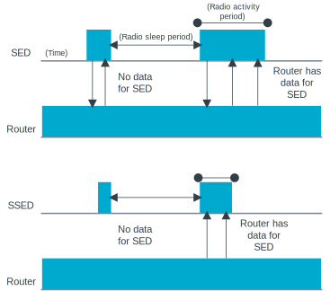

.. _matter_window_covering_sample:

Matter: Window covering
#######################

.. contents::
   :local:
   :depth: 2

This sample demonstrates the usage of the :ref:`Matter <ug_matter>` application layer to build a window covering device.
This device works as a Matter accessory device, meaning it can be paired and controlled remotely over a Matter network built on top of a low-power 802.15.4 Thread network.
Additionally, this device works as a Thread :ref:`Synchronized Sleepy End Device (SSED) <thread_ot_device_types>`.

Use this sample as a reference for developing your own application.
See the :ref:`ug_matter_creating_accessory` page for an overview of the process you need to follow.

Requirements
************

The sample supports the following development kits:

.. table-from-sample-yaml::

If you want to commission the window covering device and :ref:`control it remotely <matter_window_cover_network_mode>` through a Thread network, you also need a Matter controller device :ref:`configured on PC or smartphone <ug_matter_configuring>`.
This requires additional hardware depending on the setup you choose.

.. note::
    |matter_gn_required_note|

Overview
********

The sample uses buttons for gradually changing the position and movement mode of the window cover, and LEDs to show the state of these changes.
The following movement modes are available:

* Lift - In this movement mode, the window cover moves up and down.
* Tilt - In this movement mode, the window cover slats are tilted forward or backward without the cover moving vertically.

See `User interface`_ for information about how to switch the movement modes.

.. _matter_window_covering_sample_ssed:

SSED device type
================

The SSED device type was created for the window covering devices to optimize the power usage of the device and communication pattern with the parent.

A Thread Synchronized Sleepy End Device (SSED) is synchronized with its parent router and uses the radio only at scheduled intervals, by using the :ref:`thread_ug_supported_features_csl` feature introduced as one of the `Thread 1.2 Base Features`_.
During those intervals, the device waits for the router to send it any data related to the desired device activity.
The SSED does require sending packets occasionally to keep synchronization with the router.
However, unlike a regular SED, an SSED does not actively communicate with the router by polling and goes into the idle mode between the scheduled activity periods.
If there is no application-related traffic for an extended period of time, the SSED sends a data poll request packet to synchronize with the parent.
Compared to a standard SED, the SSED features can further reduce energy consumption of the device and generate less data traffic.

   Comparison of Thread SED and Thread SSED radio activity

See the :ref:`thread_sed_ssed` page for more information.

Sample testing
==============

You can test the sample in the following ways:

* Standalone, using a single DK that runs the window covering application.
* Remotely over the Thread protocol, which requires more devices.

The remote control testing requires a Matter controller that you can configure either on a PC or mobile device (for remote testing in a network).
You can enable both methods after :ref:`building and running the sample <matter_window_cover_sample_remote_control>`.

.. _matter_window_cover_network_mode:

Remote testing in a network
---------------------------

.. include:: ../light_bulb/README.rst
    :start-after: matter_light_bulb_sample_remote_testing_start
    :end-before: matter_light_bulb_sample_remote_testing_end

Configuration
*************

|config|

Matter window covering build types
==================================

.. include:: ../light_bulb/README.rst
    :start-after: matter_light_bulb_sample_configuration_file_types_start
    :end-before: matter_light_bulb_sample_configuration_file_types_end

Device Firmware Upgrade support
===============================

.. include:: ../lock/README.rst
    :start-after: matter_door_lock_sample_build_with_dfu_start
    :end-before: matter_door_lock_sample_build_with_dfu_end

FEM support
===========

.. include:: /includes/sample_fem_support.txt

Factory data support
====================

.. include:: ../lock/README.rst
    :start-after: matter_door_lock_sample_factory_data_start
    :end-before: matter_door_lock_sample_factory_data_end

User interface
**************

.. include:: ../lock/README.rst
    :start-after: matter_door_lock_sample_led1_start
    :end-before: matter_door_lock_sample_led1_end

LED 2:
    Indicates the lift position of the window cover, which is represented by the brightness of the LED.
    The brightness level ranges from ``0`` to ``255``, where the brightness level set to ``0`` (switched off LED) indicates a fully opened window cover (lifted) and the brightness level set to ``255`` indicates a fully closed window cover (lowered).

    Additionally, the LED starts blinking evenly (500 ms on/500 ms off) when the Identify command of the Identify cluster is received on the endpoint ``1``.
    The command's argument can be used to specify the duration of the effect.

LED 3:
    Indicates the tilt position of the window cover, which is represented by the brightness of the LED.
    The brightness level ranges from ``0`` to ``255``, where the brightness level set to ``0`` (switched off LED) indicates a fully opened window cover (tilted to a horizontal position) and the brightness level set to ``255`` indicates a fully closed window cover (tilted to a vertical position).

.. include:: ../lock/README.rst
    :start-after: matter_door_lock_sample_button1_start
    :end-before: matter_door_lock_sample_button1_end

Button 2:
    When pressed once and released, it moves the window cover towards the open position by one step.
    Depending on the movement mode of the cover (see `Overview`_), the button decreases the brightness of either  **LED 2** for the lift mode or **LED 3** for the tilt mode.

Button 3:
    When pressed once and released, it moves the cover towards the closed position by one step.
    Depending on the movement mode of the cover (see `Overview`_), the button increases the brightness of either  **LED 2** for the lift mode or **LED 3** for the tilt mode.

Button 2 and Button 3:
    When pressed at the same time, they toggle the cover movement mode between lift and tilt.
    After each device reset, the mode is set to lift by default.

.. note::
    Completely opening and closing the cover requires 20 button presses (steps).
    Each step takes approximately 200 ms to simulate the real window cover movement.
    The cover position and the LED brightness values are stored in non-volatile memory and are restored after every device reset.
    After the firmware update or factory reset both LEDs are switched off by default, which corresponds to the cover being fully open, both lift-wise and tilt-wise.

.. include:: ../lock/README.rst
    :start-after: matter_door_lock_sample_jlink_start
    :end-before: matter_door_lock_sample_jlink_end

NFC port with antenna attached:
    Optionally used for obtaining the `Onboarding information`_ from the Matter accessory device to start the :ref:`commissioning procedure <matter_window_cover_sample_remote_control_commissioning>`.

Building and running
********************

.. |sample path| replace:: :file:`samples/matter/window_covering`

.. include:: /includes/build_and_run.txt

Selecting a build type
======================

Before you start testing the application, you can select one of the `Matter window covering build types`_, depending on your building method.

Selecting a build type in |VSC|
-------------------------------

.. include:: /config_and_build/modifying.rst
   :start-after: build_types_selection_vsc_start
   :end-before: build_types_selection_vsc_end

Selecting a build type from command line
----------------------------------------

.. include:: /config_and_build/modifying.rst
   :start-after: build_types_selection_cmd_start
   :end-before: For example, you can replace the

For example, you can replace the *selected_build_type* variable to build the ``release`` firmware for ``nrf52840dk_nrf52840`` by running the following command in the project directory:

.. parsed-literal::
   :class: highlight

   west build -b nrf52840dk_nrf52840 -d build_nrf52840dk_nrf52840 -- -DCONF_FILE=prj_release.conf

The ``build_nrf52840dk_nrf52840`` parameter specifies the output directory for the build files.

.. note::
   If the selected board does not support the selected build type, the build is interrupted.
   For example, if the ``shell`` build type is not supported by the selected board, the following notification appears:

   .. code-block:: console

      File not found: ./ncs/nrf/samples/matter/window_covering/configuration/nrf52840dk_nrf52840/prj_shell.conf

Testing
=======

After building the sample and programming it to your development kit, complete the following steps to test its basic features:

#. |connect_kit|
#. |connect_terminal_ANSI|
#. Observe that **LED 2** and **LED 3** are turned off, which means that the window cover is fully open.
   The device starts in the lift movement mode by default.
#. Press **Button 3** 20 times to fully close the cover in the lift movement mode.
   **LED 2** lights up and its brightness increases with each button press until it reaches full brightness.
#. Press **Button 2** 20 times to fully lift the cover up.
   The brightness of **LED 2** decreases with each button press until the LED turns off.
#. Press **Button 2** and **Button 3** together to switch into the tilt movement mode.
#. Press **Button 3** 20 times to fully tilt the cover into the closed position.
   **LED 3** light up and its brightness increases with each button press until it reaches full brightness.
#. Press **Button 2** 20 times to fully tilt the cover into the open position.
   The brightness of **LED 3** decreases with each button press until the LED turns off.
#. Press **Button 1** to initiate the factory reset of the device.

The device reboots after all its settings are erased.

.. _matter_window_cover_sample_remote_control:

Enabling remote control
=======================

Remote control allows you to control the Matter window covering device from a Thread network.

`Commissioning the device`_ allows you to set up a testing environment and remotely control the sample over a Matter-enabled Thread network.

.. _matter_window_cover_sample_remote_control_commissioning:

Commissioning the device
------------------------

.. include:: ../light_bulb/README.rst
    :start-after: matter_light_bulb_sample_commissioning_start
    :end-before: matter_light_bulb_sample_commissioning_end

Before starting the commissioning procedure, the device must be made discoverable over Bluetooth LE.
Press **Button 4** to enable the Bluetooth LE advertising.

Onboarding information
++++++++++++++++++++++

When you start the commissioning procedure, the controller must get the onboarding information from the Matter accessory device.
The onboarding information representation depends on your commissioner setup.

For this sample, you can use one of the following :ref:`onboarding information formats <ug_matter_network_topologies_commissioning_onboarding_formats>` to provide the commissioner with the data payload that includes the device discriminator and the setup PIN code:

  .. list-table:: Window covering sample onboarding information
     :header-rows: 1

     * - QR Code
       - QR Code Payload
       - Manual pairing code
     * - Scan the following QR code with the app for your ecosystem:

         .. figure:: ../../../doc/nrf/images/matter_qr_code_window_covering.png
            :width: 200px
            :alt: QR code for commissioning the window covering device

       - MT:SAGA442C00KA0648G00
       - 34970112332

.. include:: ../lock/README.rst
    :start-after: matter_door_lock_sample_onboarding_start
    :end-before: matter_door_lock_sample_onboarding_end

|matter_cd_info_note_for_samples|

Upgrading the device firmware
=============================

To upgrade the device firmware, complete the steps listed for the selected method in the :doc:`matter:nrfconnect_examples_software_update` tutorial of the Matter documentation.

Dependencies
************

This sample uses the Matter library that includes the |NCS| platform integration layer:

* `Matter`_

In addition, the sample uses the following |NCS| components:

* :ref:`dk_buttons_and_leds_readme`

The sample depends on the following Zephyr libraries:

* :ref:`zephyr:logging_api`
* :ref:`zephyr:kernel_api`
