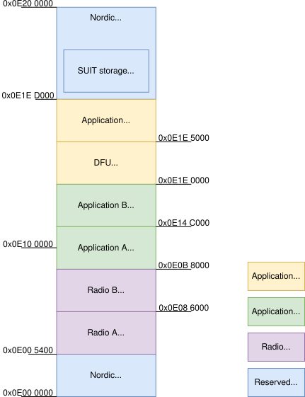
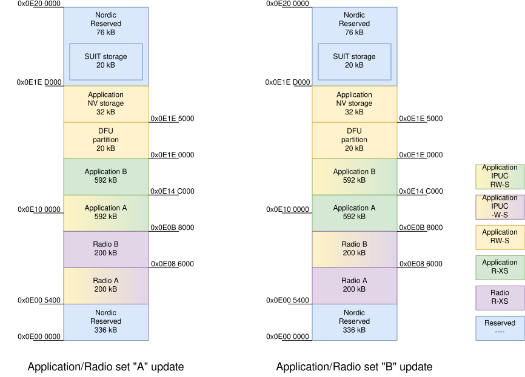
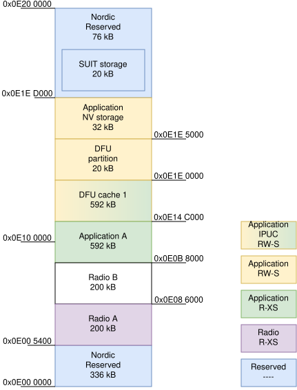
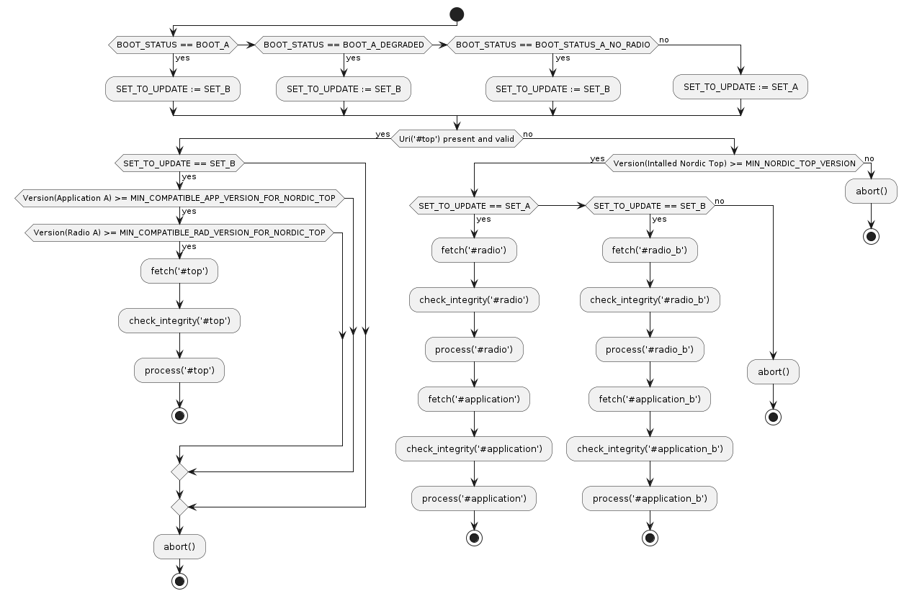
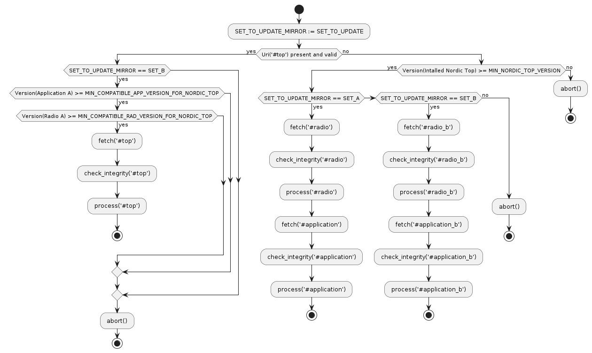
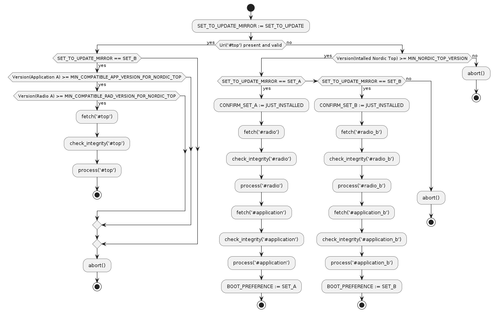
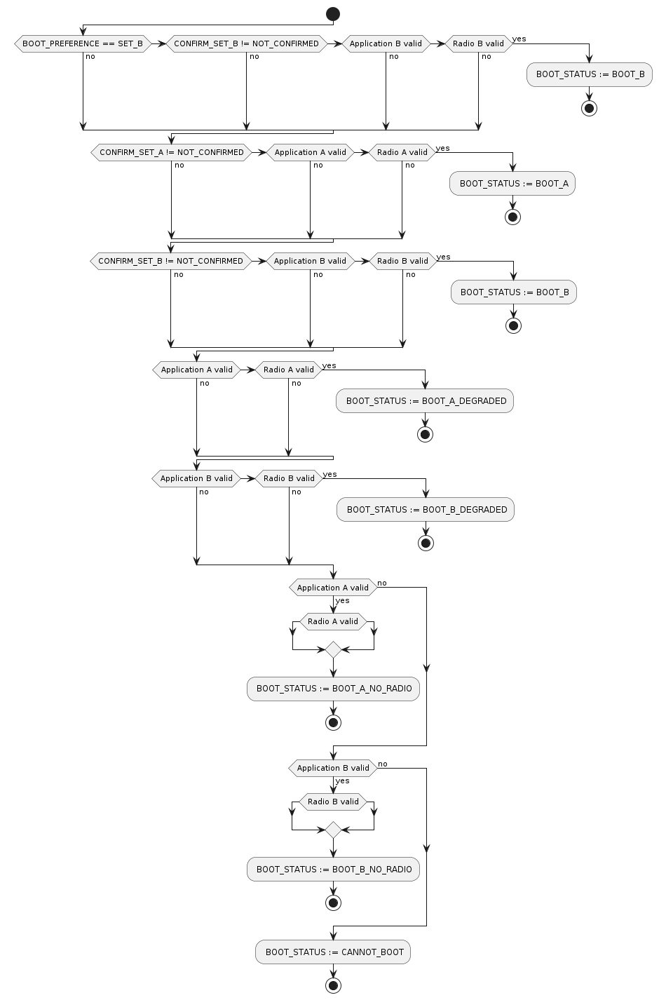
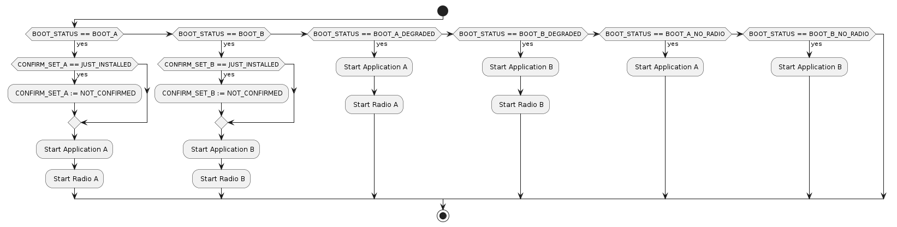

.. _nrf54h_suit_ab_sample:

SUIT: Device firmware "A/B" update on the nRF54H20 SoC
######################################################

.. contents::
   :local:
   :depth: 2

The sample demonstrates how to configure the application, so it will be updated using the "A/B" method using :ref:`SUIT <ug_nrf54h20_suit_intro>` as well as the usage of manifest-controlled variables for implementing a mechanism to confirm device operation after the update.

You can update the sample using SMP protocol with UART or Bluetooth® Low Energy.

Requirements
************

The sample supports the following development kit:

.. table-from-rows:: /includes/sample_board_rows.txt
   :header: heading
   :rows: nrf54h20dk_nrf54h20_cpuapp

You need the nRF Device Manager app for SUIT update over Bluetooth Low Energy:

* `nRF Device Manager mobile app for Android`_
  (The minimum required version is v2.4.2.)

* `nRF Device Manager mobile app for iOS`_
  (The minimum required version is v1.9.3.)

To perform a SUIT update over UART using the SMP protocol, install SUIT commands in nrfutil by running the ``nrfutil install suit`` command (requires nrfutil version 0.8.1 or higher).

Overview
********

This sample provides a good starting point for applications that use the "A/B" update method.
Apart from all configuration parameters, template files, and sources, it also introduces a new file structure to simplify the development:

* Only a single variant of the application configuration is available.
* A dedicated file to define the memory map (``sysbuild/nrf54h20dk_nrf54h20_memory_map.dtsi``).
* A dedicated file to set the manifest provisioning configuration (``suit_mpi.conf``).
* Sample logic for managing the device using manifest variables (``src/device_management.c``).
* Sample logic for checking the state of manifests (``src/suit_manifest_state.c``).
* Sample logic for checking the state of in-place updateable components (``src/suit_components_state.c``).

The "A/B" method is based on the assumption that the system is partitioned in such a way that each executable part of the firmware has two memory regions assigned (often referred as ``A`` and ``B`` slots or variants).
Each of the firmware variants must be executable from their own memory region, thus every part of the application is linked at least twice, once for each slot.
Such configuration allows to quickly switch to the new version (the update candidate is downloaded into the final destination) and provides limited rollback capabilities, if the user experience is degraded by the update.

The sample uses the following manifest-controlled variables:

* ``BOOT_STATUS``: This variable is used to pass information from SDFW to the application about the selected boot path inside the root manifest.

  * Value ``1`` (``BOOT_A``) indicates the successful boot of the variant ``A``.
  * Value ``2`` (``BOOT_B``) indicates the successful boot of the variant ``B``.
  * Value ``3`` (``BOOT_A_DEGRADED``) indicates the degraded boot of the variant ``A``.
  * Value ``4`` (``BOOT_B_DEGRADED``) indicates the degraded boot of the variant ``B``.
  * Value ``5`` (``BOOT_A_NO_RADIO``) indicates the emergency boot of the application variant ``A`` without the radio firmware.
  * Value ``6`` (``BOOT_B_NO_RADIO``) indicates the emergency boot of the application variant ``B`` without the radio firmware.
  * Value ``7`` (``BOOT_CANNOT_BOOT``) indicates that the root manifest was unable to boot the device.

* ``BOOT_PREFERENCE``: This variable is used to pass information from the application to the SDFW about the intended variant to be booted.
  The root manifest is allowed to boot the other variant if the preferred one fails.

  * Value ``1`` (``SET_A``) indicates the variant ``A``.
  * Value ``2`` (``SET_B``) indicates the variant ``B``.

* ``SET_TO_UPDATE``: This variable is used by the processor on the application core to select which variant of the images should be downloaded and updated.

  * Value ``1`` (``SET_A``) indicates the variant ``A``.
  * Value ``2`` (``SET_B``) indicates the variant ``B``.

* ``CONFIRM_SET_A``: This variable is used to pass information about the confirmation status to the application.
  If the current image is not confirmed, the application should perform a self-check and update its value using the :c:func:`suit_mfst_var_set` function.

  * Value ``1`` (``JUST_INSTALLED``) indicates that the variant ``A`` has just been installed and requires confirmation.
  * Value ``2`` (``NOT_CONFIRMED``) indicates that the variant ``A`` is not confirmed (or is pending confirmation if booted).
  * Value ``3`` (``CONFIRMED``) indicates that the variant ``A`` is already confirmed to be usable.

* ``CONFIRM_SET_B``: This variable is used to pass information about the confirmation status to the application.
  If the current image is not confirmed, the application should perform a self-check and update its value using the :c:func:`suit_mfst_var_set` function.

  * Value ``1`` (``JUST_INSTALLED``) indicates that the variant ``B`` has just been installed and requires confirmation.
  * Value ``2`` (``NOT_CONFIRMED``) indicates that the variant ``B`` is not confirmed (or is pending confirmation if booted).
  * Value ``3`` (``CONFIRMED``) indicates that the variant ``B`` is already confirmed to be usable.

The sample logic for managing confirmation variables in the :file:`src/device_management.c` file.
This logic also uses the :kconfig:option:`CONFIG_APP_HEALTH_CHECK_FAILURE` Kconfig option to emulate a "broken" application that does not pass the self-test.
You can print the current status of the device, based on the values of ``BOOT_STATUS``and ``BOOT_PREFERENCE`` using the :c:func:`device_boot_state_report` function.

Memory layout definition
========================

The sample uses "A/B" method for updates.
It has strong requirements on the partitioning of the system.
The whole memory map, dedicated for the sample is defined in the :file:`sysbuild/nrf54h20dk_nrf54h20_memory_map.dtsi` file.
It defines two memory regions ``cpuapp_slot_b_partition`` and ``cpuapp_slot_a_partition`` for the main application and two memory regions ``cpurad_slot_b_partition`` and ``cpurad_slot_a_partition`` for the radio stack.

The following rules were followed while writing the common memory map:

* The default MRAM partitioning has been completely removed by removing the nodes that group partitions, based on the assigned memory access permissions (``cpurad_rx_partitions``, ``cpuapp_rx_partitions``, and ``cpuapp_rw_partitions``).
* For each executable part of the sample, two equally sized partitions, with suffixes ``a_partition`` and ``b_partition`` were defined.
* Partitions with the same access rights are grouped and occupy a continuous region in the memory.
  This is required due to the limited number of regions that can be defined within the memory protection hardware.
* All partitions are defined by the common memory map, but not enabled.
  This is required, because the memory map file is shared by both the main application and the radio stack.
  Enabling the partitions would result in access requests from both domains to the same memory regions through their UICRs.
  The domain-specific overlays include the common memory map and modify it by enabling the set of partitions, owned by the domain.
* A small staging area, called ``dfu_partition`` was defined.
  The size of it is set to 20 kB, so it is capable of holding all update candidate manifests, but is insufficient to store firmware binaries.
  This is acceptable, because the firmware binaries are written directly into their final destination.
* Both VPR cores (FLPR and PPR) are disabled in this sample.
  Adding VPR cores is out of scope of this documentation.

   Application and radio partitions on nRF54H20

The common memory map must be included in the image-specific overlay files.
Add ``#include "nrf54h20dk_nrf54h20_memory_map.dtsi"`` in the following files:

* ``boards/nrf54h20dk_nrf54h20_cpuapp.overlay`` for the main application image
* ``sysbuild/hci_ipc.overlay`` for the radio stack image

Apart from including the common memory map, you must enable the partitions owned by the respective domain:

* ``cpuapp_rx_partitions`` and ``cpuapp_rw_partitions`` for the application domain
* ``cpurad_rx_partitions`` for the radio domain

Building the second variant of an image
=======================================

To specify the address for which the application is built, you must set the ``zephyr,code-partition`` chosen symbol correctly.
The start address for the second variant (as well as SUIT aliases) is configured by overlays with the ``_slot_b`` suffix as follows:

* ``sysbuild/ab_slot_b.overlay`` for the application slot ``B``
* ``sysbuild/hci_ipc_slot_b.overlay`` for the radio firmware slot ``B``

If a project is built using SUIT, the build system automatically generates the second variant of a particular sysbuild image if it finds the overlay with the ``_slot_b`` suffix.
Those files are needed not only to change the code partition, but also to extend the build logic by additional images.
Since these overlays are meant only for the second variant build, the build system automatically adds all overlays, found for the first variant before loading the ``_slot_b`` overlay.
As a result of this, you do not need to include the memory map definition in the ``_slot_b`` overlay files.

To simplify the manifest templates, the following two aliases have been created to identify the active and inactive memory regions:

* ``suit-active-code-partition`` for the active partition
* ``suit-inactive-code-partition`` for the inactive one

These aliases must be set in the main image overlay and overwritten in the respective ``_slot_b`` overlays.

If you want to overwrite a configuration parameter from the command-line, you have the following three options:

* ``-DCONFIG_<config_name>=<new_value>`` sets the ``<config_name>`` to the ``<new_value>`` in the primary variant (slot ``A``) of the ``<image>``.
  For example, the following parameter will change the number of LED blinks only in the variant ``A``:

   .. code-block:: console

      -DCONFIG_N_BLINKS=2

* ``-D<image>_CONFIG_<config_name>=<new_value>`` sets the ``<config_name>`` to the ``<new_value>`` in both variants of the ``<image>``.
  For example, the following parameter will change the number of LED blinks in both variants ``A`` and ``B``:

   .. code-block:: console

      -Dab_CONFIG_N_BLINKS=2

* ``-D<image>_slot_b_CONFIG_<config_name>=<new_value>`` sets the ``<config_name>`` to the ``<new_value>`` in the secondary variant (slot ``B``) of the ``<image>``.
  For example, the following parameter will change the number of LED blinks only in the variant ``B``:

   .. code-block:: console

      -Dab_slot_b_CONFIG_N_BLINKS=2

Manifest Provisioning Information
=================================

The second part of the sample configuration is the Manifest Provisioning Information (MPI).

The default "A/B" sample configuration enables the following seven manifest classes:

* The root manifest - responsible for verifying the availability of manifest sets, selects one of them,
  populates manifest variables, and boots the selected set of manifests.
* The application recovery manifest - provides a backup root manifest logic, in case of root manifest update failure.
* The application local 1 manifest - provides instructions to verify and boot the first (``A``) variant of the main application.
* The application local 2 manifest - provides instructions to verify and boot the second (``B``) variant of the main application.
* The radio local 1 manifest - provides instructions to verify and boot the first (``A``) variant of the radio firmware.
* The radio local 2 manifest - provides instructions to verify and boot the second (``B``) variant of the radio firmware.

In this sample, all MPI parameters are placed in a separate :file:`suit_mpi.conf` file.
All of these parameters are sysbuild Kconfig values.
This file is not automatically picked up by the build system, so build the project with an additional command-line parameter as follows:

.. code-block:: console

   -DSB_EXTRA_CONF_FILE="suit_mpi.conf"

Manifest templates
==================

The last part of the sample configuration is SUIT manifests.
For the "A/B" update purposes, the generic manifest templates are insufficient.
This is why the project includes the :file:`suit` directory with a dedicated set of manifest templates.
For a better understanding of connection between manifest logic and manifest variables, the logic implemented in the root manifest sequences is explained.

The logic inside the update sequences (``suit-payload-fetch``, ``suit-candidate-verification``, and ``suit-install``) is sensitive to the set of available integrated (candidate) manifests.
If the Nordic top manifest is present, the logic attempts to update the Nordic-controlled firmware.
If it is not available, the manifest will process the application and radio manifests.

You cannot update both Nordic firmware as well as application and radio firmware using a single update package.
Due to this limitation, all sequences participating in the update candidate processing validates the compatibility of the update package with the counterpart that is currently installed.
To configure the conditions on versions, set the following attributes in the :file:`VERSION` file:

* ``MIN_COMPATIBLE_APP_VERSION_FOR_NORDIC_TOP`` to control if the Nordic top manifest is allowed to be updated for a given application manifest version.
* ``MIN_COMPATIBLE_RAD_VERSION_FOR_NORDIC_TOP`` to control if the Nordic top manifest is allowed to be updated for a given radio manifest version.
* ``MIN_NORDIC_TOP_VERSION`` to control if the application and radio manifests are allowed to be updated for a given Nordic top manifest version.

The ``suit-payload-fetch`` sequence
-----------------------------------

The logic in the ``suit-payload-fetch`` sequence is sensitive to the current ``BOOT_STATUS`` manifest variable.
Based on its value (set by the currently installed root manifest), one set of manifests is selected.
The selected set of manifests is stored in the dedicated ``SET_TO_UPDATE`` manifest variable.
Based on the ``SET_TO_UPDATE`` variable value, the ``suit-payload-fetch`` sequence from the corresponding local manifests is executed.
Each root manifest integrates both variants of the application and radio manifests that do not include the firmware binaries.
The binaries are fetched from the external source, based on the logic in their ``suit-payload-fetch`` sequence.

   Application and radio update over in-place update

If the Nordic manifest is present, the logic erases one of the available in-place updateable components to initialize this area as a temporary DFU cache partition.

   Nordic firmware update over temporary DFU cache

The Nordic firmware binaries are downloaded into the temporary DFU cache partition.

   The ``suit-payload-fetch`` sequence of the root manifest

Once the ``suit-payload-fetch`` sequences are completed successfully, the application triggers the update.

The ``suit-candidate-verification`` sequence
--------------------------------------------

The logic of the ``suit-candidate-verification`` is very similar to the logic of the ``suit-payload-fetch`` sequence.
The main differences are the following:

* The logic does not analyze the ``BOOT_STATUS`` variable value, but bases its logic on the ``SET_TO_UPDATE`` manifest variable.
* The value of the ``SET_TO_UPDATE`` variable is copied to the ``SET_TO_UPDATE_MIRROR`` manifest variable.
  The ``SET_TO_UPDATE_MIRROR`` variable is stored in local SDFW RAM and cannot be updated by local cores.
* The ``suit-candidate-verification`` sequence from the local manifests is executed.
  The main purpose of the local manifests is to check that all staging areas (DFU partition, caches, and in-place updateable regions) are correctly populated with the data.
* If the Nordic manifest is present, the logic verifies the Nordic firmware binaries stored in the temporary DFU cache partition.

   The ``suit-candidate-verification`` sequence of the root manifest

Once the ``suit-candidate-verification`` sequences are completed successfully, the SDFW continues the update procedure by executing the ``suit-install`` sequence of the root manifest.

The ``suit-install`` sequence
-----------------------------

The logic in the ``suit-install`` sequence is very similar to the logic of the ``suit-candidate-verification`` sequence.
The main differences are the following:

* The ``suit-install`` sequence from the local manifests is executed.
  The main purpose of the local manifests is to check that the in-place update, performed by the application was successful.
  If it is, the sequence completes and the local manifests are updated in the SUIT storage area.
* The logic updates the ``CONFIRM_SET_A`` or ``CONFIRM_SET_B`` variables before executing the ``suit-install`` sequence of the local manifests.
* The logic updates the ``BOOT_PREFERENCE`` variable after executing the ``suit-install`` sequence of the local manifests.
  This operation effectively schedules the verification of the newly installed images and manifests after a reboot.
* If the Nordic manifest is present, the logic schedules the update of the Nordic firmware binaries stored in the temporary DFU cache partition.

   The ``suit-install`` sequence of the root manifest

Once the ``suit-install`` sequences are completed successfully, the root manifest is updated in the SUIT storage and the SDFW reboots the device.
After the reboot, the SDFW proceeds with the boot path, executing the ``suit-validate`` sequence of the new root manifest.

The ``suit-validate`` sequence
------------------------------

The ``suit-validate`` sequence of the root manifest is used to select the valid set of manifests to boot from.
The result of this check is written into the ``BOOT_STATUS`` manifest variable.
The following activity diagram presents the logic, implemented in the ``suit-validate`` sequence.

   The ``suit-validate`` sequence of the root manifest

The ``suit-invoke`` sequence
----------------------------

The ``suit-invoke`` sequence of the root manifest reads the value of the ``BOOT_STATUS`` manifest variable and acts upon it.
If the application has been just updated, which is indicated by the ``CONFIRM_SET_A`` or ``CONFIRM_SET_B`` manifest variable set to ``JUST_INSTALLED``,
and correctly validated by the ``suit-validate`` sequence, the confirmation variable is reset to ``NOT_CONFIRMED``.
It is now the application's responsibility to set this variable to ``CONFIRMED``.
Otherwise this variant will be considered as degraded on the next boot attempt.
The following activity diagram presents the logic implemented in the ``suit-invoke`` sequence.

   The ``suit-invoke`` sequence of the root manifest

Apart from the regular application, radio, and root manifest, the application recovery manifest is also defined.
In the "A/B" sample, there is no separate recovery binary, just the recovery manifest is used.
The recovery manifest is very similar to the root manifest, so in case of a damaged root manifest, the recovery manifest serves as a backup logic.
The recovery manifest logic differs from the root manifest in the following two areas:

* The boot preference variable is ignored and the manifest tries to boot first the variant ``A`` and then the variant ``B``.
* The recovery logic always boots the application and radio in the "degraded" mode.

User interface
**************

LED 0:
   This LED is controlled by the application variant ``A``.
   This LED is controlled as "active low", meaning it will turn on once the application is booted and blinks (turn off) in short intervals.
   The :ref:`ab_CONFIG_N_BLINKS <ab_CONFIG_N_BLINKS>` Kconfig option sets the number of blinks.
   The default value of the option is set to ``1``, causing a single blink to indicate *Version 1*.
   You can increment this value to represent an update, such as set it to ``2`` to indicate *Version 2*.
   Using the ``-Dab_CONFIG_N_BLINKS`` command-line option, you can set the number of blinks for both variants of the application.
   If the application variant ``B`` is started, this LED will not blink.

LED 1:
   This LED is controlled by the application variant ``B``.
   This LED is controlled as "active low", meaning it will turn on once the application is booted and blinks (turn off) in short intervals.
   Using the ``-Dab_slot_b_CONFIG_N_BLINKS`` command-line option, you can change the number of blinks just for the application variant ``B``.
   If the application variant ``A`` is started, this LED will not blink.

LED 2 and 3:
   These LEDs indicate the status of manifests inside the device:

   * If both LEDs are lit, the application is booted normally.
   * If both LEDs blink simultaneously, the application is booted in a degraded mode (into an unconfirmed variant).
   * If both LEDs blink in an alternating pattern, the application is booted using the recovery manifest.
   * If only **LED 2** blinks and **LED 3** is switched off, the application is booted without radio capabilities.

BUTTON 3:
   By pressing this button, the value of the boot preference setting stored in one of the manifest-controlled variables is changed.

Configuration
*************

|config|

The default configuration uses both UART and Bluetooth LE with sequence number 1 (shown as Version 1 in the nRF Device Manager app).

To change the sequence number of the application, configure the ``APP_ROOT_SEQ_NUM`` in the :file:`VERSION` file, used for :ref:`zephyr:app-version-details` in Zephyr and the |NCS|.
It sets the :ref:`sequence number <ug_suit_dfu_suit_manifest_elements>` of the :ref:`SUIT envelope <ug_suit_dfu_suit_concepts>` manifest.
If you do not provide the :file:`VERSION` file, the sample is built with sequence number set to 1 (shown as Version 1 in the nRF Device Manager app).

To change the number of blinks on **LED 0**, configure the :ref:`ab_CONFIG_N_BLINKS <ab_CONFIG_N_BLINKS>` Kconfig option.
If you do not specify this configuration, the sample is built with the number of blinks set to 1.

Configuration options
=====================

Check and configure the following configuration option for the sample:

.. _ab_CONFIG_N_BLINKS:

CONFIG_N_BLINKS - The number of blinks.
   The sample configuration changes the number of blinks on **LED 0**.
   The default value is ``1``.

.. _ab_CONFIG_BT_DEVICE_NAME:

CONFIG_BT_DEVICE_NAME - Bluetooth Device Name.
   The sample configuration changes the advertised Bluetooth name.
   The default value is ``SUIT AB Sample``.

.. _ab_CONFIG_ID_VAR_BOOT_STATUS:

CONFIG_ID_VAR_BOOT_STATUS - The ID of manifest-controlled variable used by the root manifest, representing the boot status.
   The default value is ``256``.

.. _ab_CONFIG_ID_VAR_BOOT_PREFERENCE:

CONFIG_ID_VAR_BOOT_PREFERENCE - The ID of manifest-controlled variable used by the root manifest, representing the boot preference.
   The default value is ``0``.

.. _ab_CONFIG_ID_VAR_SET_TO_UPDATE:

CONFIG_ID_VAR_SET_TO_UPDATE - The ID of manifest-controlled variable used by the root manifest, representing the image set to be updated.
   The default value is ``1``.

.. _ab_CONFIG_ID_VAR_CONFIRM_SET_A:

CONFIG_ID_VAR_CONFIRM_SET_A - The ID of manifest-controlled variable used by the root manifest, representing the after-update confirmation state for image set A.
   The default value is ``2``.

.. _ab_CONFIG_ID_VAR_CONFIRM_SET_B:

CONFIG_ID_VAR_CONFIRM_SET_B - The ID of manifest-controlled variable used by the root manifest, representing the after-update confirmation state for image set B.
   The default value is ``3``.

.. _ab_CONFIG_EMULATE_APP_HEALTH_CHECK_FAILURE:

CONFIG_EMULATE_APP_HEALTH_CHECK_FAILURE - Blocking a confirmation of being healthy after the update.
   The default value is ``n``.

Building and running
********************

.. |sample path| replace:: :file:`samples/suit/ab`

This sample is located in the |sample path| directory in the |NCS| folder structure.

.. note::
    |sysbuild_autoenabled_ncs|

Building and programming using the command-line
===============================================

To build and program the sample to the nRF54H20 DK, complete the following steps:

1. |open_terminal_window_with_environment|
#. Navigate to |sample path|.
#. Build the sample using the following command, with the following Kconfig options set:

   .. code-block:: console

      west build -p -b nrf54h20dk/nrf54h20/cpuapp -- -DSB_EXTRA_CONF_FILE="suit_mpi.conf" -Dab_CONFIG_N_BLINKS=1

   See :ref:`configure_application` for information on additional configuration options.

   The output build files are located in the :file:`build/DFU` directory, including the :ref:`app_build_output_files_suit_dfu`.
   For more information on the contents of the build directory, see :ref:`zephyr:build-directory-contents` in the Zephyr documentation.
   For more information on the directory contents and structure provided by sysbuild, see :ref:`zephyr:sysbuild` in the Zephyr documentation.

#. Connect the DK to your computer using a USB cable.
#. Power on the DK.
#. Program the sample to the kit (see :ref:`programming_cmd` for instructions).
#. Update the SUIT envelope sequence number by changing the following line in the :file:`VERSION` file:

   .. code-block:: console

      APP_ROOT_SEQ_NUM = 2
      APP_LOCAL_1_SEQ_NUM = 2

#. Update the number of LED blinks by rebuilding the sample with the following Kconfig options set:

   .. code-block:: console

      west build -p -b nrf54h20dk/nrf54h20/cpuapp -- -DSB_EXTRA_CONF_FILE="suit_mpi.conf" -Dab_CONFIG_N_BLINKS=2

   Another :file:`root.suit` file containing the updated firmware is created after running this command.

Testing
=======

This sample uses the following two serial ports:

* The first one (vcom: 0, referred to as the COM7) has SMP server enabled.
  It is used to check the state of manifests and send the update candidate binaries.
* The second one (vcom: 1, referred to as the COM8) has debug logs enabled.
  It is used to verify that the application works as expected.

To verify the serial ports name for your operating system, use the ``nrfutil device list`` command.

Complete the following steps to test the sample:

1. Confirm the image ``A``.

   After programming the device, check if the application successfully confirmed the image ``A``.
   The following log message should appear on the logging serial interface:

   .. code-block:: console

      <inf> AB: Image set A not confirmed yet, testing...
      <inf> AB: Confirming...
      <inf> AB: Confirmed

   The **LED 0** should blink once every five seconds, indicating the first version of the application variant ``A``.

#. Change the boot preference variable value.

   Press the **Button 3** on the DK.
   The application should switch the ``BOOT_PREFERENCE`` variable value and confirm it with the following messages:

   .. code-block:: console

      <inf> AB: Changing a boot preference (a -> B)
      <inf> AB: restart the device to enforce

#. Confirm the image ``B``.

   Reboot the DK using the reset button.
   After the reboot, the application confirms the new active image ``B``.
   The following log message should appear on the logging serial interface:

   .. code-block:: console

      <inf> AB: Image set B not confirmed yet, testing...
      <inf> AB: Confirming...
      <inf> AB: Confirmed

   The **LED 1** should blink once every five seconds, indicating the first version of the application variant ``B``.

#. Update the inactive variant of the image (``A``).

   a. Read the sequence number of the installed root and local application manifests using the following nrfutil command:

      .. code-block:: console

         nrfutil suit manifests --serial-port COM7

      You should see an output similar to the following printed in the terminal:

      .. code-block:: console

         role(10) (Nordic Top)
            classId: f03d385e-a731-5605-b15d-037f6da6097f (nRF54H20_nordic_top)
            vendorId: 7617daa5-71fd-5a85-8f94-e28d735ce9f4 (nordicsemi.com)
            downgradePreventionPolicy: downgrade forbidden
            independentUpdateabilityPolicy: independent update allowed
            signatureVerificationPolicy: signature verification on update and boot
            digest: 3e979cf7bf71f980c1b29f3479eb62399bec20127b4fc41664e98cac60499445
            digestAlgorithm: sha256
            signatureCheck: signature check passed
            sequenceNumber: 590592
            semantic version: 0.9.3

         ...

         role(20) (Root Manifest)
            classId: 3f6a3a4d-cdfa-58c5-acce-f9f584c41124 (nRF54H20_sample_root)
            vendorId: 7617daa5-71fd-5a85-8f94-e28d735ce9f4 (nordicsemi.com)
            downgradePreventionPolicy: downgrade forbidden
            independentUpdateabilityPolicy: independent update allowed
            signatureVerificationPolicy: signature verification on update and boot
            digest: 18184b471302c4dda4ef873c00b30e0a121eb39f71a66bc86ddb1c5ccb448c5f
            digestAlgorithm: sha256
            signatureCheck: signature check not performed
            sequenceNumber: 1
            semantic version: 0.1.0

         ...

         role(22) (Application Local Manifest)
            classId: 08c1b599-55e8-5fbc-9e76-7bc29ce1b04d (nRF54H20_sample_app)
            vendorId: 7617daa5-71fd-5a85-8f94-e28d735ce9f4 (nordicsemi.com)
            downgradePreventionPolicy: downgrade allowed
            independentUpdateabilityPolicy: independent update forbidden
            signatureVerificationPolicy: signature verification on update and boot
            digest: 7480ebdc80d4ceb0640fbee0a04996c6f9b9a6112ad2fb82e294408b643e41a5
            digestAlgorithm: sha256
            signatureCheck: signature check not performed
            sequenceNumber: 1
            semantic version: 0.1.0
         role(23) (Application Local Manifest)
            classId: 51de10b8-ee2e-5b4b-80ee-534a4a3c04fc Unknown class id
            vendorId: 7617daa5-71fd-5a85-8f94-e28d735ce9f4 (nordicsemi.com)
            downgradePreventionPolicy: downgrade allowed
            independentUpdateabilityPolicy: independent update forbidden
            signatureVerificationPolicy: signature verification on update and boot
            digest: 83d4a5e62aec20b8ce1c24f8481dbcf63a7520bf14c372109c598bbce3bd36d6
            digestAlgorithm: sha256
            signatureCheck: signature check not performed
            sequenceNumber: 1
            semantic version: 0.1.0

   #. Upload the image using the following nrfutil command:

      .. code-block:: console

         nrfutil suit upload-envelope --serial-port COM7 --envelope-file build/DFU/root.suit

      You should see an output similar to the following logged on UART:

      .. code-block::

         [00:00:07] ###### 100% [COM7] Uploaded

#. Start the installation of the new firmware using the following nrfutil command:

   .. code-block:: console

      nrfutil suit install --serial-port COM7 --serve-images 60 --images-path build/DFU/

   You should see an output similar to the following logged on UART:

   .. code-block::

      ✔️ Installation triggered
      ✔️ Serving images done
      ✔️ Uploaded hci_ipc.bin
      ✔️ Uploaded ab.bin

#. Read the sequence number of the uploaded root and local application manifests using the following nrfutil command:

   .. code-block:: console

      nrfutil suit manifests --serial-port COM7

   You should see an output similar to the following printed in the terminal:

   .. code-block:: console

      role(10) (Nordic Top)
         classId: f03d385e-a731-5605-b15d-037f6da6097f (nRF54H20_nordic_top)
         vendorId: 7617daa5-71fd-5a85-8f94-e28d735ce9f4 (nordicsemi.com)
         downgradePreventionPolicy: downgrade forbidden
         independentUpdateabilityPolicy: independent update allowed
         signatureVerificationPolicy: signature verification on update and boot
         digest: ab6e57a7a88bbee073b101480c566fb444d101852dc31e09112acf8a5d179c03
         digestAlgorithm: sha256
         signatureCheck: signature check passed
         sequenceNumber: 590592
         semantic version: 0.9.3

      ...

      role(20) (Root Manifest)
         classId: 3f6a3a4d-cdfa-58c5-acce-f9f584c41124 (nRF54H20_sample_root)
         vendorId: 7617daa5-71fd-5a85-8f94-e28d735ce9f4 (nordicsemi.com)
         downgradePreventionPolicy: downgrade forbidden
         independentUpdateabilityPolicy: independent update allowed
         signatureVerificationPolicy: signature verification on update and boot
         digest: e9315a664071b851097f438052fec60ab68627f17447b231d873e5e0dc416ac0
         digestAlgorithm: sha256
         signatureCheck: signature check not performed
         sequenceNumber: 2
         semantic version: 0.1.0

      ...

      role(22) (Application Local Manifest)
         classId: 08c1b599-55e8-5fbc-9e76-7bc29ce1b04d (nRF54H20_sample_app)
         vendorId: 7617daa5-71fd-5a85-8f94-e28d735ce9f4 (nordicsemi.com)
         downgradePreventionPolicy: downgrade allowed
         independentUpdateabilityPolicy: independent update forbidden
         signatureVerificationPolicy: signature verification on update and boot
         digest: 8a84780635900fe566f045e072c6ed16441bc4cf351a9dfef59b2a9e4f7654fe
         digestAlgorithm: sha256
         signatureCheck: signature check not performed
         sequenceNumber: 2
         semantic version: 0.1.0
      role(23) (Application Local Manifest)
         classId: 51de10b8-ee2e-5b4b-80ee-534a4a3c04fc Unknown class id
         vendorId: 7617daa5-71fd-5a85-8f94-e28d735ce9f4 (nordicsemi.com)
         downgradePreventionPolicy: downgrade allowed
         independentUpdateabilityPolicy: independent update forbidden
         signatureVerificationPolicy: signature verification on update and boot
         digest: e5e145ceed48ca59a085e234c558f95ee098c2a9ce1d0d4d7c41ddca7a095eb5
         digestAlgorithm: sha256
         signatureCheck: signature check not performed
         sequenceNumber: 1
         semantic version: 0.1.0

   The application local 1 (``A`` variant) as well as the root manifests are now updated to the version ``2``.
   The **LED 0** should blink twice every five seconds, indicating the second version of the application variant ``A``.

#. Revert to the previous firmware using the boot preference variable value.

   Press the **Button 3** on the DK.
   The application should switch the ``BOOT_PREFERENCE`` variable value:

   .. code-block:: console

      <inf> AB: Changing a boot preference (a -> B)
      <inf> AB: restart the device to enforce

#. Confirm that the image ``B`` still works.

   Reboot the DK using the reset button.
   After reboot the new root manifest boots the old application variant ``B``.
   The following log message should appear on the logging serial interface:

   .. code-block:: console

      Boot preference: set B
      Boot status: image set B active
      Confirm status set A: confirmed
      Confirm status set B: confirmed

   The **LED 1** should blink once every five seconds, indicating the first version of the application variant ``B``.

#. Enter the degraded mode.

   You can test the degraded mode using the sample.
   If the application enables the :ref:`ab_CONFIG_EMULATE_APP_HEALTH_CHECK_FAILURE <ab_CONFIG_EMULATE_APP_HEALTH_CHECK_FAILURE>` Kconfig option, no update is confirmed.
   Thus after two updates, the device contains two unconfirmed variants.
   In such case, the logic in the root manifest sets the ``BOOT_STATUS`` to ``BOOT_A_DEGRADED``.

   To test it, first build the third version of the application.
   It does not confirm its correctness after any update:

   #. Update the SUIT envelope sequence number by changing the following line in the :file:`VERSION` file:

      .. code-block:: console

         APP_ROOT_SEQ_NUM = 3
         APP_LOCAL_1_SEQ_NUM = 3

   #. Update the number of LED blinks by rebuilding the sample with the following Kconfig options set:

      .. code-block:: console

         west build -p -b nrf54h20dk/nrf54h20/cpuapp -- \
            -DSB_EXTRA_CONF_FILE="suit_mpi.conf" \
            -Dab_CONFIG_N_BLINKS=3 \
            -Dab_CONFIG_EMULATE_APP_HEALTH_CHECK_FAILURE=y

      Another :file:`root.suit` file is created after running this command.
      It contains the updated firmware, that does not confirm its correctness.

   Once created, send the update to the device twice:

   #. Change the directory to execute commands from the DFU artifacts folder:

      .. code-block:: console

         cd build/DFU

   #. Upload the image variant ``A`` using the following nrfutil command:

      .. code-block:: console

         nrfutil suit upload-envelope --serial-port COM7 --envelope-file root.suit --install --serve-images 60

      You should see an output similar to the following logged on UART:

      .. code-block::

         [00:01:01] ###### 100% [COM7] Uploaded
         ✔️ Serving images done
         ✔️ Uploaded hci_ipc.bin
         ✔️ Uploaded ab.bin

      The following log message should appear on the logging serial interface:

      .. code-block:: console

         <inf> AB: Image set A not confirmed yet, testing...
         <err> AB: App domain is NOT healthy
         <err> AB: Reboot the device to try to boot from previous firmware

      The **LED 0** should blink three times every five seconds, indicating the third version of the application variant ``A``.

   #. Upload the image variant ``B`` using the following nrfutil command:

      .. code-block:: console

         nrfutil suit upload-envelope --serial-port COM7 --envelope-file root.suit --install --serve-images 60

      You should see an output similar to the following logged on UART:

      .. code-block::

         [00:01:01] ###### 100% [COM7] Uploaded
         ✔️ Serving images done
         ✔️ Uploaded hci_ipc_variant_b.bin
         ✔️ Uploaded ab_variant_b.bin

      The following log message should appear on the logging serial interface:

      .. code-block:: console

         <inf> AB: Image set B not confirmed yet, testing...
         <err> AB: App domain is NOT healthy
         <err> AB: Reboot the device to try to boot from previous firmware

      The **LED 1** should blink three times every five seconds, indicating the third version of the application variant ``B``.

   #. Reboot the DK using the reset button.

      After the reboot, the root manifest boots the unconfirmed application variant ``A`` in the degraded mode.
      The following log message should appear on the logging serial interface:

      .. code-block:: console

         Boot preference: set B
         Boot status: image set A active, degraded mode
         Confirm status set A: not confirmed
         Confirm status set B: not confirmed

      The **LED 0** should blink three times every five seconds, indicating the third version of the application variant ``A``.
      The **LED 2** and **LED 3** should blink simultaneously, indicating the degraded mode.

#. Destroy the radio firmware

   Modify the variant ``A`` of the radio firmware to enter the degraded mode in the application variant ``B``.

   .. code-block:: console

      nrfutil device x-write --address 0xe054000 --value 0xFFFFFF --core Network --traits jlink

   You should see an output similar to the following logged on UART:

   .. code-block::

      ✔️ Data written to <snr>

   Reboot the DK using the reset button.
   After the reboot, the root manifest boots the unconfirmed application variant ``B`` in the degraded mode with the radio.
   The following log message should appear on the logging serial interface:

   .. code-block:: console

      Boot preference: set B
      Boot status: app image B active, degraded mode
      Confirm status set A: not confirmed
      Confirm status set B: not confirmed

   Modify the variant ``B`` of the radio firmware to enter the degraded mode without radio support.

   .. code-block:: console

      nrfutil device x-write --address 0xe086000 --value 0xFFFFFF --core Network --traits jlink

   You should see an output similar to the following logged on UART:

   .. code-block::

      ✔️ Data written to <snr>

   Reboot the DK using the reset button.
   After the reboot, the root manifest boots the unconfirmed application variant ``A`` in the degraded mode without the radio.
   The following log message should appear on the logging serial interface:

   .. code-block:: console

      Boot preference: set B
      Boot status: app image A active, no radio, degraded mode
      Confirm status set A: not confirmed
      Confirm status set B: not confirmed

   * The **LED 0** should blink three times every five seconds, indicating the third version of the application variant ``A``.
   * The **LED 2** should blink continuously.
   * The **LED 3** should be switched off.

#. Enter the recovery mode by destroying the root manifest.

   Modify the root manifest to enter the recovery mode using the following nrfutil command:

   .. code-block:: console

      nrfutil device x-write --address 0x0e1ef400 --value 0xFFFFFF --traits jlink

   You should see an output similar to the following logged on UART:

   .. code-block::

      ✔️ Data written to <snr>

   Reboot the DK using the reset button.
   After the reboot, the root manifest boots the unconfirmed application variant ``A`` in the degraded mode without the radio, using the recovery manifest.
   The following log message should appear on the logging serial interface:

   .. code-block:: console

      Boot in RECOVERY mode, probably the root manifest is damaged!
      Boot preference: set B
      Boot status: app image A active, no radio, degraded mode
      Confirm status set A: not confirmed
      Confirm status set B: not confirmed

   The **LED 0** should blink three times every five seconds, indicating the third version of the application variant ``A``.
   Both **LED 2** and **LED 3** should blink in an alternating pattern, indicating the recovery mode.

#. Recover the device through the application update

   To test it, first build the fourth version of the application, which confirms its correctness after an update:

   #. Update the SUIT envelope sequence number by changing the following line in the :file:`VERSION` file:

      .. code-block:: console

         APP_ROOT_SEQ_NUM = 4
         APP_LOCAL_1_SEQ_NUM = 4

   #. Update the number of LED blinks by rebuilding the sample with the following Kconfig options set:

      .. code-block:: console

         west build -p -b nrf54h20dk/nrf54h20/cpuapp -- \
            -DSB_EXTRA_CONF_FILE="suit_mpi.conf" \
            -Dab_CONFIG_N_BLINKS=4

      Another :file:`root.suit` file is created after running this command.
      It contains the updated firmware that confirms its correctness.

   #. Change the directory to execute commands from DFU artifacts folder:

      .. code-block:: console

         cd build/DFU

   #. Upload the image variant ``B`` using the following nrfutil command:

      .. code-block:: console

         nrfutil suit upload-envelope --serial-port COM7 --envelope-file root.suit --install --serve-images 60

      You should see an output similar to the following logged on UART:

      .. code-block::

         [00:01:01] ###### 100% [COM7] Uploaded
         ✔️ Serving images done
         ✔️ Uploaded hci_ipc_variant_b.bin
         ✔️ Uploaded ab_variant_b.bin

      The following log message should appear on the logging serial interface:

      .. code-block:: console

         Boot preference: set B
         Boot status: image set B active
         Confirm status set A: not confirmed
         Confirm status set B: not confirmed

         <inf> AB: Image set B not confirmed yet, testing...
         <inf> AB: Confirming...
         <inf> AB: Confirmed

      The **LED 1** should blink four times every five seconds, indicating the fourth version of the application variant ``B``.
      Both **LED 2** and **LED 3** should be lit, indicating that the device recovered from both recovery and degraded modes.

   #. Upload the image variant ``A`` using the following nrfutil command:

      .. code-block:: console

         nrfutil suit upload-envelope --serial-port COM7 --envelope-file root.suit --install --serve-images 60

      You should see an output similar to the following logged on UART:

      .. code-block::

         [00:01:01] ###### 100% [COM7] Uploaded
         ✔️ Serving images done
         ✔️ Uploaded hci_ipc.bin
         ✔️ Uploaded ab.bin

      The following log message should appear on the logging serial interface:

      .. code-block:: console

         Boot preference: set A
         Boot status: image set A active
         Confirm status set A: not confirmed
         Confirm status set B: confirmed

         <inf> AB: Image set A not confirmed yet, testing...
         <inf> AB: Confirming...
         <inf> AB: Confirmed

      The **LED 0** should blink four times every five seconds, indicating the fourth version of the application variant ``A``.
      Both **LED 2** and **LED 3** should be lit.

#. Update the Nordic components.

   You can update the Nordic components only from the application variant ``A``.
   If the device is booted into variant ``B``, press the **Button 3** and reset the DK to switch to the variant ``A`` before executing further steps.

   #. Check the currently installed version of the Nordic top manifest using the following nrfutil command:

      .. code-block:: console

         nrfutil device x-suit-manifest-info-get --known-class-id nRF54H20_nordic_top --traits jlink

      You should see an output similar to the following:

      .. code-block::

         manifest_info:
           classId: f03d385e-a731-5605-b15d-037f6da6097f (nRF54H20_nordic_top)
           semantic version: 0.9.4
           signatureCheck: signature check passed

   #. Build the update package through the regular application build.

      .. code-block:: console

         west build  -b nrf54h20dk/nrf54h20/cpuapp -- \
            -DSB_EXTRA_CONF_FILE="suit_mpi.conf" \
            -Dab_CONFIG_N_BLINKS=5 \
            -DSB_CONFIG_SUIT_ENVELOPE_NORDIC_TOP_DIRECTORY="\"<path-to-the-nordic-update-package>\""

   #. Send the update candidate to the device.

      .. code-block:: console

         nrfutil suit upload-envelope --serial-port COM7 --envelope-file build/DFU/root.suit

      You should see an output similar to the following:

      .. code-block::

         [00:00:07] ###### 100% [COM7] Uploaded

   #. Start the installation of the new firmware using the following nrfutil command:

      .. code-block:: console

         nrfutil suit install --serial-port COM7 --serve-images 60 --images-path build/DFU/

      You should see an output similar to the following logged on UART:

      .. code-block::

         ✔️ Installation triggered
         ✔️ Serving images done
         ✔️ Uploaded nrf54h20_sec_v10.3.1.bin
         ✔️ Uploaded nrf54h20_sec_rec_v10.3.1.bin
         ✔️ Uploaded nrf54h20_sysctl_v4.2.0.bin

   #. Check if the installation of the Nordic top manifest was successful using the following nrfutil command:

      .. code-block:: console

         nrfutil device x-suit-manifest-info-get --known-class-id nRF54H20_nordic_top --traits jlink

      You should see an output similar to the following:

      .. code-block::

         manifest_info:
           classId: f03d385e-a731-5605-b15d-037f6da6097f (nRF54H20_nordic_top)
           semantic version: 0.9.5
           signatureCheck: signature check passed

Testing push mode with "A/B" sample
===================================

You can configure the application to perform updates using the push method.

Since in the A/B method only a single variant is updateable for each boot (inactive one), the PC tool must correctly handle the error codes, if the incorrect image is attempted to be transferred.

The images will be sent as DFU cache RAW images.
Their IDs are defined using the common memory app, by adding the following aliases:

.. code-block:: dts

   dfu_target_img_22: cpuapp_slot_b_partition: partition@14c000 {
      reg = < 0x14c000 DT_SIZE_K(592) >;
   };

   dfu_target_img_21: cpuapp_slot_a_partition: partition@b8000 {
      reg = < 0xb8000 DT_SIZE_K(592) >;
   };

   ...

   dfu_target_img_32: cpurad_slot_b_partition: partition@86000 {
      reg = <0x86000 DT_SIZE_K(200)>;
   };

   dfu_target_img_31: cpurad_slot_a_partition: partition@54000 {
      reg = < 0x54000 DT_SIZE_K(200) >;
   };

Using the declaration, the following images as RAW cache partitions are available:

   * Application variant ``A`` can be sent as DFU cache partition 21
   * Application variant ``B`` can be sent as DFU cache partition 22
   * Radio variant ``A`` can be sent as DFU cache partition 31
   * Radio variant ``B`` can be sent as DFU cache partition 32

#. Build the new update candidate firmware.

   #. Update the SUIT envelope sequence number by changing the following line in the :file:`VERSION` file:

      .. code-block:: console

         APP_ROOT_SEQ_NUM = 5
         APP_LOCAL_1_SEQ_NUM = 5

   #. Update the number of LED blinks by rebuilding the sample with the following Kconfig options set:

      .. code-block:: console

         west build -p -b nrf54h20dk/nrf54h20/cpuapp -- \
            -DSB_EXTRA_CONF_FILE="suit_mpi.conf" \
            -Dab_CONFIG_N_BLINKS=5

      Another :file:`root.suit` file is created after running this command.
      It contains the updated firmware that confirms its correctness.

#. Update the device using the push method.

   #. Send the root manifest, but do not trigger the installation procedure.

      Use the following nrfutil command:

      .. code-block:: console

         nrfutil suit upload-envelope --serial-port COM7 --envelope-file build/DFU/root.suit

      You should see an output similar to the following:

      .. code-block::

         [00:00:07] ###### 100% [COM7] Uploaded

   #. Try to push application image ``A`` using the following nrfutil command (this should fail):

      .. code-block:: console

         nrfutil suit upload-cache-raw --serial-port COM7 --cache-file ./build/ab/zephyr/zephyr.bin  --pool 21

      You should see an output similar to the following:

      .. code-block::

         [00:00:00] ------   0% [COM7] Upload cache raw failed: NMP_ERR_ENOENT - Is dfu_cache_partition_21 defined in the device tree?
         Error: NMP_ERR_ENOENT - Is dfu_cache_partition_21 defined in the device tree?

   #. Push the application image ``B`` using the following nrfutil command:

      .. code-block:: console

         nrfutil suit upload-cache-raw --serial-port COM7 --cache-file ./build/ab_variant_b/zephyr/zephyr.bin  --pool 22

      You should see an output similar to the following:

      .. code-block:: console

         [00:00:28] ###### 100% [COM7] Uploaded

   #. Push the radio image ``B`` using the following nrfutil command:

      .. code-block:: console

         nrfutil suit upload-cache-raw --serial-port COM7 --cache-file ./build/hci_ipc_variant_b/zephyr/zephyr.bin  --pool 32

      You should see an output similar to the following:

      .. code-block::

         [00:00:28] ###### 100% [COM7] Uploaded

   #. Trigger the update using the following nrfutil command:

      .. code-block:: console

         nrfutil suit install --serial-port COM7

      You should see an output similar to the following:

      .. code-block::

         ✔️ Installation triggered

      The following log message should appear on the logging serial interface:

      .. code-block:: console

         Boot preference: set B
         Boot status: image set B active
         Confirm status set A: confirmed
         Confirm status set B: not confirmed

#. Update Nordic components using push method

   The update of Nordic components is possible only from the application variant ``A``.
   If the device is booted into variant ``B``, press the BUTTON 3 and reset the DK to switch to the variant ``A`` before executing further steps.

   #. Check the currently installed version of Nordic top manifest using the following nrfutil command:

      .. code-block:: console

         nrfutil device x-suit-manifest-info-get --known-class-id nRF54H20_nordic_top --traits jlink

      You should see an output similar to the following:

      .. code-block::

         manifest_info:
           classId: f03d385e-a731-5605-b15d-037f6da6097f (nRF54H20_nordic_top)
           semantic version: 0.9.4
           signatureCheck: signature check passed

   #. Build the update package through the regular application build.

      .. code-block:: console

         west build  -b nrf54h20dk/nrf54h20/cpuapp -- \
            -DSB_EXTRA_CONF_FILE="suit_mpi.conf" \
            -Dab_CONFIG_N_BLINKS=5 \
            -DSB_CONFIG_SUIT_ENVELOPE_NORDIC_TOP_EXTRACT_PAYLOADS_TO_CACHE=y \
            -DSUIT_DFU_CACHE_PARTITION_1_EB_SIZE=128 \
            -DSB_CONFIG_SUIT_ENVELOPE_NORDIC_TOP_DIRECTORY="\"<path-to-the-nordic-update-package>\""

   #. Send the root manifest, but do not trigger the installation procedure.

      Use the following nrfutil command:

      .. code-block:: console

         nrfutil suit upload-envelope --serial-port COM7 --envelope-file build/DFU/root.suit

      You should see an output similar to the following:

      .. code-block::

         [00:00:07] ###### 100% [COM7] Uploaded

   #. Upload RAW cache image, containing Nordic firmware binaries using the following nrfutil command:

      .. code-block:: console

         nrfutil suit upload-cache-raw --serial-port COM7 --cache-file ./build/DFU/dfu_cache_partition_1.bin --pool 1

      You should see an output similar to the following:

      .. code-block::

         [00:00:28] ###### 100% [COM7] Uploaded

   #. Trigger the update using the following nrfutil command:

      .. code-block:: console

         nrfutil suit install --serial-port COM7

      You should see an output similar to the following:

      .. code-block::

         ✔️ Installation triggered

   #. Check if the of Nordic top manifest was successful using the following nrfutil command:

      .. code-block:: console

         nrfutil device x-suit-manifest-info-get --known-class-id nRF54H20_nordic_top --traits jlink

      You should see an output similar to the following:

      .. code-block::

         manifest_info:
           classId: f03d385e-a731-5605-b15d-037f6da6097f (nRF54H20_nordic_top)
           semantic version: 0.9.5
           signatureCheck: signature check passed
